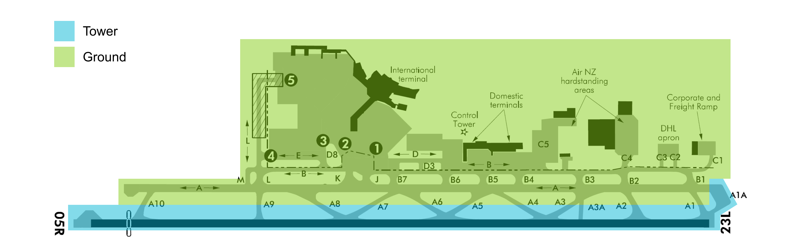

--8<-- "includes/abbreviations.md"

## Positions

| Position Name | Shortcode | Callsign          | Frequency | Login ID | Usage     |
|---------------|-----------|-------------------|-----------|----------|-----------|
| Auckland DLV  | DAA       | Auckland Delivery | 128.200   | NZAA_DEL | Secondary |
| Auckland SMC  | GAA       | Auckland Ground   | 121.900   | NZAA_GND | Secondary |
| Auckland ADC  | TAA       | Auckland Tower    | 118.700   | NZAA_TWR | Primary   |
| Auckland TMA  | ATMA      | Auckland Approach | 124.300   | NZAA_APP | Primary   |

### Event Only Positions

!!! Danger
    The following are designated as Event Only positions, and may only be staffed during a VATNZ event where approved, or if explicitly authorised by the Operations Director.

| Position Name       | Shortcode | Callsign          | Frequency | Login ID | Usage                       |
|---------------------|-----------|-------------------|-----------|----------|-----------------------------|
| Auckland Departures | ADEP      | Auckland Approach | 129.600   | NZAA_DEP | Events - Traffic Management |

## Airspace

The Auckland CTR/C follows the lateral boundaries as shown below from `SFC` to `A015`. The CTR/C comprises of three sectors - the North, Instrument and South Sectors. 

<figure markdown>
   
  <figcaption>Auckland Control Zone (CTR/C)</figcaption>
</figure>

## Areas of Responsibility

The areas of responsibility are as depicted below. The Transfer of Control Points are as listed in the below table.

<figure markdown>
   
  <figcaption>Auckland Areas of Responsibility</figcaption>
</figure>

### Transfer of Control points

| Transfer Flow      | Requirements                                                                         | Notes                                                                                  |
|--------------------|--------------------------------------------------------------------------------------|----------------------------------------------------------------------------------------|
| Delivery -> Ground | Once PDC has been issued either through Voice or DCL.                                |                                                                                        |
| Ground -> Tower    | Prior to arriving at their assigned hold, once clear of other traffic.               |                                                                                        |
| Tower -> Approach  | For Airline traffic, once airborne. For GA, when leaving the zone, if applicable.    |                                                                                        |
| Approach -> Tower  | When established on an instrument final, or if on an RNP approach, overhead the IAF. |                                                                                        |
| Tower -> Ground    | Once clear of the active runway.                                                     | Tower may turn an aircraft off the rapid exit, onto `A` if necessary for traffic flow. |

## Control Positions

### Clearance Delivery

Clearances shall be issued by the Delivery position, and may be given via DCL or voice.

#### International Traffic with a domestic SID transition

Aircraft departing for South American destinations are not given an Oceanic transition as a part of their clearance - they shall be issued a domestic transition instead. These aircraft shall be cleared to their destination via their FPR at their RFL.

!!! example 
    For example, LAN800 is a service between NZAA and SCEL, usually filing the following routing -  
    `H372 RO H328 GS DCT GOKAG ...`. 
    
    This aircraft would be issued either the `POLIS #Q/TULMI` or the `LEVRA #P/TULMI` departures depending on active runway.

### Ground

#### Pushback

Pushback and start up clearances are managed by the Ground Controller. Controllers should make use of the "tail facing" instruction to ensure that aircraft do not block apron entry and exit points. 

#### Domestic 

Aircraft pushing from Gates 20 to 22 shall push either onto `D1/D2` or `B`, depending on other traffic. Aircraft on Gates 28 to 33 shall be pushed with the nose facing towards the active runway.

For Gates 28 to 33, the Controller shall ensure that `B4`, `B5` and `B6` are kept clear for other aircraft, which can be ensured through two methods:

- Instructing the aircraft to have their tail facing a certain way, or
- Instructing the aircraft to push clear of a taxiway.

Aircraft on the `C5` apron shall be instructed to push and start at their discretion, as it is not a part of the manoeuvring area but still requires a clearance.

#### International 

All aircraft pushing from the International apron shall be given a tail facing instruction, and *may* be given a start location.

!!! example "International Apron: Push and Start"
    **Auckland Ground**: *"ANZ26, cleared push and start with the tail facing North"*

!!! info
    The start instruction is only utilised in the real-world to ensure that the jet wash doesn't interfere with the aircraft stands on the opposite side of the taxiway. As this isn't an issue within the Simulator, it is up to Controller discretion.

#### Taxiing 

As the runway utilises high-speed exits, the Controller shall avoid using taxiway `A` when there is a potential for conflict between the taxiway and any vacating traffic. 

When Runway 23L is in operation aircraft will vacate at either `A4`, `A6` or `A8`, and `A7`, `A5` or `A3` when 05R is in use.

When RWY 05R is active any domestic aircraft shall be given taxi instructions via `B` and `L`. Taxiway `M` may be utilized by controllers in order to get aircraft past any queues at holding point `A9`.

#### Use of Holding Points

Departures may occur from any runway intersection, providing that it does not interfere with the use of any high-speed exits. Controllers may apply the following rules without coordination from the Pilot:
 
| Type        |  Runway 23L   | Runway 05R |
|-------------|:-------------:|:----------:|
| Large Jets  | `A1` or `A1A` |   `A10`    |
| Medium Jets |     `A2`      |    `A9`    |
| Turboprops  | `A2` or `A3A` |    `A9`    |

!!! important "Usage of the A3 and A8 Holding Points"
    The `A3` and `A8` holds are not to be used, as Pilots cannot visually check the approaches are clear before entering the runway.

### Tower

The Tower shall ensure that all VFR traffic within the Auckland CTR/C does not conflict with any IFR operations. IFR operations shall take precedence over VFR.

Unless established within the aerodrome circuit, Tower must ensure that no VFR aircraft are present within the Instrument Sector when an aircraft is either turning onto, or established on an approach. VFR aircraft are not authorised to operate under any approach path, or within 3nm laterally of the approach path.

Aircraft that have been cleared to operate within the North or South sectors are deemed to be separated from IFR arrivals on the ILS or RNP Z approaches, but not from RNP (AR) approaches.

### Departures

Aircraft departures shall be managed in-line with the [Runway Operations section](../../controller-skills/separation.md#runway-operations). 

Some departures have immediate divergent turns once the aircraft passes `A005`, taking the aircraft away from the centreline, allowing for another aircraft to follow soon after.

#### SID Assignment

International SIDs are straight-forward, in that all of them have a shallow climb gradient, suitable for most aircraft types. The Controller shall issue the SID that is suggested by their Controller Client.

For Domestic aircraft that are departing to the North or Northeast, the Controller shall issue the SID that is suggested by the Controller Client. If the aircraft is departing to the South, the following rules shall be applied:

| Runway | Procedure  | Allowed A/C Categories | Is divergent?                  | Notes                                                                                                                             |
|--------|------------|------------------------|--------------------------------|-----------------------------------------------------------------------------------------------------------------------------------|
| 05R    | `BROOK #Q` | Cat A to C             | Yes - >30° turn passing `A005` | Available to Cat C Jets for noise-abatement. AA TMA approval required.                                                            |
| 05R    | `PAGLA #Q` | Cat A to D             | No                             | **Preferred departure for Cat C Jets**. Steep climb gradient - aircraft unable to meet this shall be given the `POLIS #Q`.        |
| 05R    | `POLIS #Q` | Cat A to D             | No                             | **Preferred departure for Cat D Jets, or heavies**. Shallower climb gradient.                                                     |
| 05R    | `REKIS #Q` | Cat A to D             | Yes - >30° turn passing `A005` | **Preferred departure for Props South**. May be given to jets provided they are comfortable with the 180kt limitation at `VINOD`. |
| 05R    | `EMRAG #Q` | Cat A to D             | No                             | Least preferred departure due to manual vectoring required.                                                                                         |

| Runway | Procedure  | Allowed A/C Categories | Is divergent?                  | Notes                                                                                                     |
|--------|------------|------------------------|--------------------------------|-----------------------------------------------------------------------------------------------------------|
| 23L    | `LENGU #A` | Cat A to D             | No                             | Least preferred departure due to manual vectoring required.                                               |
| 23L    | `LENGU #P` | Cat A to D             | No                             |                                                                                                           |
| 23L    | `LEVRA #P` | Cat A to D             | No                             | **Preferred departure for Jets**.                                                                         |
| 23L    | `STEAL #P` | Cat A to D             | Yes - >30° turn passing `A005` | **Preferred departure for Props**. Shall not be initially issued to Jets, but may be issued if requested. |

#### Assigned Headings

To ensure a divergent departure occurs due to traffic, AA TMA may request an aircraft be assigned a heading to fly once passing `A005`. This ensures a 30 degree offset from the centreline exists, and therefore another aircraft may then depart. These will usually be issued when an aircraft is at the holding point, and will be given to the Tower as a part of AA TMA's release of the aircraft.

As the aircraft is off an evaluated procedure, there is a potential that an assigned heading departure may conflict with an arriving aircraft. In this case, ATMA may request a hold-down altitude to maintain separation.

!!! danger "Propellor Aircraft Only"
    Due to the early turn required, assigned heading departures shall be given to prop aircraft only.

!!! example "Coordination for an assigned heading departure"
    **AA TWR** -> **AA TMA**: "Successive departures. Request ANZ631 assigned heading 190 degrees climbing five thousand then yours for vectors. Second in queue."  
    **AA TMA** -> **AA TWR**: "ANZ631 approved heading 190 degrees climbing five thousand then my vectors. Copy second in line."

!!! example "Issuing a departure heading to an Aircraft"
    **Auckland Tower**: *"ANZ631, additional departure instructions, report ready to copy"*  
    **ANZ631**: *"ANZ631, ready to copy"*  
    **Auckland Tower**: *"ANZ631, on departure turn right heading 190, climb five thousand"*  
    **ANZ631**: *"ANZ631, on departure turn right heading 190, climb five thousand"* 

## Noise Abatement (Night STARs)

!!! warning "Use of Noise Abatement Operations"
    In the real world, Auckland uses noise abatement procedures from 2300 until 0600 local in order to minimise disturbances over populated areas.

    The use of Noise Abatement procedures (Night STARs) on the network is **not** mandatory, and Controllers may elect to provide a normal control service if they wish. As the primary Controller affected, the decision to implement Noise Abatement Operations sits with AA TMA.

    These STARs **shall not** be used during high-traffic volumes due to the lack of separation against other routine procedures.

### Use of the Preferential Runway System

Use of the Preferential Runway System is not authorised and Controllers shall nominate a single runway direction for both take-off and landing.

### Departures

#### Runway 05R

Aircraft operating from RWY 05R shall not be taken off the SID until passing `A030`. Aircraft shall not overfly the City lower than `A050` unless established on an approach or departure path.

For all international departures the Controller shall issue the SID that is suggested by their Controller Client. For Domestic departures, Controllers shall observe the following SID assignment preferences:

| Priority | Runway | Procedure      | Allowed A/C Categories | Notes                                                                                  |
|----------|--------|----------------|------------------------|----------------------------------------------------------------------------------------|
| 1        | 05R    | `BROOK #Q`     | Cat A to C             | AA TMR approval not required during Noise Abatement hours.                             |
| 2        | 05R    | `REKIS #Q`     | Cat A to D             | **Preferred departure for Props**. Shall not be issued to Jets during Noise Abatement. |
| 3        | 05R    | `POLIS #Q`     | Cat A to D             | **Preferred departure for Cat D Jets, or heavies**. Shallower climb gradient.          |
| 4        | 05R    | All other SIDs |                        | Use of the `PAGLA #Q` departure shall be avoided.                                      |

#### Runway 23L

Aircraft operating from Rwy 23L must climb to `A030` on the extended runway centreline before turning to the right on departure. Aircraft may turn left once above `A005`.

There are no limits on the issuing of SIDs for Rwy 23L.

### Arrivals

#### Domestic

There are no limitations on the assignment of STARs for Domestic traffic, however Controllers should avoid the issuing of RNP-linking STARs.

#### International

OCR has three Noise Abatement STARs that shall be issued as first preference. If track shortening is provided, Controllers shall ensure that aircraft do not overfly the city.

| Runway | Procedure  | Transitions                                                             | Allowed A/C Categories |
|--------|------------|-------------------------------------------------------------------------|------------------------|
| 23L    | `BASIV #N` | `ELNOS` `SALAG` `UPLAR`                                                 | All                    |
| 05R    | `RIKDI #N` | `KALAG` `AGREX` `TARIB` `ELPAK` `AGEDU` `IDSEM` `DABAS` `AKLOM` `OLBEX` | All                    |
| 23L    | `TAZEY #N` | `PEBLU` `VELMO`                                                         | All                    |
| 23L    | `LUNBI #N` |                                                                         | All                    |
## VFR Procedures

### Arrival

In order to lessen the amount of instructions given to VFR traffic, the Controller shall issue the `Mangere Bridge` VFR arrival where possible. Once the Pilot reports overhead Mangere Town, the Controller shall integrate them with the circuit. [AIP Chart refers](https://www.aip.net.nz/assets/AIP/Aerodrome-Charts/Auckland-NZAA/NZAA_35.1_35.2.pdf){ target=new }.

!!! important
    If instructed to join via the overhead, it is the Controller's responsibilty to ensure that the missed approach is protected. A non-circuit side join may be given instead.

### Departure

In order to lessen the amount of instructions given to VFR traffic, the Controller shall issue the `Mangere Bridge` VFR departure at all times - ([AIP Chart](https://www.aip.net.nz/assets/AIP/Aerodrome-Charts/Auckland-NZAA/NZAA_64.1.pdf){ target=new }). Once the Pilot reaches Mangere Bridge, the aircraft shall be handed off to UNICOM or Approach where appropriate. 

If a departing VFR aircraft requests to climb into controlled airspace, this shall be coordinated with Approach. The Tower Controller may amend the clearance as they see fit while the aircraft is in their Control Zone, however must be coordinated with Approach if the ammendment changes their Control Area entry point.

As flights to the West, North, and Northeast require a turn against the circuit direction, the Tower may approve a turn against the circuit direction.

!!! example "Turn against the Circuit direction"
    **Auckland Tower**: *"On departure a left/right turn is approved. Runway 05R/23L, cleared for takeoff"*

### Helicopters

Helicopter operations are frequent within Auckland CTR/C, usually operating within one of the three sectors. Tower must ensure that no VFR aircraft are present within the Instrument Sector when an aircraft is either turning onto, or established on an approach. VFR aircraft are not authorised to operate under any approach path, or within 3nm laterally of the approach path.

