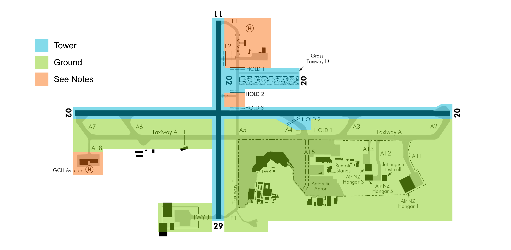

--8<-- "includes/abbreviations.md"

## Positions

| Position Name    | Shortcode | Callsign              | Frequency | Login ID | Usage     |
| ---------------- | --------- | --------------------- | --------- | -------- | --------- |
| Christchurch DLV | DCH       | Christchurch Delivery | 128.200   | NZCH_DEL | Secondary |
| Christchurch SMC | GCH       | Christchurch Ground   | 121.900   | NZCH_GND | Secondary |
| Christchurch TWR | TCH       | Christchurch Tower    | 118.400   | NZCH_TWR | Primary   |
| Christchurch TMA | CTMA      | Christchurch Approach | 126.100   | NZCH_APP | Primary   |

### Event Only Positions

!!! Danger "Important"
    The following are designated as Event Only positions, and may only be staffed during a VATNZ event where approved, or if explicitly authorised by the Operations Director.

| Position Name               | Shortcode | Callsign                | Frequency | Login ID | Usage                       |
| --------------------------- | --------- | ----------------------- | --------- | -------- | --------------------------- |
| Christchurch Terminal Radar | CDEP      | Christchurch Departures | 120.900   | NZCH_DEP | Events - Traffic Management |

## Airspace

The Christchurch CTR/C follows the lateral boundaries as shown below from `SFC` to `A015`. The CTR/C comprises of three sectors - the West, Instrument and East Sectors.

<figure markdown>
  
  <figcaption>Christchurch Control Zone (CTR/C)</figcaption>
</figure>

## Areas of Responsibility

The areas of responsibility are as depicted below.

<figure markdown>
  
  <figcaption>Christchurch Areas of Responsibility</figcaption>
</figure>

!!! Notes
    The areas marked in orange have special condition-based rules, and can be read about here - [GCH Apron](#gch-apron) and [Western Apron](#aeroclub-apron).

### Transfer of Control Points

| Transfer Flow      | Requirements                                                                                  | Notes                                                                                                                                            |
| ------------------ | --------------------------------------------------------------------------------------------- | ------------------------------------------------------------------------------------------------------------------------------------------------ |
| Delivery -> Ground | Once PDC has been issued either through Voice or DCL                                          | Exceptions for the [Western](#western-apron) and [GCH](#gch-apron) aprons.                                                                       |
| Ground -> Tower    | Prior to arriving at their assigned hold, once clear of other traffic.                        | See conditions for [traffic crossing a Rwy](#traffic-crossing-intersecting-runway) and [traffic backtracking via Rwy 29](#backtrack-via-rwy-29). |
| Tower -> Ground    | Once clear of the active Rwy.                                                                 | Tower may taxi aircraft vacating via `A4` to `A4 Hold 1` without coordination.                                                                   |
| Tower -> Approach  | For Airline traffic, once airborne. For GA traffic, prior to leaving the zone, if applicable. |                                                                                                                                                  |
| Approach -> Tower  | Once established on an instrument final, or overhead the IAF if on an RNP approach.           |                                                                                                                                                  |

## Control Positions

### Clearance Delivery

Clearances shall be issued by the Delivery position, and may given via DCL or voice.

When applicable, Delivery may issue taxi instructions in line with the [GCH Special Conditions](#gch-apron) or [Western Apron Special Conditions](#western-apron).

### Ground

#### Pushback

Pushback and startup clearances are managed by the Ground Controller. Due to the single taxiway at NZCH, the Controller shall ensure that pushbacks are carefully timed to allow for aircraft to taxi to both the runway and stands.

!!! info "Starting on Stand at the Terminal"
    Christchurch utilises W/E stands to allow for Props to park into the wind. Aircraft utilising these stands do not require a push-back, and may start on stand.

| Stands / Gates    | Usage               | Has a W/E stand? | Pushback required? | Pushback Location | Notes                                                                                                 |
| ----------------- | ------------------- | ---------------- | ------------------ | ----------------- |------------------------------------------------------------------------------------------------------ |
| 3 and 4           | Cat B Props         | Yes, only        | No                 | N/A               | Designed for C208 or PC12 type aircraft                                                               |
| 5 to 8            | Turboprops          | Yes              | No                 | N/A               | Only W/E                                                                                              |
| 9, 11, 12, 13, 15 | Turboprops          | Yes              | No                 | N/A               | Both Nose-in, and W/E                                                                                 |
| 10, 14            | Turboprops          | No               | No                 | Twy `F`           |                                                                                                       |
| 16                | Turboprops and Jets | No               | No                 | Twy `F`           |                                                                                                       |
| 17 to 22          | Turboprops and Jets | No               | **Yes**            | Twy `A`           | Primarily for Jets, but turboprop capable. May push straight back to allow multiple pushbacks onto `A`|
| 26 to 28          | Jets                | No               | **Yes**            | Twy `A`           | If Rwy 02 is active, Stand 28 shall be pushed clear of `A4`                                           |
| 29 to 35          | Jets                | No               | **Yes**            | Twy `A15`         | International Stands                                                                                  |

#### Taxiing

##### Dakota Apron

Dakota Apron is used exclusively by Parcel Air (APK), Airwork (AWK) and Texel Air (XLR). Aircraft utilising this apron may be instructed to start at their discretion and report for taxi.

When ready for taxi, aircraft taxiing from the Dakota Apron may be instructed to cross Runway 29 and taxi via `F`, or may be given a [backtrack via Runway 29](#backtrack-via-rwy-29). A backtrack via Runway 29 is usually preferred, as it allows the Domestic ramp to continue to flow.

##### Post Apron

The Post Apron is on the northern side of `A4`, and is used by DHL, Qantas Freight and other freight traffic. Aircraft utilising this apron may be instructed to start at their discretion.

##### Romeo Apron

The Romeo Apron is a transitional apron, and is commonly used by aircraft arriving at the aerodrome without a contracted parking location, or for overflow or long-term parking. 

!!! info
    Aircraft utilising Stands R1A, R1B, and R3A stands may start on stand. Aircraft utilising Stands R1, R2 or R3 must be pushed onto `A15`.

##### Antarctic Apron

The Antarctic Apron is used for all military traffic, but may also be used for larger private traffic. Stands are not issued on this apron, and aircraft may start on stand.

##### West of RWY 02/20

Aircraft operating within the bounds of the Western Apron shall be controlled in line with [the Western Apron special conditions](#western-apron). 

##### Use of RWY 11/29 as a Taxiway

When RWY 11/29 is not in use Tower may delegate the use of RWY 29, south of the RWY 02/20 intersection, to Ground as a taxiway.

###### Traffic crossing intersecting Runway

When delegated RWY 29, the Ground Controller may authorise the aircraft to cross RWY 29 without seeking permission, or transferring that aircraft to Tower.

!!! warning "When Runway 11/29 is in use"
    The Ground Controller shall not assume crossing authority for the intersecting runway when Runway 11/29 is in use.

!!! example "RTF for crossing a Runway"
    **Christchurch Ground**: *"ANZ218, taxi holding point A6, Runway 02, via A. Cross Runway 29"*

###### Backtrack via Rwy 29

When delegated RWY 29, aircraft taxiing to or from the Dakota apron may be instructed to backtrack via RWY 29, avoiding taxiway `F`. Domestic prop traffic taxiing to or from the Domestic apron may also be instructed to backtrack via RWY 29 in order to avoid congestion on taxiway `F`.

#### Use of Holding Points

Departures may occur from any intersection, providing that it does not interfere with the use of normal exits. 

##### RWY 02

When Runway 02 is in use, domestic jet traffic shall be issued `A6`, and international traffic issued `A7`. Domestic jet traffic may be re-issued `A7` if requested from the Pilot.

Departing prop traffic is usually able to take a mid-field departure via `A5` or RWY 29. Arriving prop traffic will usually vacate via `A5`, so traffic may be instructed to hold short of RWY 02/20 on RWY 29, provided that Tower has [delegated the use of Runway 29 to Ground](#backtrack-via-rwy-29).

##### RWY 20

When Runway 20 is in use, domestic jet traffic shall be issued `A3`, and international traffic issued `A2`. Domestic jet traffic may be re-issued `A2` if requested by the Pilot.

Departing prop traffic shall be issued `A4`, but may be re-issued `A3` if required for performance.

##### High Performance Aircraft

High performance aircraft, such as private jets or King Airs, may be issued any holding point, provided that it does not interfere with landing traffic. If a high performance aircraft is using a usual vacate route, any aircraft on approach shall be notified and instructed to roll out to the next runway vacate point.

### Tower

In normal operation, RWY 02/20 shall be used. The use of RWY 11/29 is detailed in [the special conditions section](#use-of-rwy-2911-as-the-duty-rwy).

The Tower shall ensure that all VFR traffic within the Christchurch CTR/C does not conflict with any IFR operations. IFR operations shall take precedence over VFR.

Unless established within the aerodrome circuit, Tower must ensure that no VFR aircraft are present within the Instrument Sector when an aircraft is either turning onto, or established on an approach. VFR aircraft are not authorised to operate under any approach path, or within 3nm laterally of the approach path.

When RWY 02/20 is in use, aircraft that have been cleared to operate within the West or East sectors are deemed to be separated from IFR arrivals on the ILS or RNP Z approaches, but not from RNP (AR) approaches. When RWY 11/29 is in use, VFR aircraft shall not be authorised to operate within the West, East or Instrument sectors.

#### Simultaneous use of Grass and Sealed 02/20

The simultaneous use of Grass and Sealed 02/20 is authorised, except that:

  - Aircraft in the grass circuit must be informed of the arriving sealed traffic, and instructed to remain clear of the sealed runway.  
  - Aircraft on approach for the sealed runway must be informed of the grass traffic.  
  - When an aircraft using the sealed is under `A010`, no grass traffic shall be authorised to turn base leg, and must be instructed to hold in the downwind until the sealed traffic has landed.  
  - There shall be no simultaneous use of the grass and sealed when sealed traffic is departing. In this case, grass traffic shall be instructed to hold in the downwind.  

### Departures

Aircraft departures shall be managed in-line with the [Runway Operations section](../../controller-skills/separation.md#runway-operations)

For the purposes of arrival and departure management, all Christchurch departures shall be treated as divergent - providing that the aircraft on approach is at the same, or lower approach category. 

#### SID Assignment

There are no discrete prop or jet SIDs at Christchurch, and the Controller shall issue the departure suggested by the Controller Client.

#### Assigned Headings for PEDMI departures

Where multiple departures have been assigned the `PEDMI #Q` SID, the Tower Controller may, with coordination with CH TMA, instruct the aircraft to fly a heading of 160°M and climb to `A050`. 

Where a prop and jet have both been assigned the `PEDMI #Q`, the jet shall be issued the assigned heading due to its capability to climb faster above the city.

!!! example "RTF and coordination for Assigned Heading departure"
    **CH TWR** -> **CH TMA**: "Successive PEDMI departures. Request ANZ631 assigned heading 160°M climbing five thousand then yours for vectors. Second in queue."  
    **CH TMR** -> **CH TWR**: "ANZ631 approved heading 160 climbing five thousand then my vectors. Copy second in line."

    **Christchurch Tower**: *"ANZ631, additional departure instructions, report ready to copy"*  
    **ANZ631**: *"ANZ631, ready to copy"*  
    **Christchurch Tower**: *"ANZ631, on departure turn left heading 160, climb five thousand."*  
    **ANZ631**: *"On departure turn left heading 160, climbing five thousand. ANZ631."*

<figure markdown>
  
  <figcaption>Manually assigned heading of 160°M, climbing to <code>A050</code>. Visualisation in LittleNavMap and accurate as of AIRAC 2304.</figcaption>
</figure>

## Special Requirements

### Code F

ICAO has classified the B747-800 and A-380 aircraft as code F aircraft (wingspan from 65 to 80 meters and a width of the main fuselage from 14 to 16 meters)

Special rules apply to Code F aircraft, such as taxiway and gate restrictions.

##### Code F Information

Code F aircraft may only use Stand 30. For taxi Code F aircraft must use TWY `A` and shall be given full length either `A2` or `A7`.

### Use of RWY 11/29 as the Duty RWY

During the use of RWY 11/29 as the duty runway controllers shall note that the only instrument approaches are the `RNP RWY 11` and the `RNP Y RWY 29 (AR)`. Therefore the nominated approach shall be RNP, Visual approaches may still be used. 

Tower may release `RWY 02/20` to GND. 

All aircraft shall use full length unless requested otherwise. 

### Western Apron

When `RWY 02/20` is in use, aircraft shall call Delivery for clearance and Ground for start and taxi. When `RWY 11/29` is in use, aircraft shall call Delivery for clearance, start and taxi. 

When `RWY 11/29` is in use, aircraft shall contact Ground when vacating the runway. When `RWY 02/20` is in use, aircraft shall remain on Tower when vacating the runway. 

### Holding Points

When `RWY 02/20` is in use, aircraft shall be issued taxi clearance to `Hold 1 E` and handed over to Tower. Tower shall then issue taxi clearance to `D` for `Grass 20`, `Hold 3 E` for sealed `RWY 02/20`, or when traffic permits depart them off `Grass 02`. 

Aircraft departing `RWY 11` shall be issued taxi clearance to either `E1` or `E2` before being handed to Tower. For aircraft departing `RWY29`, the same rules shall apply as using sealed `RWY 02/20`. 

### GCH Apron

Fixed wing aircraft on the GCH Apron shall call Delivery for clearance and then Ground for start and taxi. However when `RWY 02` is in use, Delivery shall issue taxi instructions and hand aircraft to Tower, given the short taxi required. Controllers shall note that the GCH Apron **is** within the manouvering area. 

Helicopters departing from the GCH shall call Tower prior to lift off for clearance. Tower shall issue the `Copter North/South/West` Departure depending on the requested direction of travel, an issue of the clearance implies take off clearance. Therefore, should the helicopter need to hold on the ground, a instruction to "Hold on the ground" shall be issued until a time at which a departure can be facilitated. 

## VFR Procedures
    
Where possible it is preffered that controllers issue one of the published VFR Departures as stated on the [VFR Departure Procedures RWY 02/20](https://www.aip.net.nz/assets/AIP/Aerodrome-Charts/Christchurch-NZCH/NZCH_64.1_64.2.pdf){target=new} and the [VFR Departure Procedures RWY 29](https://www.aip.net.nz/assets/AIP/Aerodrome-Charts/Christchurch-NZCH/NZCH_64.3_64.4.pdf){target=new} charts. Where a misunderstanding may occur, or in low levels of traffic, more plain langauge clearances may be issued.
