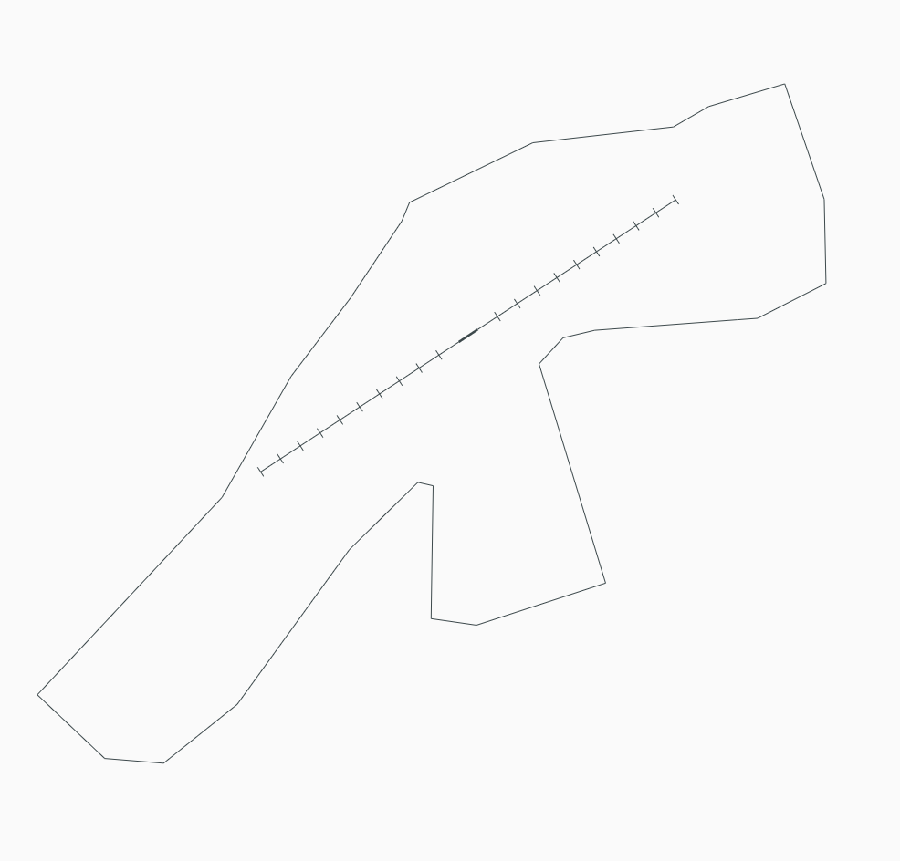

title: NZQN - Queenstown
---

--8<-- "includes/abbreviations.md"

## Positions

| Position Name  | Shortcode | Callsign            | Frequency | Login ID | Usage     |
| -------------- | --------- | ------------------- | --------- | -------- | --------- |
| Queenstown DLV | DQN       | Queenstown Delivery | 121.900   | NZQN_DEL | Secondary |
| Queenstown ADC | TQN       | Queenstown Tower    | 118.100   | NZQN_TWR | Primary   |
| Queenstown TMA | QTMA      | Queenstown Approach | 125.750   | NZQN_APP | Primary   |

### Event Only Positions

!!! Danger
    The following are designated as Event Only positions, and may only be staffed during a VATNZ event where approved, or if explicitly authorised by the Operations Director.

| Position Name             | Shortcode | Callsign              | Frequency | Login ID | Usage                       |
| ------------------------- | --------- | --------------------- | --------- | -------- | --------------------------- |
| Queenstown Ground         | GQN       | Queenstown Ground     | 128.300   | NZQN_GND | Events - Traffic Management |

## Airspace 

The Queenstown CTR/C follows the lateral boundaires as shown below from `SFC` to `A075`. The CTR/C comprises of one large sector. 

<figure markdown>
  
  <figcaption>Queenstown Control Zone (CTR/C)</figcaption>
</figure>

## Areas of Responsibility 

The areas of responsiblility are as depicted below. 

<figure markdown>
   
  <figcaption>Queenstown Areas of Responsibility</figcaption>
</figure>

### Transfer of Control Points

| Transfer Flow       | Requirements                                                                             | Notes                                                                                    |
| ------------------- | ---------------------------------------------------------------------------------------- | ---------------------------------------------------------------------------------------- |
| Delivery -> Ground  | Once PDC has been issued either through Voice or DCL.                                    | This is only effective if Ground is online otherwise the aircraft is transfered to Tower | 
| Ground -> Tower     | Prior to arriving at their assigned hold, once clear of other traffic.                   | This is only effective if Ground is online                                               |
| Tower -> Ground     | Once clear of the active runway.                                                         | This is only effective if Ground is online otherwise aircraft remain with Tower          |
| Tower -> Approach   | For airline traffic, when airborne. For GA, when leaving the zone, if applicable.        |                                                                                          |
| Approach -> Tower   | When established on an instrument final, or if on an RNP approach, overhead the IAF.     |                                                                                          |

## Clearance Delivery

Clearances shall be issued by the Delivery position (if online) and may be given via DCL or voice.

## Ground 

The following only applies if Ground is online, otherwise these operations will be managed by the Tower. 

### Pushback

Pushback and start up clearances are managed by the Ground Controller. For pushbacks on apron areas the phraseology “Push your discretion” is used to indicate that the pushback
is contained within an uncontrolled portion of the movement area and that ATC may not be aware of all apron activity.

### Taxiing

If Ground is online taxi instructions will be issued by them, otherwise it is delegated to Tower.  

### Use of Holding Points 

If `23` is the Duty Runway then `A4` hold shall be used for all departures, and for `05` `A3` hold shall be used. This is to ensure landing aircraft can backtrack and vacate and also allows for a departing aircraft to backtrack after an arriving aircraft has passed that holding point increasing overall efficiency of arrivals and departures.  

If `14/32` is to be used for light aircraft, then holding points are to be used as required or if specifically requested by the pilot. 

## Tower

The Tower Controller is responsible for all arrivals and departures, plus any VFR aircraft operating within the QN CTR/C. 

