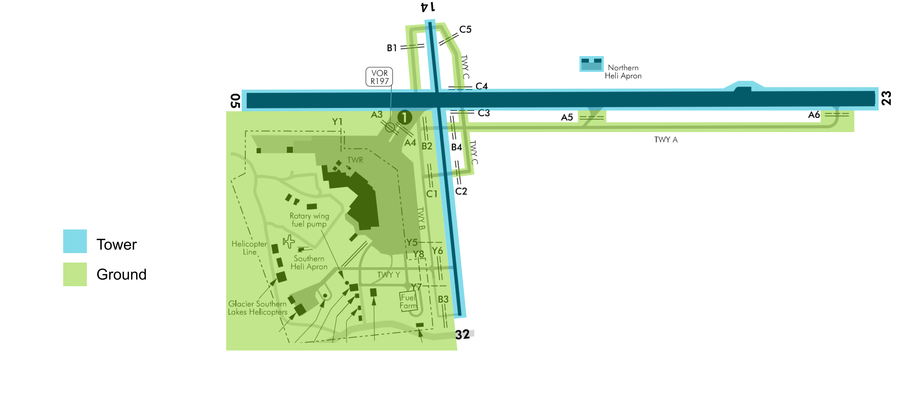

title: NZQN - Queenstown
---

--8<-- "includes/abbreviations.md"

## Positions

| Position Name  | Shortcode | Callsign            | Frequency | Login ID | Usage     |
| -------------- | --------- | ------------------- | --------- | -------- | --------- |
| Queenstown DLV | DQN       | Queenstown Delivery | 121.900   | NZQN_DEL | Secondary |
| Queenstown ADC | TQN       | Queenstown Tower    | 118.100   | NZQN_TWR | Primary   |
| Queenstown TMA | QTMA      | Queenstown Approach | 125.750   | NZQN_APP | Primary   |

### Event Only Positions

!!! Danger
    The following are designated as Event Only positions, and may only be staffed during a VATNZ event where approved, or if explicitly authorised by the Operations Director.

| Position Name             | Shortcode | Callsign              | Frequency | Login ID | Usage                       |
| ------------------------- | --------- | --------------------- | --------- | -------- | --------------------------- |
| Queenstown Ground         | GQN       | Queenstown Ground     | 128.300   | NZQN_GND | Events - Traffic Management |

## Airspace 

The Queenstown CTR/C follows the lateral boundaires as shown below from `SFC` to `A075`. The CTR/C comprises of one large sector. 

<figure markdown>
  
  <figcaption>Queenstown Control Zone (CTR/C)</figcaption>
</figure>

## Areas of Responsibility 

The areas of responsiblility are as depicted below. 

<figure markdown>
   
  <figcaption>Queenstown Areas of Responsibility</figcaption>
</figure>

### Transfer of Control Points

| Transfer Flow       | Requirements                                                                             | Notes                                                                                    |
| ------------------- | ---------------------------------------------------------------------------------------- | ---------------------------------------------------------------------------------------- |
| Delivery -> Ground  | Once PDC has been issued either through Voice or DCL.                                    | This is only effective if Ground is online otherwise the aircraft is transfered to Tower | 
| Ground -> Tower     | Prior to arriving at their assigned hold, once clear of other traffic.