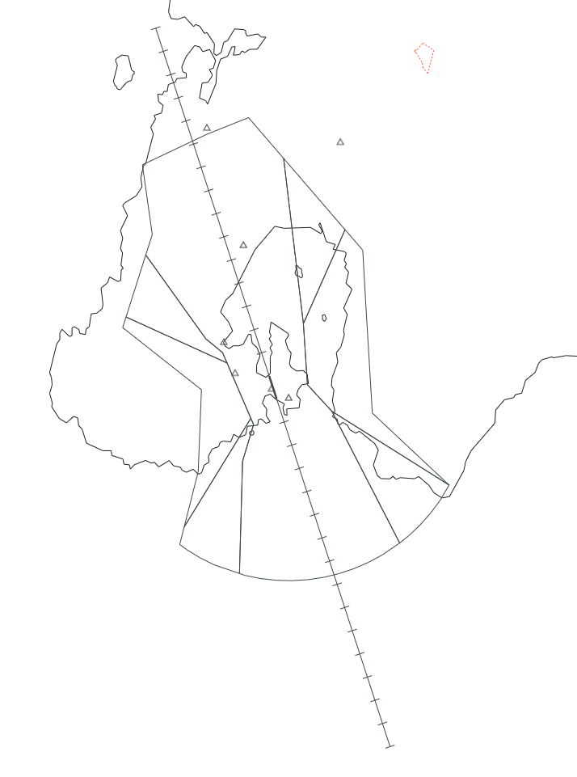
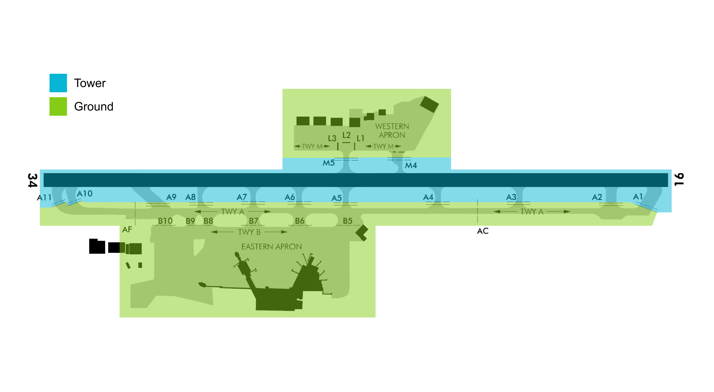

--8<-- "includes/abbreviations.md"

## Positions

| Position Name  | Shortcode | Callsign            | Frequency | Login ID | Usage     |
| -------------- | --------- | ------------------- | --------- | -------- | --------- |
| Wellington DLV | DWN       | Wellington Delivery | 128.200   | NZWN_DEL | Secondary |
| Wellington SMC | GWN       | Wellington Ground   | 121.900   | NZWN_GND | Secondary |
| Wellington ADC | TWN       | Wellington Tower    | 118.800   | NZWN_TWR | Primary   |
| Wellington TMA | WTMA      | Wellington Approach | 119.300   | NZWN_APP | Primary   |

### Event Only Positions

!!! Danger
    The following are designated as Event Only positions, and may only be staffed during a VATNZ event where approved, or if explicitly authorised by the Operations Director.

| Position Name             | Shortcode | Callsign              | Frequency | Login ID | Usage                       |
| ------------------------- | --------- | --------------------- | --------- | -------- | --------------------------- |
| Wellington Terminal Radar | WDEP      | Wellington Departures | 122.300   | NZWN_DEP | Events - Traffic Management |

## Airspace

The Wellington CTR/C follows the lateral boundaries as shown below from `SFC` to `A025`. The CTR/C comprises of seven sectors - Kelburn, West, Sinclar, Turakirae, East, Somes and Instrument Sectors. 

<figure markdown>
  
  <figcaption>Wellington Control Zone (CTR/C)</figcaption>
</figure>

## Areas of Responsibility 

The areas of responsiblility are as depicted below. 

<figure markdown>
   
  <figcaption>Wellington Areas of Responsibility</figcaption>
</figure>

### Transfer of Control Points 

| Transfer Flow      | Requirements                                                                           | Notes                                                                                                                                                                                                                     |
| ------------------ | -------------------------------------------------------------------------------------- | ------------------------------------------------------------------------------------------------------------------------------------------------------------------------------------------------------------------------- |
| Delivery -> Ground | Once PDC has been issued either through Voice or DCL.                                  |                                                                                                                                                                                                                           |
| Ground -> Tower    | Prior to arriving at their assigned hold, once clear of other traffic.                 | Aircraft operating on the Western Apron are not required to contact Ground or Tower until reaching one of the `M5 Lima` holds, or holding short of `M4`.                                                                  |
| Tower -> Ground    | Once clear of the active runway.                                                       | Aircraft vacating to the Western Apron may stay with Tower, provided there is no conflicting traffic.                                                                                                                     |
| Tower -> Approach  | For most airline traffic, when airborne. For GA, when leaving the zone, if applicable. | Aircraft assigned a SID with a visual segment, such as the `IDVAL #U` or `IPKEP #T` may be retained by Tower until clear of other aircraft, once established inbound to their IDF, or if requested by TMA for separation. |
| Approach -> Tower  | When established on an instrument final, or if on an RNP approach, overhead the IAF.   |                                                                                                                                                                                                                           |

## Control Positions

### Clearance Delivery

Clearances shall be issued by the Delivery position, and may be given via DCL or voice.

#### STAR Clearance for NZNS & NZWB

As the flight time between Wellington, Nelson and Woodbourne (Blenheim) is so short, and to reduce pilot and controller workload, the controller shall include a STAR clearance for their destination in their departure clearance.

If online, Delivery shall confirm the STAR with Wellington TMA prior to passing to aircraft.

!!! example "Clearance to Nelson"
    **Wellington Delivery**: *"SDA333, Cleared Nelson 1 via LUBSI 2A arrival at 11,000ft, IVDAL 1Q departure, Sqauwk 5021"*

### Ground

#### Pushback

Pushback and start up clearances are managed by the Ground Controller. For pushbacks on apron areas the phraseology “Pushback at your discretion” is used to indicate that the pushback
is contained within an uncontrolled portion of the movement area and that ATC may not be aware of all apron activity.

During periods of high-traffic, the Ground Controller may issue explicit push and start directions to deconflict and prioritise traffic flow.

##### International Gates

The international gates only have capacity for one pushback at a time. Should a second aircraft request pushback, they should be instructed to push to a remote push point, such as `Z1`. Not all pilots are aware of these remote push locations, so the Ground Controller may issue plain English push directions at their discretion.

##### Night Pushback Operations

Wellington has two marked pushback holding zones, `Z1` & `Z2`. These zones are used during busy periods or at night to avoid blocking entry and exit points to the rest of the gates. 

#### Taxiing

As there is only a single main taxiway, the Controller shall feed aircraft onto taxiway `A` using the `R, S, T or U` taxiways and `B` intersections as required. Aircraft taxiing from the Eastern Pier shall be instructed to taxi via one of the `R, S, T or U` taxiways or directly via `B8`, `B9` or `B10` when Runway 34 is in use - or `B9` , `B8` and `B7` when Runway 16 is in use. 

This frees up `B6` and `B5` for traffic taxiing from the main apron and international gates.

#### Use of Holding Points

| Type        |   Runway 34   |  Runway 16   |
| ----------- | :-----------: | :----------: |
| Large Jets  |     `A11`     |     `A1`     |
| Medium Jets |     `A10`     | `A1` or `A2` |
| Turboprops  | `A9` or `A10` | `A2` or `A3` |

!!! info "Use of Holding Point A10"
    The use of the `A10` hold is only authorised during day hours. During night operations, aircraft shall be directed to `A11`.

### Tower

The Tower shall ensure that all VFR traffic within the Wellington CTR/C does not conflict with any IFR operations. IFR operations shall take precedence over VFR.

Unless established within the aerodrome circuit, VFR aircraft are not authorised to operate under any approach path, or within 3nm laterally of the approach path, unless explicitly authorised by the Tower or Approach Controller.

Aircraft that have been cleared to operate within the Kelburn, Somes, East, Sinclair or East Sectors are deemed to be separated from IFR arrivals operating on straight-in approaches in the Instrument Sector. When RNP-AR approaches are in use, the Tower Controller is to ensure that the RNP path has a lateral buffer of at least 3nm.

### Departures

Aircraft departures shall be managed in-line with the [Runway Operations section](../../controller-skills/separation.md#runway-operations)

Where possible, and where weather permits, the SIDs with visual departure segements shall be issued to small Approach Category A and B aircraft (C208, PC12), to ensure an immediate turn to their departure's IDF.

!!! warning "Golden Bay Air BN-2 Aircraft"
    For the purposes of traffic separation, the Britten Norman Islander shall be classed as a Category A aircraft.

#### SID Assignment

Most of Wellington's SIDs are straight-forward, however there are a few considerations that must be made when issuing an aircraft with their clearance.

For Domestic aircraft the Controller shall issue the SID that is suggested by the Controller Client.

| Runway | Procedure  | Allowed A/C Categories | Is it divergent?         | Notes                                                                                 |
| ------ | ---------- | ---------------------- | ------------------------ | ------------------------------------------------------------------------------------- |
| 16     | `ATVEV #Q` | Cat A to D             | Yes -> 20° after `URBEM` | **Preferred departure for Jets**                                                      |
| 16     | `AGROR #Q` | Cat A to C             | Yes -> 40° after `URBEM` | **Preferred departure for southern-bound Props via `VENAM`**                          |
| 16     | `UPROG #Q` | Cat A to C             | Yes -> 40° after `URBEM` | **Preferred departure for northern-bound Props**                                      |
| 16     | `IVDAL #Q` | Cat A to C             | Yes -> 50° after `URBEM` | Preferred departure for NZNS/NZWB traffic.                                            |
| 16     | `IVDAL #U` | Cat A to C             | Yes -> 30° at `A005`     | Same as `IDVAL #Q`, but with a visual segment to IDF. Turns divergent passing `A005`. |
| 16     | `NZWN  #C` | Cat A to D             | No                       | Least preferred departure due to manual vectoring required.                           |

| Runway | Procedure  | Allowed A/C Categories | Is it divergent?         | Notes                                                                                     |
| ------ | ---------- | ---------------------- | ------------------------ | ----------------------------------------------------------------------------------------- |
| 34     | `UPLUD #R` | Cat A to D             | Yes                      | **Preferred departure for Air NZ Jets**. Has an RNP segment until `UPLUD`, thence RNAV 1. |
| 34     | `UPLUD #P` | Cat C Only             | Yes -> 18° after `COUBY` | **Preferred departure for all other domestic and international Jets**                     |
| 34     | `IPKEP #P` | Cat A to C             | No                       | **Preferred departure for western-bound Props**                                           |
| 34     | `URGEV #P` | Cat A to C             | Yes -> 42° after `GANJI` | **Preferred departure for northern, southern and eastern-bound Props**                    |
| 34     | `IPKEP #T` | Cat A to C             | Yes -> Passing `A015`    | Same as `IDVAL #Q`, but with a visual segment to IDF. Turns divergent passing `A015`.     |
| 16     | `NZWN  #D` | Cat A to D             | No                       | Least preferred departure due to manual vectoring required.                               |

#### Assigned Headings

To ensure a divergent departure occurs due to traffic, WN TMA may request an aircraft be assigned a heading to fly once passing `A005`. This ensures a 30 degree offset from the centreline exists, and therefore another aircraft may then depart. These will usually be issued when an aircraft is at the holding point, and will be given to the Tower as a part of WN TMA's release of the aircraft.

!!! example "Issuing a departure heading"
    **Wellington Tower**: *"SDA671, additional departure instructions, report ready to copy"*  
    **SDA671**: *"SDA671, ready to copy"*  
    **Wellington Tower**: *"SDA671, on departure turn right heading 250, climb three thousand"*                
    **SDA671**: *"SDA671, on departure turn right heading 250, climb three thousand"*  

## VFR Procedures

### Arrival

In order to lessen the amount of instructions given to VFR traffic, the Controller shall issue a published VFR arrival where possible. Once the Pilot reports overhead the respective VRP, the Controller shall integrate them with the circuit. [AIP Chart refers NZWN arrivals](https://www.aip.net.nz/assets/AIP/Aerodrome-Charts/Wellington-NZWN/NZWN_35.1_35.2.pdf){ target=new }.

!!! important
    If instructed to join via the overhead, it is the Controller's responsibilty to ensure that the missed approach is protected. A non-circuit side join may be given instead.

### Departure

As Wellington's CTR/C is split into different sections, many VFR procedures have been put in place to ensure safe airspace operation. In order to lessen the amount of instructions given to VFR traffic, the Controller shall issue one of the VFR Departure Procedures where possible. [AIP Chart refers NZWN departures](https://www.aip.net.nz/assets/AIP/Aerodrome-Charts/Wellington-NZWN/NZWN_64.1_64.2.pdf){ target=new }.

As flights to the West, North, and Southwest require a turn against over a populated area, against the circuit direction, the Tower shall approve a turn against the circuit direction.

!!! example "Turn against the Circuit direction"
    **Wellington Tower**: *"On departure a early left/right turn is approved. Runway 16/34, cleared for takeoff"*

### Helicopters

All Helicopters operating in or out of Wellington tend to operate from the *Western Apron* and must ask for clearance to lift and cross the active runway before departing.

!!! info "Helicopter Departure Clearance"
    **CFL10**: *"Wellington Tower, CFL10 at the western apron, request lift to operate in the city sector"* 

    **Wellington Tower**: *"CFL10, Cleared to lift at own discretion to operate in the city sector, cleared to cross the runway 16 threshold, report clear"*

    !!! danger "If runway or instrument sector are not clear:"

    **Wellington Tower**: *"CFL10 hold position due traffic. Remain on the ground, you can expect a lift in `x` minutes"*

  