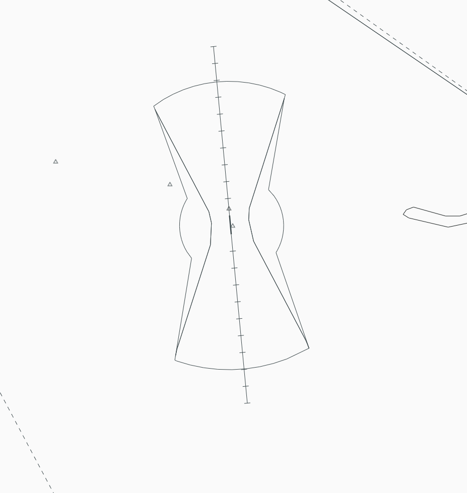
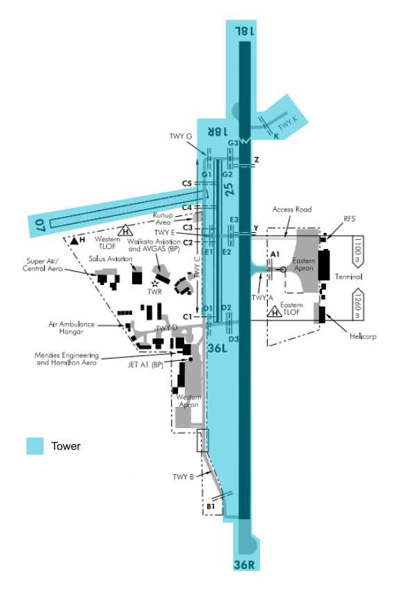

--8<-- "includes/abbreviations.md"

## Positions
| Position Name | Shortcode | Callsign          | Frequency | Login ID | Usage     |
| ------------- | --------- | ----------------- | --------- | -------- | --------- |
| Hamilton TWR  | HTWR      | Hamilton Tower    | 126.800   | NZHN_TWR | Primary   |
| Hamilton TMA  | HTMA      | Hamilton Approach | 125.300   | NZHN_APP | Secondary |

## Airspace

The Hamilton CTR follows the lateral boundaries as shown below from `SFC` to `A020`, and is designated as `Class D` airspace.

<figure markdown> 
  
  <figcaption>Hamilton Control Zone (CTR)</figcaption>
</figure>

## Area of Responsiblilty\

<figure markdown> 
  
  <figcaption>Hamilton Areas of Responsibility</figcaption>
</figure>

## Clearances

IFR clearances shall be issued as per normal. International Aircraft to the West should be cleared via `POKOM` or `AA VOR` to the North

VFR traffic shall be issued one of the published VFR Departures and may be issued plain language in low levels of traffic. Controllers shall note there are specific Helicopter Procedures.

## Ground Movements

No aircraft should requrie pushback. However a start clearance is still required by **IFR aircraft only**. VFR aircraft do not require a start clearance. 

For aircraft parked on the Eastern Apron, they shall be cleared to "Via A backtrack and line up runway XX".

Aircraft parked on the Western Apron 

## Tower 

### IFR Arrivals

#### Instrument Approaches

#### Visual Approaches

## Coordination

