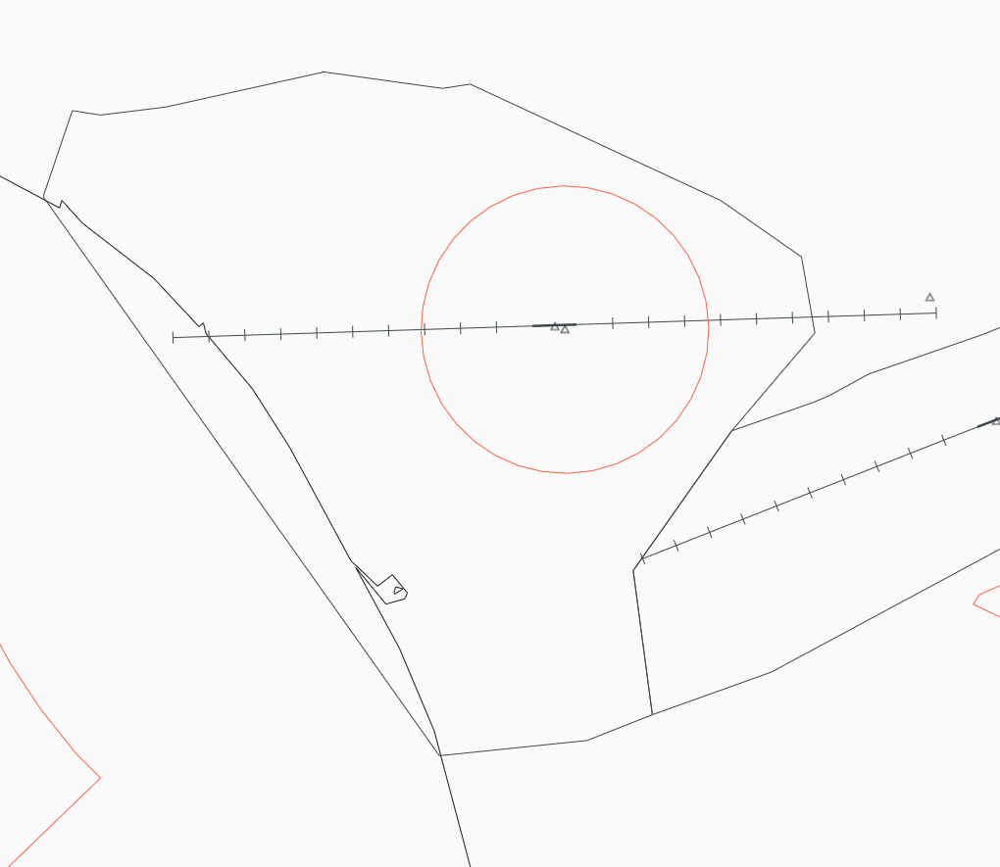

--8<-- "includes/abbreviations.md"

## Positions

| Position Name | Shortcode | Callsign        | Frequency | Login ID | Usage     |
| ------------- | --------- | --------------- | --------- | -------- | --------- |
| Ohakea SMC    | GOH       | Ohakea Ground   | 122.100   | NZOH_GND | Secondary |
| Ohakea ADC    | TOH       | Ohakea Tower    | 134.500   | NZOH_TWR | Primary   |
| Ohakea TMA    | OTMA      | Ohakea Approach | 125.100   | NZOH_APP | Primary   |

## Airspace

The Ohakea CTR follows the lateral boundaries as shown below from `SFC` to `A025`, and is designated as `Class D` airspace.

<figure markdown> 
  
  <figcaption>Ohakea Control Zone (CTR)</figcaption>
</figure>

## Areas of Resposibility

<figure markdown> 
  
  <figcaption>Ohakea Areas of Responsibility</figcaption>
</figure>

## Control Positions

### Ground

#### IFR Clearances

Controllers shall assign SIDs as suggested by the client. The `OH#S` and `OH#R` departures may be issued on request from an aircraft. An assigned heading shall be coordinated with OTMA where applicable.

#### Start up and Taxi

All departing VFR and IFR aircraft require start clearance.

All fixed wing aircraft shall be issued taxi clearance to a full length holding point, unless an intersection departure is requested by the pilot.

## Tower

For all circuit traffic - jet aircraft shall fly the circuit at `A017`, and all other aircraft shall fly the circuit at `A012`.

### IFR Arrivals

#### Instrument Approaches

As default for `RWY 09/27` the ILS shall be the nominated approach. For `RWY 15/33` as there is no ILS, `RNP` shall be the nominated approach. For any non-nominated approaches - OTMA shall coordinate with TOH. 

#### Visual Approaches

Aircraft shall be restricted to `A030` unless otherwise coordinated with OTMA.

## VFR Procedures

### Departures and Arrivals

Military VFR flights arriving or departing the CTR/D shall be cleared via [Transit South, or Transit North.](https://www.aip.net.nz/assets/AIP/Aerodrome-Charts/Ohakea-NZOH/NZOH_35.1_35.2.pdf){ target=new } Plain language may be issued to Military VFR aircraft where needed. 

### Helicopters

VFR Helicopter traffic shall be issued a [Helo Departure](https://www.aip.net.nz/assets/AIP/Aerodrome-Charts/Ohakea-NZOH/NZOH_52.3_52.4.pdf){ target=new } based on their direction of flight and where they are located on the aerodrome.

Helicopter traffic may operate in Southfield at any time.

## Noise Abatement

Except in an emergency or when on an authorised instrument approach procedure under IMC conditions, departing and arriving aircraft are to avoid
overflying Sanson (R092/1.5 NM OH VOR/DME) and Bulls (R325/2NM OH VOR/DME). To meet this requirement when operating from the most critical runways the following specific procedures are to be adhered to:

### Arrival — RWY 15 and RWY 27

VFR flights are not to overfly Sanson or Bulls. IFR Flights - When visual, if time permits, IFR flights are to remain visually clear of
Sanson and Bulls. However, when adverse weather
conditions exist, no departure from the published instrument approach
the procedure is expected.

## Level Restrictions for Departures

All IFR flights cleared at 11,000 ft or above:

- On tracks between radials 215 to 261 (inclusive) Ohakea VOR/DME — maintain 10,000 ft to 60 OH
- On all other tracks — maintain 10,000 ft to 30 OH

!!! Note
    The above level restrictions may be cancelled by OTMA once aircraft are airborne.

## Coordination

TOH shall coordinate all IFR departures with OTMA for a radar release, as well as an assigned heading where applicable.
