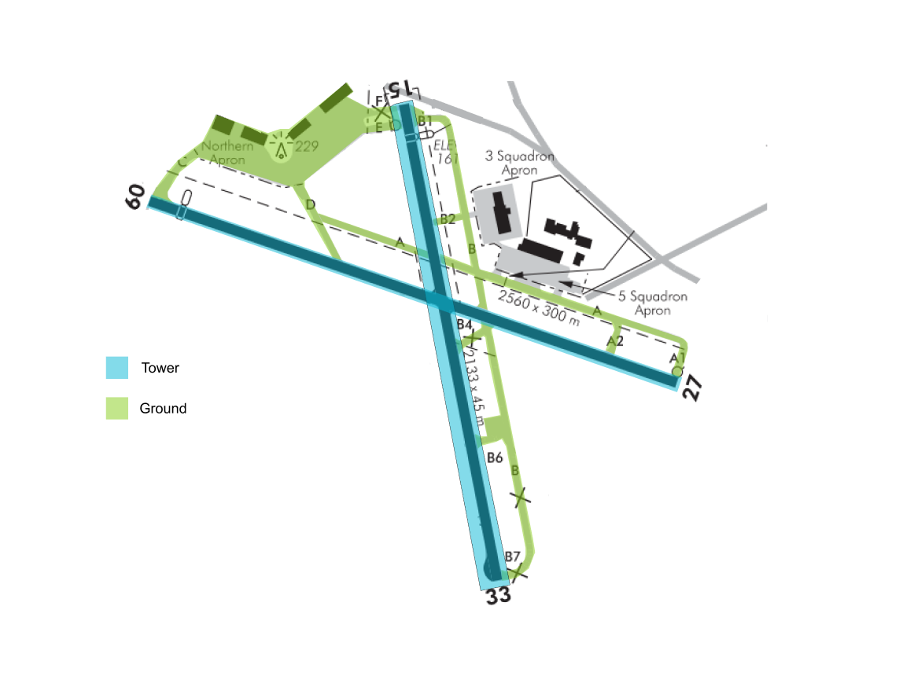

--8<-- "includes/abbreviations.md"

## Positions

| Position Name | Shortcode | Callsign      | Frequency | Login ID | Usage     |
| ------------- | --------- | ------------- | --------- | -------- | --------- |
| Ohakea SMC    | GOH       | Ohakea Ground | 122.100   | NZOH_GND | Secondary |
| Ohakea ADC    | TOH       | Ohakea Tower  | 134.500   | NZOH_TWR | Primary   |

## Airspace

The Ohakea CTR follows the lateral boundaries as shown below from `SFC` to `A025`, and is designated as `Class D` airspace.

<figure markdown> 
  
  <figcaption>Ohakea Control Zone (CTR)</figcaption>
</figure>

## Areas of Resposibility

<figure markdown> 
  
  <figcaption>Ohakea Areas of Responsibility</figcaption>
</figure>

## Control Positions

### Ground

#### IFR Clearances

Controllers shall assign SIDs as suggested by the client. The `OH#S` and `OH#R` departures may be issued on request from an aircraft. An assigned heading shall be coordinated with OTMA where applicable.

#### Start up and Taxi

All departing VFR and IFR aircraft require start clearance.

All fixed wing aircraft shall be issued taxi clearance to a full length holding point, unless an intersection departure is requested by the pilot.

## Tower

For all circuit traffic - jet aircraft shall fly the circuit at `A017`, and all other aircraft shall fly the circuit at `A012`.

## VFR Procedures

### Departures and Arrivals

Miliary VFR flights arriving or departing the CTR/D shall be cleared via [Transit South, or Transit North.](https://www.aip.net.nz/assets/AIP/Aerodrome-Charts/Ohakea-NZOH/NZOH_35.1_35.2.pdf) Plain language may be issued to Military VFR aircraft where needed and shall be issued to all civillian aircraft.

### Helicopters

VFR Helicopter traffic shall be issued a [Helo Departure](https://www.aip.net.nz/assets/AIP/Aerodrome-Charts/Ohakea-NZOH/NZOH_52.3_52.4.pdf) based on their direction of flight and where they are located on the aerodrome.

Helicopter traffic may operate in Southfield at any time.

## Coordination

OTMA shall coordinate any non nominated approaches with TOH. Note - Military aircraft will often fly an approach for a non nominated runway, then circle to land the nominated runway.

TOH shall coordinate any IFR departure with OTMA for a radar release. And assigned heading where appliciable.
