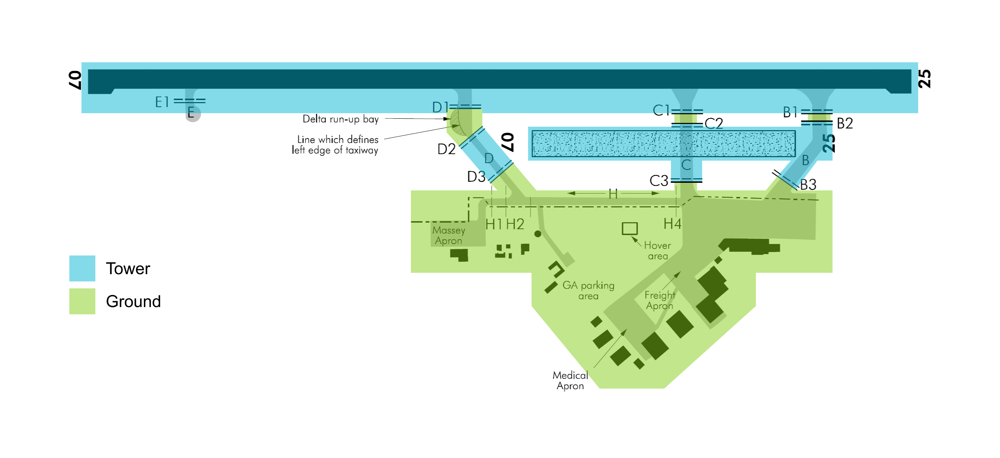
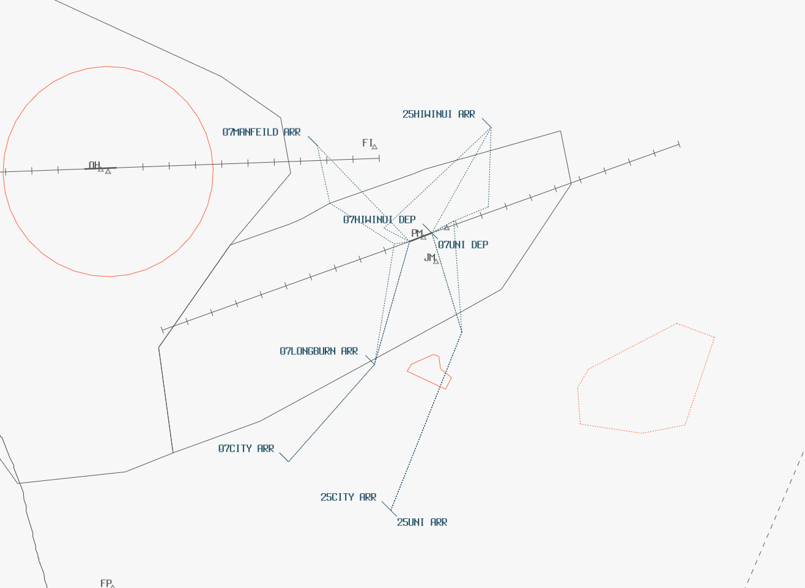

--8<-- "includes/abbreviations.md"

# NZPM - Palmerston North

| Position             | Callsign                | Frequency | Login    | Type      |
| -------------------- | ----------------------- | --------- | -------- | --------- |
| Palmerston North ADC | Palmerston North Tower  | 120.6     | NZPM_TWR | Primary   |
| Palmerston North SMC | Palmerston North Ground | 121.7     | NZPM_GND | Secondary |

## Areas of Responsibility

The areas of responsibilty are as depicted below. The areas of Taxiways `B`, `C` and `D` that fall under Tower's responsibility only apply if Grass 07/25 is in use. If not in use, this area shall be delegated to Ground.

If Grass 07/25 is in use, aircraft taxiing for the sealed must be handed off before reaching the `B3`, `C3` or `D3` holds.

Tower shall hand off all aircraft once clear of the sealed runway. If the grass runway is in use, they shall be handed to Ground when passing `B3`, `C3` or `D3`.

<figure markdown> 
  
  <figcaption>Palmerston North Areas of Responsibility</figcaption>
</figure>

## Taxiways

Taxiways `D` and `H` are only suitable for light GA aircraft. B733 and B734 to use Taxiway `C` to transit between `RWY 07/25` and stand 7. A320 and B738 aircraft restricted to Taxiway `B` when transiting between RWY 07/25 and main apron.

All other traffic shall enter the runway closest to the take-off roll position. For example, if Runway 25 is active, aircraft should be instructed to enter the runway via Taxiway `B`.

## Airspace

The Palmerston North CTR follows the lateral boundaries as shown below from `SFC` to `A015`, and is designated as `Class D` airspace.

<figure markdown> 
  
  <figcaption>Palmerston North Control Zone (CTR)</figcaption>
</figure>

## SIDs and STARs

Due to the surrounding MOAs, NZPM has numerous SIDs and STARs to either reroute traffic around, or climb aircraft above, the active MOAs. These limitations only apply to aircraft arriving from and departing to the North.

### Runway 07

The preferred departure for IFR aircraft tracking via `OMBUB` is the `TEROT #Q`, due to the relatively direct nature. For other departure directions, issue the suggested SID.

The below table outlines the prohibited procedures when the respective MOA is active.

| Active MOA(s) | MOA Vertical Limits | Prohibited SIDs                  | Prohibited STARs | Reasoning                        |
| ------------- | ------------------- | -------------------------------- | ---------------- | -------------------------------- |
| M311 - Bulls  | `A015` - `A025`     | None                             | `BUVLI #B`       | STAR descends through active MOA |
| M307 - Marton | `A080` - `FL200`    | `RUXOS #S` `DADLI #S` `TEROT #Q` | None             | SIDs climbs through active MOA   |

### Runway 25

The preferred departure for IFR aircraft tracking via `OMBUB` is the `GUTNI #R`, due to the relatively direct nature. For other departure directions, issue the suggested SID.

The below table outlines the prohibited procedures when the respective MOA is active.

| Active MOA(s) | MOA Vertical Limits | Prohibited SIDs | Prohibited STARs | Reasoning                     |
| ------------- | ------------------- | --------------- | ---------------- | ----------------------------- |
| M311 - Bulls  | `A015` - `A025`     | `GUTNI #R`      | None             | SID climbs through active MOA |
| M307 - Marton | `A080` - `FL200`    | `GUTNI #R`      | None             | SID climbs through active MOA |
