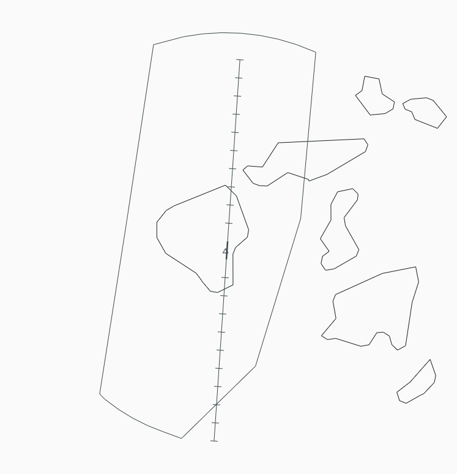
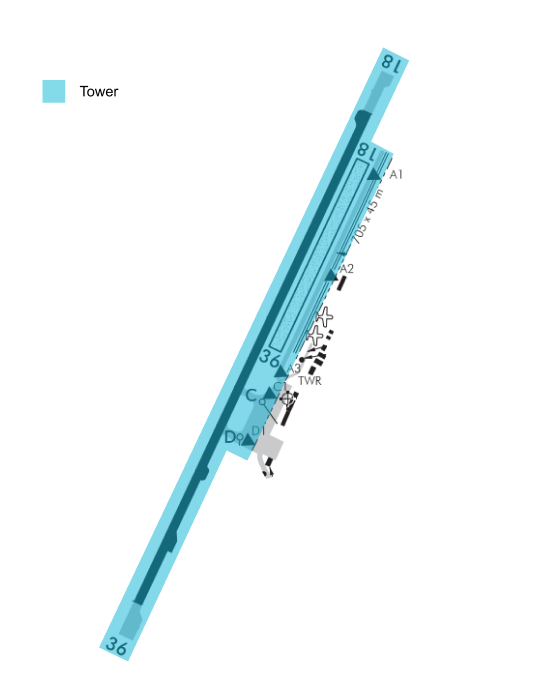

--8<-- "includes/abbreviations.md"

## Positions
| Position Name               | Shortcode | Callsign       | Frequency | Login ID   | Usage   |
| --------------------------- | --------- | -------------- | --------- | ---------- | ------- |
| Rotorua TWR                 | TRO       | Rotorua Tower  | 121.200   | NZRO_TWR   | Primary |
| Christchurch Control (Bay)  | BAY       | Bay Approach   | 119.500   | NZCH-B_CTR | Primary |

## Airspace

The Rotorua CTR follows the lateral boundaries as shown below from `SFC` to `A035`, and is designated as `Class D` airspace.

<figure markdown> 
  
  <figcaption>Rotorua Control Zone (CTR)</figcaption>
</figure>

## Area of Responsibility

<figure markdown> 
  
  <figcaption>Rotorua Areas of Responsibility</figcaption>
</figure>

## Clearances

Controllers shall assign SIDs as suggested by the client.

## Ground Movements

No aircraft should require pushback. However a start clearance is still required for IFR traffic. 

!!! note
    `C` may not be used by jet aircraft

Aircraft may be given a combined taxi/backtrack instruction.

!!! example "Enter and Backtrack Instruction"
    **ANZ231L**: *"ANZ231L, request taxi."*

    **Rotorua Tower**: *"ANZ231L, via D, enter backtrack and lineup RWY 18."*

## Tower 

### IFR Arrivals

Arriving IFR traffic shall contact TRO established inbound on an approach or when approaching the `CTR/D` on a visual approach. 

#### Instrument Approaches

The nominated approach for RWY `36` should always be `RNP B` and for RWY `18` it should always be `RNP Z`. 

## Coordination

BAY shall coordinate any non-nominated approaches including visual approaches with TRO. 
