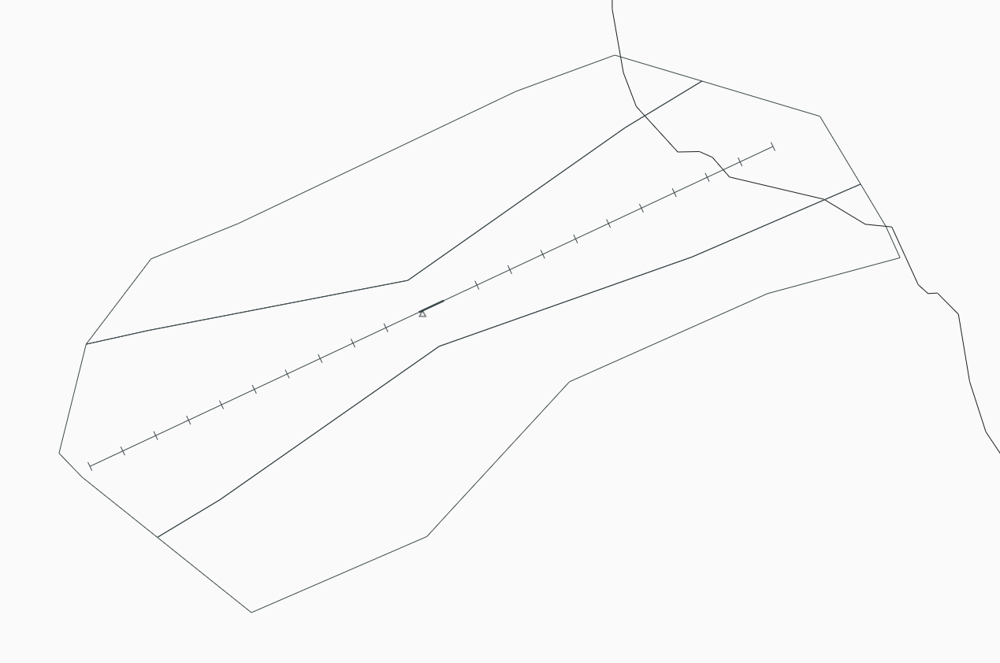
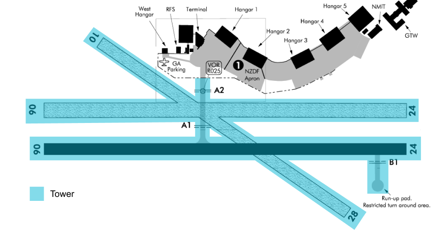

--8<-- "includes/abbreviations.md"

## Positions
| Position Name  | Shortcode | Callsign            | Frequency | Login ID | Usage   |
| -------------- | --------- | ------------------- | --------- | -------- | ------- |
| Woodbourne TWR | TWB       | Woodbourne Tower    | 118.100   | NZWB_TWR | Primary |
| Wellington TMA | WTMA      | Wellington Approach | 119.300   | NZWN_APP | Primary |

## Airspace

The Woodbourne CTR follows the lateral boundaries as shown below from `SFC` to `A035`, and is designated as `Class D` airspace.

<figure markdown> 
  
  <figcaption>Woodbourne Control Zone (CTR)</figcaption>
</figure>

## Area of Responsibility

<figure markdown> 
  
  <figcaption>Woodbourne Areas of Responsibility</figcaption>
</figure>

## Clearances

IFR clearances shall be issued as per normal.

Aircraft bound to NZWN or NZNS should be issued a STAR along side their clearance.

VFR traffic shall be issued one of the published VFR Departures and may be issued plain language in low levels of traffic.

## Ground Movements

No aircraft should require pushback. However a start clearance is still required for IFR traffic. 

Aircraft may be given a combined taxi/backtrack instruction.

!!! example "Enter and Backtrack Instruction"
    **ANZ758M**: *"ANZ730L, request taxi."*

    **Woodbourne Tower**: *"ANZ730L, via A1 cross all grass runways, enter backtrack and lineup RWY 06."*

## Tower 

### IFR Arrivals

Arriving IFR traffic shall contact TWB established inbound on an approach or when approaching the `CTR/D` on a visual approach. 

#### Instrument Approaches

The nominated approach should always be the RNP for 24. 

RWY 06 has a RNP (AR) approach avialvile but can't be nominated as the standard apporach. Controllers should use `Circling RNP RWY 24`

## Coordination

WTMA shall coordinate any non-nominated approaches including visual approaches with TWB. 
