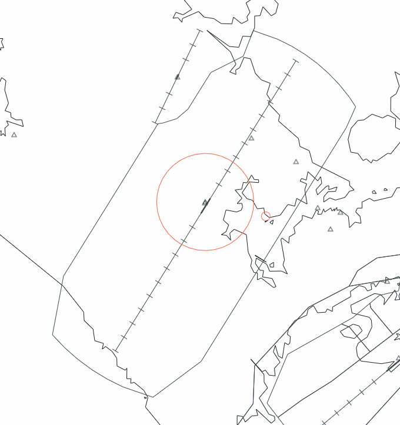
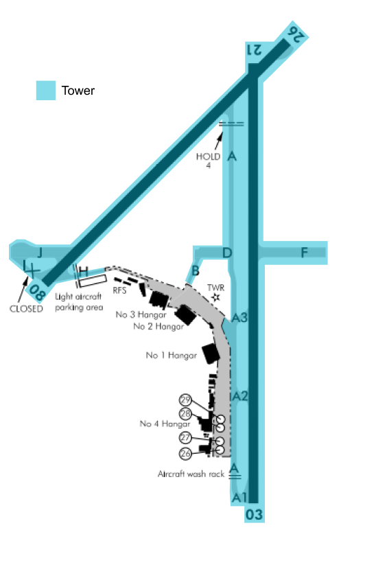

--8<-- "includes/abbreviations.md"

## Control Positions and Navaids

| Position Name    | Shortcode  | Callsign          | Frequency   | Login ID       | Usage      |
| ---------------- | ---------- | ----------------- | ----------- | ---------------| ---------- |
| Whenuapai ADC    | TWP        | Whenuapai Tower   | 134.500     | NZWP_TWR       | Primary    | 
| Auckland TMA     | ATMA       | Auckland Approach | 124.300     | NZAA_APP       | Primary    | 

## Airspace 

The Whenuapai CTR follows the lateral boundaries as shown below from `SFC` to `A025`, and is designated as `Class D` airspace.

<figure markdown> 
  
  <figcaption>Whenuapai Control Zone (CTR)</figcaption>
</figure>

## Area of Responsibility 

<figure markdown> 
  
  <figcaption>Whenuapai Areas of Responsibility</figcaption>
</figure>

## Clearances

IFR clearances shall be issued as per normal. Controllers shall use the client suggested SID however pilots may request a specific SID. If a Non-RNAV SID is required/requested TWP shall coordinate approcal with ATMA. 

As there are no published VFR procedures. Plain language clearances shall be used for VFR aircraft. 

## Ground Movements

Stands 18 to 23 are primarily used for helicopters, suitable for SH-2G and NH90 size. Stands 24 and 25 are also primarily used for helicopters, suitable for A109 size.

Any other stands may be used for any fixed wing aircraft. 

No aircraft should require pushback. However controllers shall note a start clearance is required for **both** IFR and VFR traffic.

Aircraft departing off `RWY 21` shall be taxiied to `Hold 4 A`. A backtrack is not required. An example of a line up clearance is - `Via RWY 08 Line Up RWY 21`

Aircraft departing off `RWY 03` shall be taxiied to `A1` however may be given an intersection departure if the pilot requests so. 

Helicopters may be departed via any intersection. 

Code C aircraft or larger may **not** use `RWY 08` for departure due to taxiway restrictions leading to the runway. 

## Tower

Controllers shall note for `RWY 03/21` the ILS shall always be the nominated approach. `RWY 08/26` shall only be nominated in the case of strong westerlies or easterlies and if so controllers shall nominate the `RNP` approach. 

Controllers shall treat `M107` as normal airspace, since there is no VSOA within New Zealand. 

### Departures

TWP shall conduct auto release and shall coordinate with ATMA where required for Non-RNAV SIDs etc. 

### Arrivals 

Arriving IFR traffic shall contact TWP established inbound on an approach or when approaching the CTR/D on a visual approach.

### Visual Approaches

Aircraft shall be restricted to `A030` unless otherwise coordinated with ATMA.

### VFR Operations

Circuit Altitudes are as follows:

- `B757`: `A016`
- All other fixed and rotary wing: `A011`

Only one circuit may have active aircraft at a time. Ie. If an aircraft is in the `RWY 21` circuit, an aircraft may not operate in the `RWY 26` circuit. 

`Grass 08/26` shall **only** be used for gliders. 

## Coordination

ATMA shall coordinate any non-nominated approaches with TWP. 
