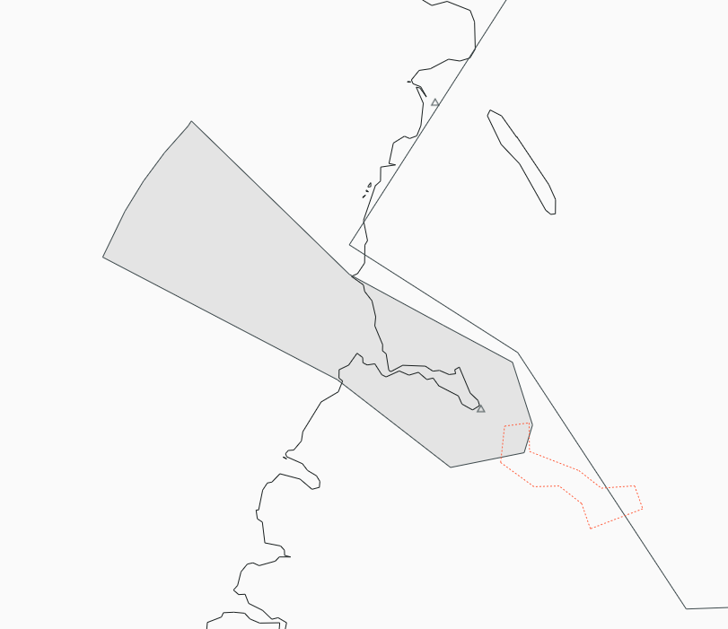

--8<-- "includes/abbreviations.md"

!!! Danger "Important"
    The following are designated as Event Only positions, and may only be staffed during a VATNZ event where approved, or if explicitly authorised by the Operations Director.

## Positions

| Position Name          | Shortcode | Callsign                                 | Frequency | Login ID | Usage      |
| ---------------------- | --------- | ---------------------------------------- | --------- | -------- | ---------- |
| Milford FIS | MFS      | Milford Flight Service / Milford Traffic             | 118.200   | NZMF_TWR | Event Only |

## Area of Responsibility

Milford Flight Service provides an Aerodrome Flight Information Service (AFIS) within the Milford Sound Common Frequency Zone (CFZ).

<figure markdown>
   
  <figcaption> Milford CFZ</figcaption>
</figure>

The AFIS area extends to `A110` within the published Milford Sound CFZ.

The Flight Service Operator is responsible for providing:

- Weather information.
- Traffic information.
- Relevant safety information.

!!! danger "Air Traffic Control"
    Flight Service Operators do **not** provide Air Traffic Control and shall **not** issue taxi, take-off or landing clearances.

## Standard Operations

!!! info "Scenic Flight Environment"
    Milford Sound is a busy scenic flying environment. Aircraft frequently operate at low level between visual reporting points within the CFZ.

    Flight Service Operators should maintain a good awareness of all reported traffic and provide relevant traffic information whenever required.

## Standard Phraseology

Refer to the **AFIS** [guide](../../controller-skills/flight-service.md#standard-phraseology).

## VFR Procedures

### Scenic Flight Operations

!!! note "Common Reporting Areas"
    Scenic flights commonly operate between:

    - Harrison River
    - Pembroke Junction
    - St Anne Point

    Traffic information should be passed to aircraft operating within these areas whenever appropriate.

## IFR Operations

!!! warning "IFR Operations"
    Milford Sound is primarily a VFR aerodrome. IFR procedures are not routinely provided by Milford Flight Service.

    Where IFR operations are required, coordinate with the overlying ATS unit as appropriate and refer to the **Paraparaumu Flight Service** procedures for IFR guidance.

## Frequency Changes

!!! note
    As Flight Service is an advisory service, formal handoffs are not required.

    Aircraft leaving the CFZ will normally:

    - Change to the **VATSIM Advisory Frequency** when remaining outside controlled airspace.
    - Contact the appropriate ATS unit when entering controlled airspace (CTA).

    If an aircraft remains on the Flight Service frequency after leaving the CFZ, remind the pilot to change to the appropriate frequency.
