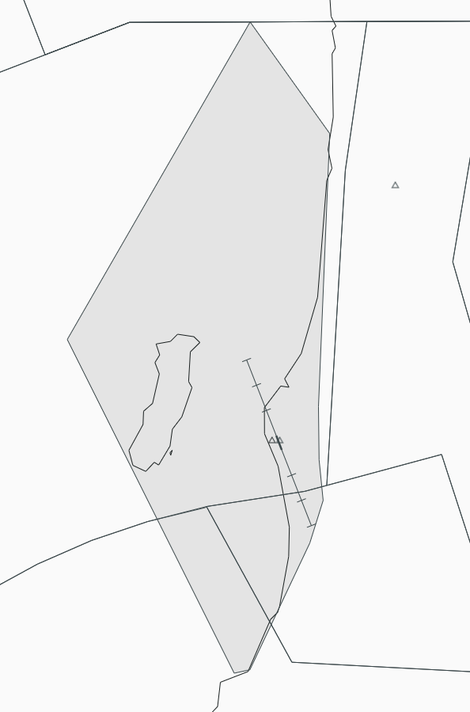

--8<-- "includes/abbreviations.md"

!!! Danger "Important"
    The following are designated as Event Only positions, and may only be staffed during a VATNZ event where approved, or if explicitly authorised by the Operations Director.

## Positions

| Position Name              | Shortcode | Callsign                                         | Frequency | Login ID | Usage      |
| -------------------------- | --------- | ------------------------------------------------ | --------- | -------- | ---------- |
| Paraparaumu Flight Service | PFS       | Paraparaumu Flight Service / Paraparaumu Traffic | 118.300   | NZPP_TWR | Event Only |

!!! note "Pronunciation"
    The unofficial real-world pronunciation of **Paraparaumu** is **"Paraparam"**, and this pronunciation should be used on the network.

## Area of Responsibility

Paraparaumu Flight Service provides an Aerodrome Flight Information Service (AFIS) within the Paraparaumu MBZ.

<figure markdown>
   
  <figcaption> Paraparaumu MBZ</figcaption>
</figure>

The AFIS area extends:

- Below **4500 ft** north of NZPP.
- Below **2500 ft** and **3500ft** south of NZPP (the lower limit of the Wellington CTA).

The Flight Service Operator is responsible for providing:

- Weather information.
- Traffic information.
- Relevant safety information.
- Relaying IFR clearances

## Standard Phraseology

Refer to the **AFIS** [guide](../../controller-skills/flight-service.md#standard-phraseology).

## VFR Procedures

### Preferred Arrival and Departure Routes

VFR aircraft should use the published preferred arrival and departure routes whenever practicable.

[AIP Chart refers](https://www.aip.net.nz/assets/AIP/Aerodrome-Charts/Paraparaumu-NZPP/NZPP_35.3_35.4.pdf){ target=new }

### Circuit Operations

Pilots should remain on the Flight Service frequency whilst taxiing, operating within the circuit and manoeuvring within the MBZ.

## IFR Operations

### IFR Departures

Paraparaumu Flight Service may relay IFR clearances issued by Wellington Approach.

Clearances remain **invalid** until Wellington Approach advises that they are released.

### IFR Arrivals

Aircraft conducting instrument approaches should remain with Wellington Approach until instructed to contact Paraparaumu Flight Service.

Once established within the MBZ, provide weather information and any relevant traffic information.

## Coordination

### IFR Departure Clearance

Prior to relaying an IFR clearance, Paraparaumu Flight Service shall obtain the clearance from Wellington Approach.

!!! example "Coordination For Clearance"
    **Paraparaumu Flight Service** -> **Wellington Approach**: "Clearance Request KVY, GUGAK6 Departure, KAMET Transition, at 5000 feet, Runway 34."  
    **Wellington Approach** -> **Paraparaumu Flight Service**: "KVY, Approved."

!!! example "Coordination For Release" 
    **Paraparaumu Flight Service** -> **Wellington Approach**: "Request Release KVY"  
    **Wellington Approach** -> **Paraparaumu Flight Service**: "KVY Released"

## Frequency Changes

As Flight Service is an advisory service, formal handoffs are not required.

Aircraft leaving the MBZ will normally change to:

- **Wellington Approach** when entering controlled airspace.
- **Paraparaumu Traffic** or **VATSIM ADVISORY FREQUENCY** when operating outside the MBZ.

If a aircraft remains on the Flight Service frequency after leaving the MBZ, remind the pilot to change to the appropriate frequency.