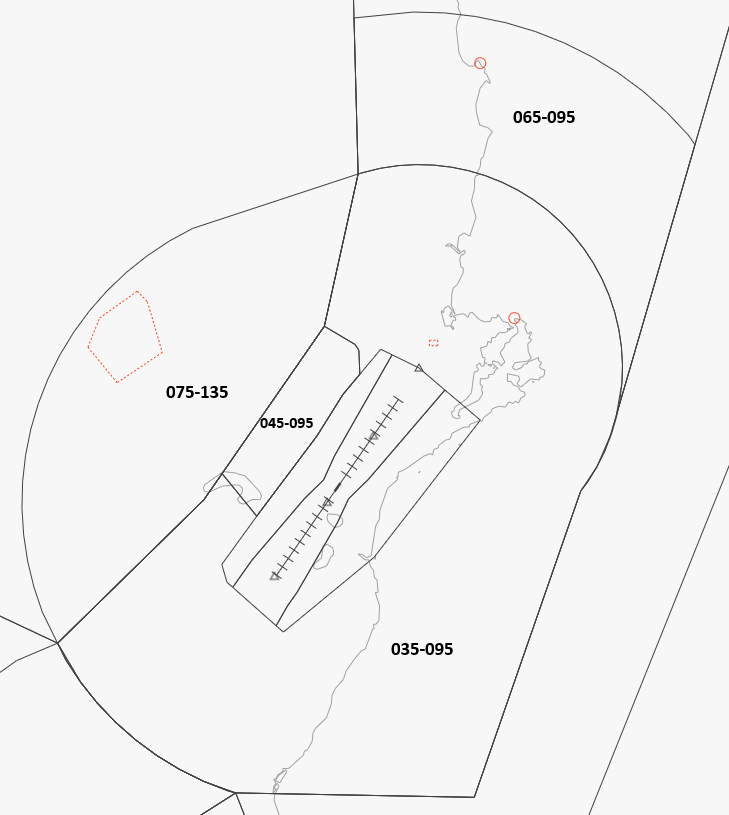
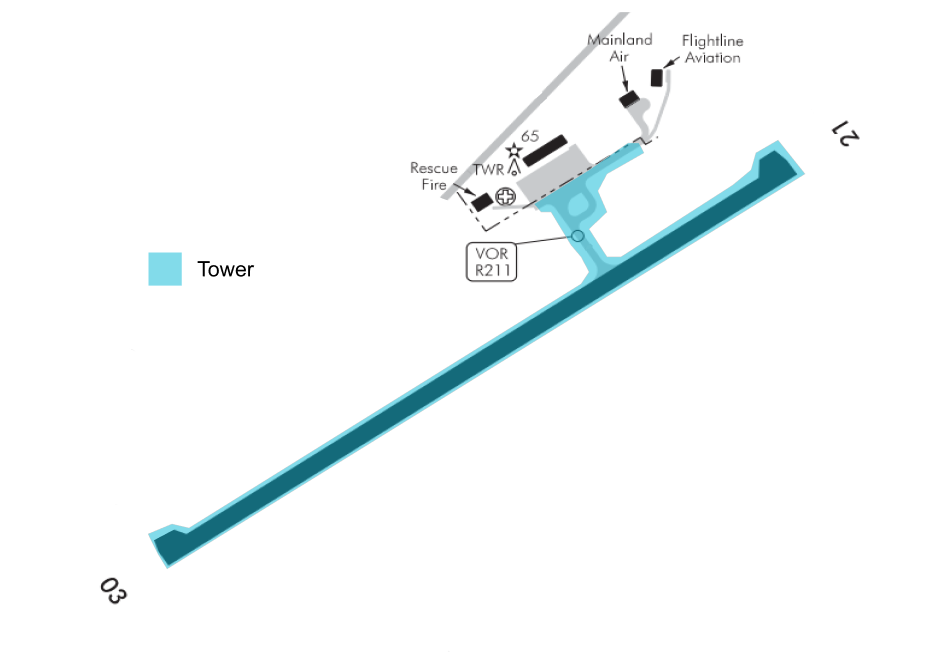

--8<-- "includes/abbreviations.md"

## Control Positions and Navaids

| Position Name  | Shortcode  | Callsign        | Frequency   | Login ID       | Usage      |
| -------------- | ---------- | --------------- | ----------- | ---------------| ---------- |
| Dunedin ADC    | TDN        | Dunedin Tower   | 120.700     | NZDN_TWR       | Primary    |

## Airspace

The Dunedin CTR/D follows the inner lateral boundaries shown below from `SFC` to `A035`. The CTR/D is comprised of three sectors - the West, East and Instrument sectors. 

The wider Dunedin CTA/D follows the outer boundaries as shown below, with the vertical boundaries also listed in their respective sector. Dunedin's airspace tops out at `A095`, except for the western portion of CTA/D, which tops out at `A135`. 

Dunedin Tower provides a Procedural Approach service for the wider CTA/D.

<figure markdown>
   
  <figcaption>Dunedin Control Zone (CTR/D) and Control Area (CTA/D)</figcaption>
</figure>

## Areas of Responsibility

Dunedin's main apron has five stands, two of those with jetways. TWY `C` leads to the Mainland Air and Flightline Aviation hangars. 

In addition to all taxiways and runways, Dunedin Tower has responsibility for the main apron, with the exception of the taxiway east of the Mainland Air hangar.

<figure markdown>
   
  <figcaption>Dunedin Areas of Responsibility</figcaption>
</figure>

## Pushback and Taxi

Pushback and start-up clearance from stand one to five is managed by Tower. Controllers can make use of a "tail-facing" instruction to manage direction of pushback. Aircraft operating east of the Mainland Air hangar are required to contact Tower prior to passing the `C2` hold for taxi instructions.

Aircraft may be given a combined taxi/backtrack instruction. When RWY 21 is in use, an intersection departure is available.

Controllers should make use of the holding point on TWY `B` to allow for multiple runway movements.

!!! example "Enter and Backtrack Instruction"
    **ANZ758M**: *"ANZ758M, request taxi."*

    **Dunedin Tower**: *"ANZ758M, enter backtrack and lineup RWY 21."*

!!! example "Taxi Instruction using the `B` hold"
    **ZK-ELT**: *"ELT, request taxi."*

    **Dunedin Tower**: *"ELT, taxi and hold on `B` for arriving A320. Once passed, enter backtrack and linup RWY 21"*

## Departures

IFR traffic departing via BIDEL shall be handed off to STH either crossing BIDEL or passing `A095`. Other IFR departures shall be handed off either crossing the lateral boundary of the airspace or when passing the upper limit of `A095` or `A135`.

### Initial Climb Level

Dunedin Tower shall only climb aircraft to a maximum altitude of `FL250`. Aircraft with an RFL higher than `FL250` can expect higher climb once handed over.

!!! example "Intermediate Climb"
    **ANZ622**: *"ANZ622, airborne passing 1,300 feet"*

    **Dunedin Tower**: *"ANZ622, climb via the SID, intermediate flight level 250"*

### DCL

Dunedin Tower may issue a clearance via DCL for any departing jets. All prop aircraft shall automatically revert to voice.

### SID Assignment

| Runway | Procedure  | Allowed A/C Categories | Notes                                                                                                                                     |
| ------ | ---------- | ---------------------- | ----------------------------------------------------------------------------------------------------------------------------------------- |
| 21     | `BIDEL #Q` | Cat A to C             | **Preferred departure for northern-bound aircraft via `BIDEL`.**                                                                          |
| 21     | `BIDEL #S` | Cat A to D             | More track miles to `BIDEL`, can be issued in the event of consecutive departures via `BIDEL`.                                            |
| 21     | `BASOS #Q` | Cat A to D             | **Preferred departure for `QN` and western-bound international traffic.**                                                                 |
| 21     | `AKPIN #Q` | Cat A to D             | **Preferred departure for southern-bound traffic.**                                                                                             |
| 21     | `ALBOX #Q` | Cat A to D             | Secondary departure for southern-bound traffic                                                                                                  |
| 21     | `OCEAN #`  | Cat A to D             | To `OREXI` and `SW`. Non-RNAV.                                                                                                            |
| 21     | `BE #A`    | Cat A to D             | To `OREXI`. Non-RNAV.                                                                                                                     |
| 21     | `BE #B`    | Cat A to D             | To `PORUT`. Non-RNAV.                                                                                                                     |

| Runway | Procedure  | Allowed A/C Categories | Notes                                                                                                                                     |
| ------ | ---------- | ---------------------- | ----------------------------------------------------------------------------------------------------------------------------------------- |
| 03     | `BIDEL #P` | Cat A to D             | **Preferred departure for northern-bound aircraft via `BIDEL`.**                                                                          |
| 03     | `BIDEL #R` | Cat A to D             | More track miles to `BIDEL`, can be issued in the event of consecutive departures via `BIDEL`.                                            |
| 03     | `BASOS #P` | Cat A to D             | **Preferred departure for `QN` and western-bound international traffic.**                                                                 |
| 03     | `AKPIN #P` | Cat A to D             | **Preferred departure for `NV` traffic.**                                                                                                 |
| 03     | `SOUTH #`  | Cat A to D             | To `OREXI` and `PORUT`. Non-RNAV.                                                                                                         |
| 03     | `SWAMPY #` | Cat A to D             | To `BIDEL`, `MEGUG` `MIPAK`, `PORUT` and `QN`. Non-RNAV.                                                                                  |

### Visual Departures

When RWY 03 is in use, Tower may issue northern-bound aircraft a visual departure direct to `BIDEL` at pilot's request. 

When RWY 21 is in use, Tower may issue aircraft cleared the `BIDEL #Q`or `BIDEL #S` a visual departure to `ATGUB` or `IDLIK` at pilot's request.

!!! example "Visual Departure"
    **Dunedin Tower**: *"ANZ758M, re-cleared a visual departure, left turn direct `ATGUB` to re-join the SID."*

## Arrivals

STH will issue STARs without coordination with Dunedin Tower. 

Dunedin Tower may request aircraft be issued the `MIPAK #C` arrival for RWY 03 when prevailing winds are from the north-west, or when requested by the pilot. This may be changed on initial contact.

### Runway 21

All arrivals terminate at `ESKAT`, which is the IAF for the RNAV and ILS approach. 

### Runway 03

All arrivals terminate at `AKLAR`, which is the IAF for the RNAV and ILS approach.

## VFR Procedures

### Arrivals
In order to lessen the amount of instructions given to VFR traffic, the Controller shall issue a published VFR arrival where possible. Once the Pilot reports overhead the respective VRP, Dunedin Tower shall issue circuit joining instructions. [Refer to AIP chart for VFR arrivals](https://www.aip.net.nz/assets/AIP/Aerodrome-Charts/Dunedin-NZDN/NZDN_35.1_35.2.pdf){ target=new }.

### Departures
In order to lessen the amount of instructions given to VFR traffic, the Controller shall issue one of the VFR Departure Procedures where possible, otherwise a more plain language clearance may be issued. [Refer to AIP chart for VFR departures](https://www.aip.net.nz/assets/AIP/Aerodrome-Charts/Dunedin-NZDN/NZDN_64.1_64.2.pdf){ target=new }.

## NZTI - Taieri

Taieri is a small, uncontrolled GA aerodrome located 8nm Northeast of NZDN. Aircraft may operate within the Taieri circuit and within 3nm of the aerodrome below `A011` without reference to ATC. Aircraft departing Taieri shall receive clearance and departure instructions from Dunedin Tower prior to departure.

!!! info
    VFR aircraft bound for Taieri are to be handed off to UNICOM approaching the aerodrome. A good rule of thumb for aircraft coming from the North, South or the city is to hand them off as they enter the Taieri Plains valley.

## Coordination

### STH

Tower is normally not required to advise STH of any departing IFR traffic, and may conduct a silent handover when aircraft crosses the common boundary, or when approaching the top of Tower's CTA. Except where previously coordinated, IFR aircraft shall cross the common airspace boundary overhead an IFR waypoint, or established on an airway.

All VFR traffic handovers shall be coordinated with STH. 

### NV TWR

Tower shall coordinate all traffic handovers with NV TWR, and shall advise the aircraft's current and cleared altitude, and estimated time that they will be crossing the common airspace boundary. 