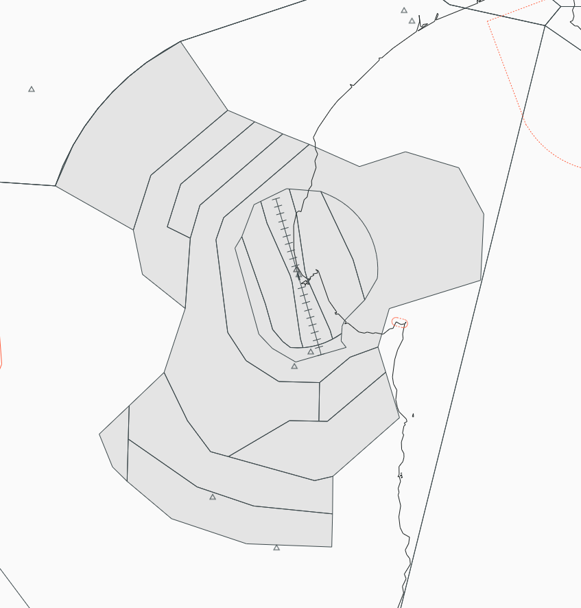
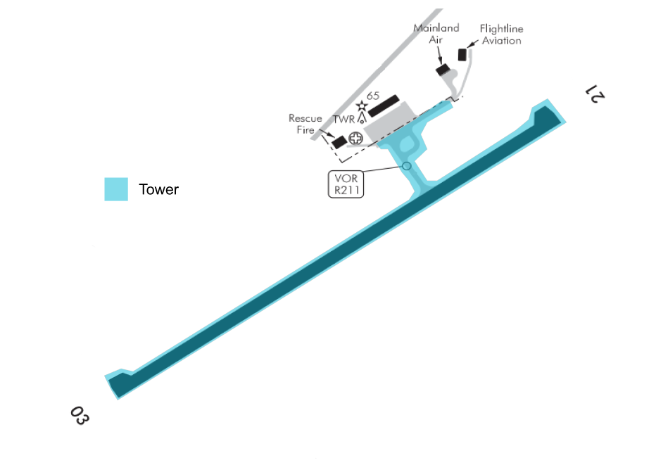

--8<-- "includes/abbreviations.md"

## Control Positions and Navaids

| Position Name  | Shortcode  | Callsign        | Frequency   | Login ID       | Usage      |
| -------------- | ---------- | --------------- | ----------- | ---------------| ---------- |
| Napier ADC     | TNR        | Napier Tower    | 124.800     | NZNR_TWR       | Primary    |

## Airspace 

The Napier CTR/D follows the inner lateral boundaries shown below from `SFC` to `A025`. The CTR/D is comprised of three sectors - the West, East and Instrument sectors.

The wider Napier CTA/D follows the outer boundaries as shown below, with the vertical boundaries also listed in their respective sector. Napier's airspace tops out at `A095`. 

Napier Tower provides a Procedural Approach service for the wider CTA/D.

<figure markdown>
   
  <figcaption>Napier Control Zone (CTR/D) and Control Area (CTA/D)</figcaption>
</figure>

## Areas of Responsibility

Napier's main apron has seven stands. With Skyline hangars at the northern end. 

Napier tower only has responsibility from the holding points out to the runway, as depicted to below.

<figure markdown>
   
  <figcaption>Napier Areas of Responsibility</figcaption>
</figure>

## Pushback and Taxi

Start up clearance shall be issued as per normal.

Taxi clearance can be given as `Via XX backtrack and line up runway XX`. If there is a possible traffic conflict, traffic shall be held as needed. Ie B2 if there is Grass RWY traffic or B2 if there is no Grass RWY traffic. 

Traffic not parked on the main apron shall be taxiied as required to the runway. It is up to the controller to determine the intersection for the aircraft to enter the RWY on. 

## Departures

Departing IFR traffic shall be handed to OHA passing `A080` if cruising at `A100` or above, using the following phraseology `Passing 8000 contact Ohakea 126.2`. For aircraft crusing at `A100` or below shall be instructed to contact OHA at 30 NR DME....`At 30 miles contact OHA 126.2`.  

SIDs shall be assigned as suggested by the controller client or by pilot request. Visual departures may be issued as requested too. 

## Arrivals

OHA shall issues STARs without coordination. 

Aicraft shall be handed from OHA at the STAR originating waypoint. Ie. `BITIL`. Or if Non-RNAV then at 30 NR DME. 

OHA shall hand aircraft over at the following waypoints if issued and RNAV STAR. 

| Handover Waypoint | STAR Origin Waypoint    | 
| ----------------- | ------------------------|
| OBDEV             | GENDA                   | 
| RIDLA             | OPAPA                   | 
| SELDU             | BITIL                   | 
| DOMON             | POTEX                   |

## VFR Procedures

To help manage traffic, Seaport VRP may be used to hold aircraft out of the circuit. As well as the east and west sectors. 

### Arrivals
In order to lessen the amount of instructions given to VFR traffic, the Controller shall issue a published VFR arrival where possible. Once the Pilot reports overhead the respective VRP, Napier Tower shall issue circuit joining instructions. [Refer to AIP chart for VFR arrivals](https://www.aip.net.nz/assets/AIP/Aerodrome-Charts/Napier-NZNR/NZNR_35.1_35.2.pdf){ target=new }.

### Departures
In order to lessen the amount of instructions given to VFR traffic, the Controller shall issue one of the VFR Departure Procedures where possible, otherwise a more plain language clearance may be issued. [Refer to AIP chart for VFR departures](https://www.aip.net.nz/assets/AIP/Aerodrome-Charts/Napier-NZNR/NZNR_64.1_64.2.pdf){ target=new }.

## Coordination

### OHA

As stated earlier OHA shall issue STAR clearances without coordination. Any request for a non-nominated approach shall be coordinated with TNR. 