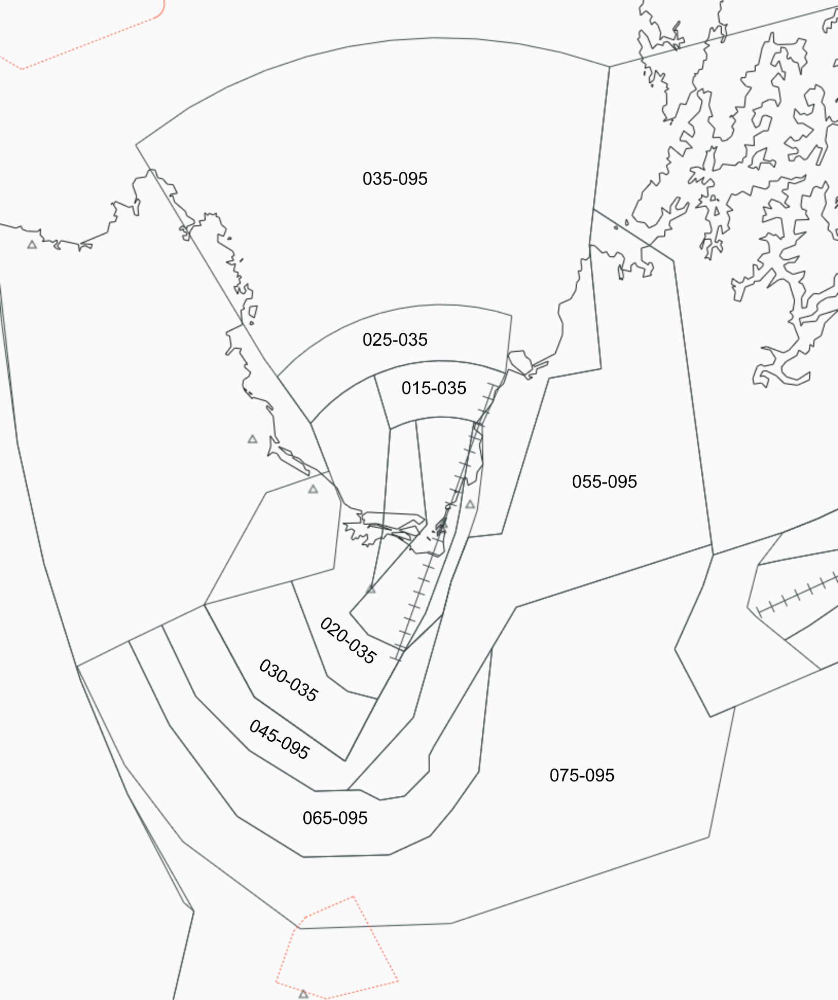
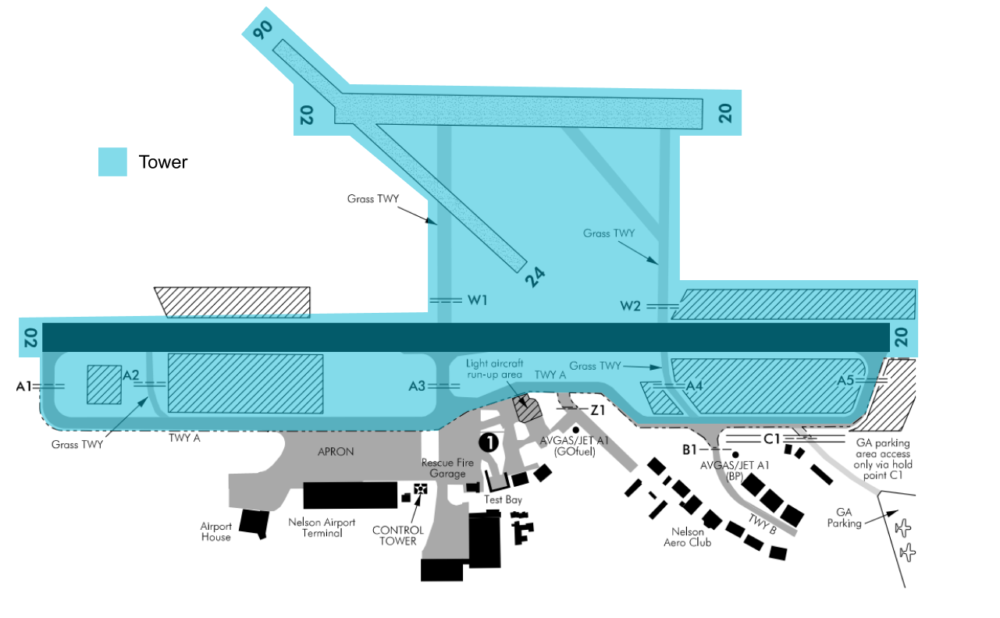

--8<-- "includes/abbreviations.md"

## Control Positions and Navaids

| Position Name  | Shortcode  | Callsign        | Frequency   | Login ID       | Usage      |
| -------------- | ---------- | --------------- | ----------- | ---------------| ---------- |
| Nelson ADC     | TNS        | Nelson  Tower   | 124.700     | NZNS_TWR       | Primary    |
| Nelson DLV     | DNS        | Nelson Delivery | 123.300     | NZNS_DEL       | Secondary  |

## Airspace

The Nelson CTR/D follows the inner lateral boundaries shown below from `SFC` to `A035`. The CTR/D is comprised of three sectors - the West, East and Instrument sectors. 

The wider Nelson CTA/D follows the boundaries as shown below, with the vertical boundaries listed in their respective sector. Nelson Tower's airspace has an upper limit of `A095`. 

Nelson Tower provides a Procedural Approach service for the wider CTA/D.

<figure markdown>
   
  <figcaption>Nelson Control Zone (CTR/D) and Control Area (CTA/D)</figcaption>
</figure>

## Areas of Responsibility

Nelson's main apron has eleven stands. TWY `A` connects the main apron to the rest of the aerodrome.

The majority of General Aviation aircraft will originate down TWY `B` or TWY `C`. These areas are outside the controlled movement area, meaning aircraft will often taxi up to `B1` or `C1` prior to contacting you.

Nelson Tower has responsibility for all operations to the west of TWY `A`. Anything east of TWY `A` is uncontrolled, with the exclusion of the main apron.

<figure markdown>
   
  <figcaption>Nelson Areas of Responsibility</figcaption>
</figure>

## Start-up and Taxi

Start-up clearance on the main apron is managed by Nelson Tower. Pushback is not required for any stands at Nelson, however, depending on scenery, some pilots may still request it. Aircraft operating on TWY `B` and TWY `C` are required to contact Nelson Tower prior to reaching `B1` and `C1` respectively.

## Use of Holding Points

Aircraft may depart from any runway intersection that the Pilot deems suitable. Controllers may apply the following rules without coordination from the Pilot.

| Type             | Runway 02 | Runway 20 |
|------------------|:---------:|:---------:|
| Turboprops       |    `A1`   |    `A5`   |
| General Aviation |`A1 or A2` |`A4 or A5` |

!!! important "Usage of the A2 and A4 Holding Points"
    The `A2` and `A4` are grass holding points. Usage is not suggested during periods when the grass may be wet.

### Usage of TWY A at Night

TWY `A` north of holding point `A3` does not have any taxiway lighting. Due to this, aircraft usually backtrack runway 02/20 during night hours, vacating the runway via `A3`. Backtrack instructions may be given with taxi instructions. It is at the controller's discretion if they wish to use this procedure.

## IFR Departures

IFR departures may be handed off to NAK or KAI (dependent on direction) at either their transition waypoint or passing `A095`. With coordination, aircraft may be handed off early passing `A070`.

Many of the Nelson SIDs contain various altitude restrictions to prevent departures from conflicting with any arriving aircraft. If there is no reported traffic, these restrictions may be cancelled.

!!! example "Cancelling altitude restrictions on the SID"
    **Nelson Tower**: *"ANZ524L, climb unrestricted to `A110`."*                                                                                      
    **ANZ524L**: *"Climb unrestricted to `A110`, ANZ524L."*

### SID Assignment

| Runway | Procedure  | Allowed A/C Categories | Notes                                                                                                                                     |
| ------ | ---------- | ---------------------- | ----------------------------------------------------------------------------------------------------------------------------------------- |
| 02     | `DUMIK #P` | Cat A to C             | **Preferred departure for western-bound traffic.**                        |
| 02     | `IDNIM #P` | Cat A to C             | **Preferred departure for southern-bound traffic.** Airspace containment not guaranteed between `RIKRU` and `DUMIK`. |
| 02     | `LUSRA #P` | Cat A to C             | **Preferred departure for eastern-bound traffic towards `LUSRA`.**  |
| 02     | `LEMUT #Q` | Cat A to C             | **Preferred departure for northern-bound traffic.**         |
| 02     | `LUSRA #R` | Cat A to C             | Offers more track miles to `LUSRA`. May be used for consecutive departures however separation must still be applied.                                                                                 |
| 02     | `ZULU #`   | Cat A to C             | Non-RNAV departure to the north. Aircraft tracking to `SIMZI` or `LUBSI` may require a hold-down at `A070` until established for separation. |
| 02     | `YANKEE #`    | Cat A to C             | Non-RNAV departure to the south. Cruising altitude must be `A080` or above. |

| Runway | Procedure  | Allowed A/C Categories | Notes                                                                                                                                     |
| ------ | ---------- | ---------------------- | ----------------------------------------------------------------------------------------------------------------------------------------- |
| 20     | `NESTA #Q` | Cat A to C            | **Preferred departure for southern-bound traffic.** |
| 20     | `PAVNI #Q`  | Cat A to C             | **Preferred departure for northern and eastern-bound traffic.** |
| 20     | `LUSRA #Q` | Cat A to C             | **Preferred departure for eastern-bound traffic towards `LUSRA`.**           |
| 20     | `CONOR #Q` | Cat A to C             |                                                                           |
| 20     | `BISEB #Q` | Cat A to C             |            |
| 20     | `DUMIK #Q` | Cat A to C             |  |                                                           |
| 20     | `LUSRA #U` | Cat A to C             | Offers more track miles to `LUSRA`. May be used for consecutive departures however separation must still be applied. |
| 20     | `LUSRA #S` | Cat A to C             | Offers more track miles to `LUSRA`. May be used for consecutive departures however separation must still be applied.           |
| 20     | `XRAY #` | Cat A to C             | Non-RNAV departure to the south. Cruising altitude must be `A080` or above. Aircraft may require a hold-down until 10 NS DME for separation. |
| 20     | `VICTOR #` | Cat A to C             | Non-RNAV departure to the north.               |

### Track Shortening on SIDs

Nelson Tower may issue track-shortening on SIDs within their airspace without coordination with NAK or KAI. Aircraft can either be instructed to track to a different waypoint on the SID, or their initial enroute waypoint. It is important to ensure that separation and terrain avoidance are maintained, so this should only be done above the relevant MSA for the routing. The aircraft's tag must also be updated to ensure situational awareness for all controllers.

!!! example "Track-shortening on a SID"
    **Nelson Tower**: *"ANZ524L, passing `A047` track direct `NESTA` to rejoin the SID"*

### Visual Departures

Tower may issue a visual departure to an aircraft at the pilot's request. In this instance, for terrain avoidance, aircraft are advised to track as required prior to proceeding direct to their initial waypoint. Information may also be found on the relevant charts for each departure.

!!! example "Visual Departure"
    **Nelson Tower**: *"ANZ524L, re-cleared a visual departure, track as required direct `LUSRA` to re-join the SID."*

### STAR Clearance for NZWN & NZWB

As the flight time from Nelson to Wellington and Woodbourne (Blenheim) is so short, and to reduce pilot and controller workload, the controller shall include a STAR clearance for their destination in their departure clearance.

If online, Delivery or Tower shall coordinate with Wellington TMA to confirm the STAR prior to passing it on to aircraft.

!!! example "Clearance to Wellington"
    **Nelson Tower**: *"ANZ524L, Cleared Wellington 2 via SIMZI8A arrival at 11,000ft, LUSRA 2P departure, Squawk 5021"*

## IFR Arrivals

NAK and KAI will issue STARs without coordination with Nelson Tower, however Nelson Tower can request a specific STAR to be issued. Aircraft will ideally be handed over to Nelson Tower prior to the initial STAR waypoint, however aircraft should be handed over by `A095` at the latest. Wherever possible, it is preferred for handovers to occur passing a waypoint, however this may not always be the best option when altitude restrictions have been cancelled. Controllers are to use their discretion to determine when to hand an aircraft off.

### Runway 20

All arrivals for runway 20 terminate at `KAPUA`, `ELMAX` and `LIKMA`, which are the IAFs for the RNP B approach. These aircraft shall be descended to `A035` before being cleared for the approach

### Runway 02

Arrivals for the RNP Z approach terminate at `ESNED`, and arrivals for the RNP Y approach terminate at `ENKIN` and `MIBEV`. Aircraft for the RNP Z shall be descended to `A033`, and aircraft for the RNP Y shall be descended to `A039`.

## VFR Procedures

### Departures
In order to lessen the amount of instructions given to VFR traffic, the Controller shall issue one of the VFR Departure Procedures where possible, otherwise a more plain language clearance may be issued. 

VFR aircraft will commonly depart Nelson to the West. In this case, aircraft should be issued the Bridge Departure when Runway 20 is in use, and the Bay Departure when Runway 02 is in use. For other departures, [refer to AIP chart for VFR departures](https://www.aip.net.nz/assets/AIP/Aerodrome-Charts/Nelson-NZNS/NZNS_64.1_64.2.pdf){ target=new }.

### Arrivals
VFR aircraft arriving into Nelson should call Nelson Tower prior to entering the CTR/D. These aircraft shall be issued joining instructions as appropriate. 

!!! example "VFR Arrival Clearance"
    **ETR**: *"Nelson Tower, Echo Tango Romeo, Cessna 152, overhead Mapau at 1,500ft, request instructions to join, Alpha 1013."*                                                                  
    **Nelson Tower**: *"Echo Tango Romeo, Nelson Tower, join left base runway 02, 1,500ft or below."*                                                                                                 
    **ETR**: *"Join left base runway 02, 1,500ft or below, Echo Tango Romeo."*                                                                                                                                                

## Coordination

### NAK and KAI

Tower is normally not required to advise the NAK or KAI sectors of any departing IFR traffic, and may conduct a silent handover when aircraft crosses the common boundary, or when approaching the top of Tower's CTA. Except where previously coordinated, IFR aircraft shall cross the common airspace boundary overhead an IFR waypoint, or established on an airway. Aircraft may be handed over earlier, at `A070`, with prior coordination.

All VFR traffic handovers shall be coordinated with NAK and KAI. 