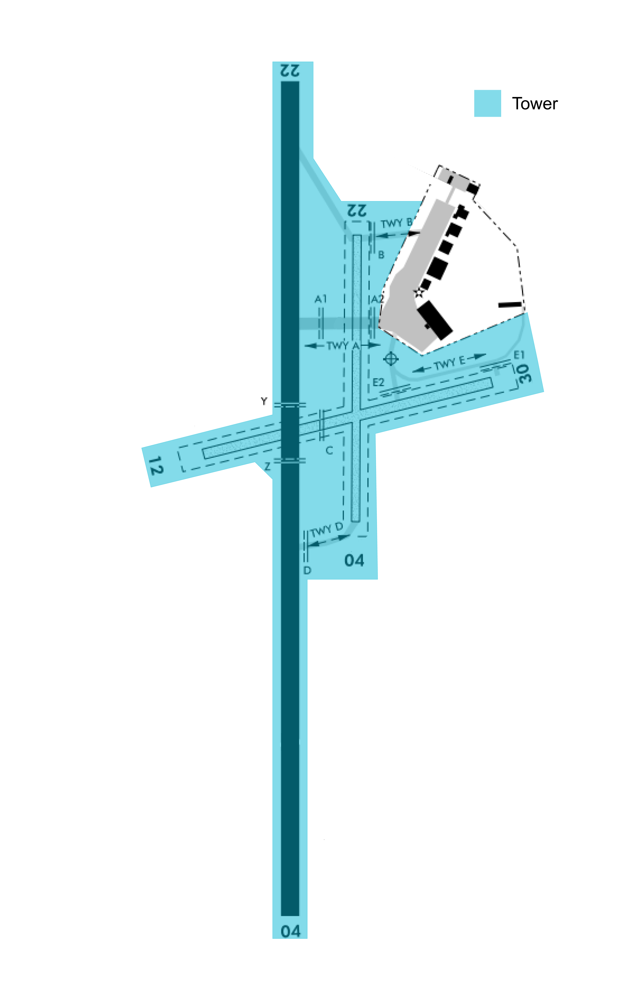

--8<-- "includes/abbreviations.md"

## Positions

| Position Name  | Shortcode  | Callsign        | Frequency   | Login ID       | Usage      |
| -------------- | ---------- | --------------- | ----------- | ---------------| ---------- |
| Invercargill ADC    | TNV        | Invercargill Tower   | 118.500     | NZNV_TWR       | Primary    |

## Airspace

The Invercargill CTR/D follows the inner lateral boundries shown below from `SFC` to `A015`. The CTR/D is comprised of three sectors - North, South and Instrument. 

The wider Invercargill CTA/D follows the outer boundaries as shown below, with the vertical boundaries also listed in their respective sector. Invercargill's airspace upper limit is `A095`.

Invercargill Tower provides a Procedural Approach service for the wider CTA/D and an uncontrolled service into Ryans Creek.

<figure markdown>
   
  <figcaption>Invercargill Control Zone (CTR/D) and Control Area (CTA/D)</figcaption>
</figure>

## Areas of Responsibility

Invercargill's main apron has five stands. The areas of responsibility are as depicted below.

<figure markdown>
   
  <figcaption>Invercargill Areas of Responsibility</figcaption>
</figure>

## Pushback and Taxi

Pushback and startup clearance from stand one to five is managed by Tower. Controllers can make use of a "tail-facing" instruction to manage direction of pushback. 

An aircraft may be given a combined taxi/backtrack instruction, Traffic permitting. Aircraft may advise the controller they are able to accept an intersection departure, therefore they may be taxiied to the holding point, omiting the backtrack instruction.

!!! example "Taxi Backtrack Instruction"
    **ZK-ELT**: *"ELT, request taxi."*

    **Invercargill Tower**: *"ELT, via `A`, enter backtrack, lineup runway 22, cross grass 22"*

!!! note "Crossing Grass Runways"
    If aircraft are required to cross more than one grass runway during their taxi, the controller must issue an additional clearance.

    **Invercargill Tower**: *"ELT, enter backtrack line up runway 04, cross all grass runways"*

## Departures
IFR traffic departing via `ADLUP` shall be handed off to STH either crossing `KELSO` or passing `A095`. Other IFR departures shall be handed off to the appropriate sector either crossing the lateral boundary of the airspace or passing the upper limit of `A095` - whichever comes first.

### SID Assignment

The controller shall assign the SID that is suggested by their Controller Client noting the steep climb gradient to `FL150` required by SIDs via `ANOPA` .

### STAR Clearances 

Tower is responsible for issuing STAR clearances for aircraft bound for Dunedin and Queenstown with reference to the QN and DN ATIS for the appropriate STARs.

## Arrivals
STH, QTMA, and DN TWR shall issue STARs to arrivals without coordination with Invercargill Tower. Invercargill Tower may choose to coordinate with the adjacent sectors or amend the arrival on first contact.

### Runway 04
All RNAV arrivals terminate at `ESNUP` or `EGAMU`, which is the IAF for the RNP approach. Aircraft for the VOR approach will track direct to the `NV` VOR. Aircraft for the VOR DME approach will either track to the `NV` VOR, direct to `PEBLY`, or join the `NV` 10 DME Arc depending on the aircraft's position.

The prefered order of approaches are RNP RWY 04, VOR DME RWY 04, VOR RWY 04.

### Runway 22
All RNAV arrivals terminate at either `LALEV` or `DOTLU`, which are the IAF for the RNP approach. Aircraft for the VOR approach will track direct to the `NV` VOR. Aircraft for the VOR DME approach will either track to the `NV` VOR, direct to `PEBLY`, or join the 10 `NV` DME Arc depending on the aircraft's position.

The prefered order of approaches are RNP RWY 22, VOR DME RWY 22, VOR RWY 22.

## VFR Procedures
NZNV has no published VFR procedures. VFR traffic shall be issued plain language instructions.

## Coordination

### Handovers

Due to the nature of procedural airspace the TWR controller shall note the following positions where aircraft are transferred. 

For Arrivals:

NV-DN-NV via H402 track: 51 NV DME, 
DN-NV via H264 track: OREXI, 
DN-NV via AKPIN: AKPIN, 
Via DUKOP: UKETA

For Departures:
W118 North: KELSO, 
Q787 North: 20nm prior to SUNGU

### STH

Tower is normally not required to advise STH of any departing IFR traffic, and may conduct a silent handover per the list above, IFR aircraft shall cross the common airspace boundary overhead an IFR waypoint, or established on an airway.

All VFR traffic handovers shall be coordinated with STH. 

### QTMA
Tower is normally not required to advise QTMA of any departing IFR traffic, and may conduct a silent handover as per the list above. Except where previously coordinated, IFR aircraft shall cross the common airspace boundary overhead an IFR waypoint, or established on an airway.

All VFR traffic handovers shall be coordinated with STH. 

### DN TWR

Tower shall coordinate all traffic handovers with DN TWR, and shall advise the aircraft's current and cleared altitude, and estimated time that they will be crossing the common airspace boundary. 

## Ryans Creek Uncontrolled IFR
Ryans Creek (NZRC) is a small uncontrolled aerodrome 30 nm south of Invercargill.

### Departures

IFR aircraft on the ground at RC shall call TNV prior to taxi to obtain IFR clearance. After a correct readback aircraft shall be cleared to enter controlled airspace via `SEBSA 1` departure. Aircraft are then advised to report prior to entering controlled airspace. 

### Arrivals

TNV shall clear the aircraft to leave controlled airspace via the RNAV approach for runway 22. The aircraft shall be instsructed to report on the ground to cancel their IFR flight plan.