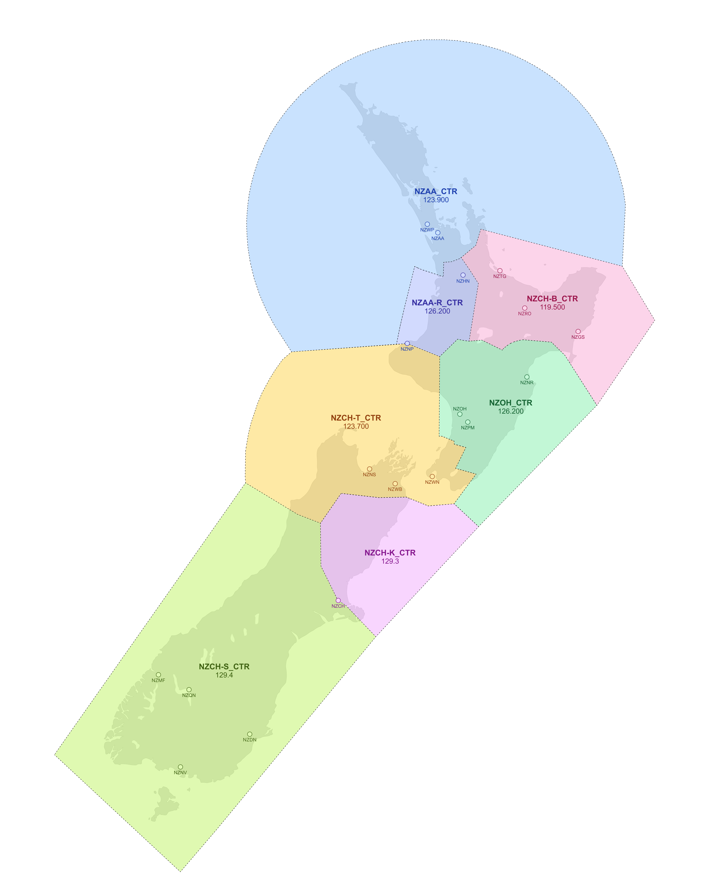

This section covers aerodrome specific procedures, separated by airspace class.

!!! tip "Interactive Aerodrome Map"
    Hover over an aerodrome marker to view its classification, then select it to open the relevant procedure page.

  

  <svg viewBox="0 0 3563 4500" role="navigation" aria-label="Aerodrome procedure page links">
    <a id="nzaa-link" href="Class-C/nzaa/" aria-label="Open Auckland procedure page"><circle class="aerodrome-marker" cx="2202" cy="1168" r="42" /></a>
    <a id="nzhn-link" href="Class-D/nzhn/" aria-label="Open Hamilton procedure page"><circle class="aerodrome-marker" cx="2332" cy="1392" r="42" /></a>
    <a id="nztg-link" href="Class-D/nztg/" aria-label="Open Tauranga procedure page"><circle class="aerodrome-marker" cx="2516" cy="1364" r="42" /></a>
    <a id="nzro-link" href="Class-D/nzro/" aria-label="Open Rotorua procedure page"><circle class="aerodrome-marker" cx="2636" cy="1556" r="42" /></a>
    <a id="nzoh-link" href="Class-D/nzoh/" aria-label="Open Ohakea procedure page"><circle class="aerodrome-marker" cx="2316" cy="2072" r="42" /></a>
    <a id="nzpm-link" href="Class-D/nzpm/" aria-label="Open Palmerston North procedure page"><circle class="aerodrome-marker" cx="2348" cy="2120" r="42" /></a>
    <a id="nznr-link" href="Procedural/nznr/" aria-label="Open Napier procedure page"><circle class="aerodrome-marker" cx="2652" cy="1896" r="42" /></a>
    <a id="nzns-link" href="Procedural/nzns/" aria-label="Open Nelson procedure page"><circle class="aerodrome-marker" cx="1852" cy="2352" r="42" /></a>
    <a id="nzwb-link" href="Class-D/nzwb/" aria-label="Open Woodbourne procedure page"><circle class="aerodrome-marker" cx="2012" cy="2416" r="42" /></a>
    <a id="nzwn-link" href="Class-C/nzwn/" aria-label="Open Wellington procedure page"><circle class="aerodrome-marker" cx="2176" cy="2364" r="42" /></a>
    <a id="nzch-link" href="Class-C/nzch/" aria-label="Open Christchurch procedure page"><circle class="aerodrome-marker" cx="1696" cy="3020" r="42" /></a>
    <a id="nzqn-link" href="Class-C/nzqn/" aria-label="Open Queenstown procedure page"><circle class="aerodrome-marker" cx="948" cy="3464" r="42" /></a>
    <a id="nzmf-link" href="Flight%20Service/nzmf/" aria-label="Open Milford Sound procedure page"><circle class="aerodrome-marker" cx="792" cy="3384" r="42" /></a>
    <a id="nzdn-link" href="Procedural/nzdn/" aria-label="Open Dunedin procedure page"><circle class="aerodrome-marker" cx="1260" cy="3696" r="42" /></a>
    <a id="nznv-link" href="Procedural/nznv/" aria-label="Open Invercargill procedure page"><circle class="aerodrome-marker" cx="908" cy="3876" r="42" /></a>
  </svg>

  
<strong>Auckland (NZAA)</strong>Class C aerodromeSelect for procedure information

  
<strong>Hamilton (NZHN)</strong>Class D aerodromeSelect for procedure information

  
<strong>Tauranga (NZTG)</strong>Class D aerodromeSelect for procedure information

  
<strong>Rotorua (NZRO)</strong>Class D aerodromeSelect for procedure information

  
<strong>Ohakea (NZOH)</strong>Class D aerodromeSelect for procedure information

  
<strong>Palmerston North (NZPM)</strong>Class D aerodromeSelect for procedure information

  
<strong>Napier (NZNR)</strong>Procedural tower aerodromeSelect for procedure information

  
<strong>Nelson (NZNS)</strong>Procedural tower aerodromeSelect for procedure information

  
<strong>Woodbourne (NZWB)</strong>Class D aerodromeSelect for procedure information

  
<strong>Wellington (NZWN)</strong>Class C aerodromeSelect for procedure information

  
<strong>Christchurch (NZCH)</strong>Class C aerodromeSelect for procedure information

  
<strong>Queenstown (NZQN)</strong>Class C aerodromeSelect for procedure information

  
<strong>Milford Sound (NZMF)</strong>Flight Service aerodromeSelect for procedure information

  
<strong>Dunedin (NZDN)</strong>Procedural tower aerodromeSelect for procedure information

  
<strong>Invercargill (NZNV)</strong>Procedural tower aerodromeSelect for procedure information

## Class C

Class C airspace is applied to CTRs at large international aerodromes, associated CTAs, and en‑route airspace covering principal domestic air routes.

In this airspace IFR and VFR traffic are separated from each other at all times. Within a CTR, IFR aircraft are separated from special VFR (operating below visual meteorological conditions) aircraft, and special VFR aircraft are separated from each other when visibility is less than 5 km.

Where separation is not being provided, air traffic controllers are required to pass appropriate traffic information to VFR aircraft about other VFR aircraft, or special VFR aircraft when visibility is less than 5 km. VFR aircraft, however, must maintain their own separation from each other.

All aircraft require an ATC clearance to be in Class C airspace.

## Class D

Class D airspace normally applies to CTRs and CTAs surrounding regional aerodromes, such as Rotorua and Nelson.

IFR aircraft are separated from other IFR aircraft, but VFR aircraft are not separated from any IFR or other VFR aircraft. Within a CTR only, during special VFR conditions, IFR aircraft are separated from special VFR aircraft, and pecial VFR aircraft are separated from other special VFR aircraft when visibility is less than 5 km.

Pilots of VFR and IFR aircraft operating within Class D airspace must use a good lookout to separate themselves from each other as ATC separation is not provided. 

## Tier 2 (Procedural Tower) Positions 

As per the [VATSIM Global Controller Administration Policy](https://vatsim.net/docs/policy/global-controller-administration-policy), the positions within VATNZ FIRs that are of a procedural nature fall under the Tier 2 Designation. In order to staff these positions, VATNZ controllers must undergo a Procedural Tower endorsement through the training department. More information on this course can be found on the [VATNZ Website](https://www.vatnz.net/training/courses/procedural-tower/)

Our procedural aerodromes are Gisborne (NZGS), Napier (NZNR), New Plymouth (NZNP), Nelson (NZNS), Dunedin (NZDN) and Invercargill (NZNV). These aerodromes are all Class D, therefore Class D airspace rules apply to these aerodromes. 

--8<-- "includes/abbreviations.md"

