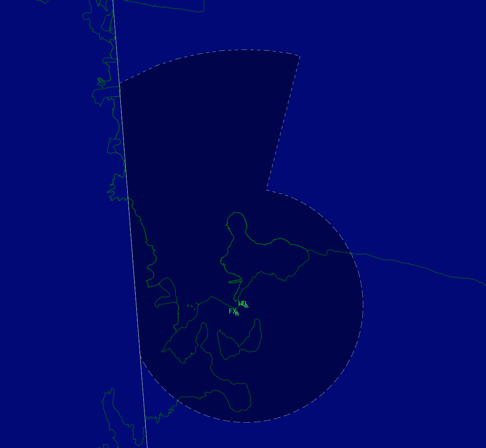

--8<-- "includes/abbreviations.md"

## Positions

| Position Name | Shortcode | Callsign          | Frequency | Login ID | Usage   |
| ------------- | --------- | ----------------- | --------- | -------- | ------- | 
| Williams TMA  | WTMA      | Williams Approach | 126.200   | NZWD_APP | Primary |

!!! note "NZWD_APP coverage"
    `NZWD_APP` is the normal approach position for the Williams Field TMA and is not event only.

    Williams Field aerodrome operations are currently fully covered by `NZWD_APP`. No separate NZWD tower, ground, or delivery positions are published in the VATNZ dataset.

## Responsibilities

Williams Approach is responsible for IFR and VFR aircraft operating within the Williams Field terminal area, including aircraft arriving to or departing from Williams Field, Phoenix Field, and the wider McMurdo area.

When no local Phoenix Field aerodrome controller is online, NZFX is uncontrolled. During events where `NZFX_TWR`, `NZFX_GND`, or `NZFX_DEL` are staffed, those positions manage local Phoenix Field operations and coordinate with `NZWD_APP`.

Williams Field aerodrome traffic remains with `NZWD_APP` for clearance, taxi, takeoff, landing, and approach services.

## Ice Runway (NZIR)

Ice Runway is an uncontrolled aerodrome. Aircraft operating at NZIR should use UNICOM on `122.800` to coordinate their own ground and runway movements.

`NZIR_TWR` is no longer a published position on the VATSIM network and must not be staffed. `NZWD_APP` continues to provide the surrounding approach service where applicable, but does not provide an aerodrome control service at NZIR.

## Airspace

The Williams Field terminal area contains controlled airspace around Williams Field, Phoenix Field, Pegasus Field, and McMurdo Station.

The Williams Field CTA/D follows the lateral and vertical boundaries as shown below. 

<figure markdown>
   
  <figcaption>Williams Field TMA (CTA/D)</figcaption>
</figure>

### Class D

Phoenix Field has `Class D` airspace within a `4.3 NM` radius of the aerodrome, from the surface up to and including `A025` AGL. When `NZFX_TWR` is online, Phoenix Field Tower is responsible for that airspace.

Williams Field operations are fully covered by `NZWD_APP`.

### Class E

The surrounding `Class E` airspace extends within `100 NM` of the Williams Field or Pegasus Field TACANs, excluding `Class D` airspace, from the surface up to but not including `FL245`.

Within `Class E` airspace:

- IFR aircraft are separated from other IFR aircraft.
- IFR aircraft receive traffic information about VFR aircraft as far as practicable.
- VFR aircraft may receive flight following on request, workload permitting.
- Hazard alerts should be passed to known VFR aircraft.

VFR aircraft do not require a clearance to enter `Class E` airspace, but should monitor the appropriate frequency and avoid published IFR routes and holding patterns where possible.

## Williams Field Operations

### Clearances

IFR clearances should be issued using FAA phraseology or standard VATNZ IFR phraseology. VFR phraseology should remain in line with standard VATNZ practice.

IFR clearances may include:

- Destination airport.
- Assigned SID, if applicable.
- Route, such as `THEN AS FILED` or `AS FILED`.
- Initial altitude or `CLIMB VIA SID`, as applicable.
- Additional instructions or information where required.

If no SID is assigned, clear the aircraft to destination as filed and assign the appropriate initial altitude.

### Ground Movements

Williams Field aerodrome control is provided by `NZWD_APP`. Aircraft operating IFR should obtain start and taxi clearance before entering the manoeuvring area.

Taxi instructions should be issued in plain language and kept simple. Use progressive taxi instructions where required, particularly during events or when multiple aircraft are operating on the movement area.

### Departures

Williams Approach is responsible for departure sequencing, IFR release, and initial climb.

Departing IFR aircraft should be identified as soon as practicable after departure. Once identified, climb the aircraft in accordance with its clearance and coordinate onward with `NZCM_FSS` when the aircraft will leave the terminal area.

### Arrivals

Williams Approach is responsible for arrival sequencing, descent, approach clearance, and landing clearance for Williams Field.

Arriving aircraft should be cleared for the nominated approach or a visual approach when conditions and traffic permit. Non-standard approach requests should be handled workload permitting and should not conflict with Phoenix Field operations.

## Phoenix Field Interface

### When NZFX_TWR is Online

`NZFX_TWR` is responsible for Phoenix Field local aerodrome operations within its delegated airspace.

`NZWD_APP` remains responsible for the surrounding terminal area and shall coordinate:

- IFR arrival sequence and approach clearance.
- IFR departure release and initial tracking.
- Visual approaches or circuit operations affecting the terminal area.
- Any aircraft requiring non-standard routing, altitude, or runway use.

Departing IFR aircraft should be transferred from Phoenix Field Tower to `NZWD_APP` once airborne and clear of immediate aerodrome traffic, unless otherwise coordinated.

### When NZFX_TWR is Offline

When Phoenix Field Tower is offline, `NZWD_APP` provides top-down service to NZFX. This includes IFR clearances, ground movement instructions, runway operations, and approach services.

## Coordination

### NZWD_APP to NZCM_FSS

Coordinate aircraft entering or leaving the Williams Field terminal area with `NZCM_FSS`.

Departures should be handed to Mac Center once clear of the terminal area and climbing to the coordinated level. Arrivals should be handed from Mac Center to Williams Approach in time for sequencing, descent, and approach clearance.

### NZWD_APP to NZFX_TWR

When an event-only Phoenix Field position is staffed, coordinate IFR arrivals, IFR departure releases, runway changes, missed approaches, and any traffic that may affect Phoenix Field local operations.

### No Overlying Controller

When `NZCM_FSS` is not online, aircraft leaving controlled service should be transferred to UNICOM on `122.800` once no further approach service is required.
