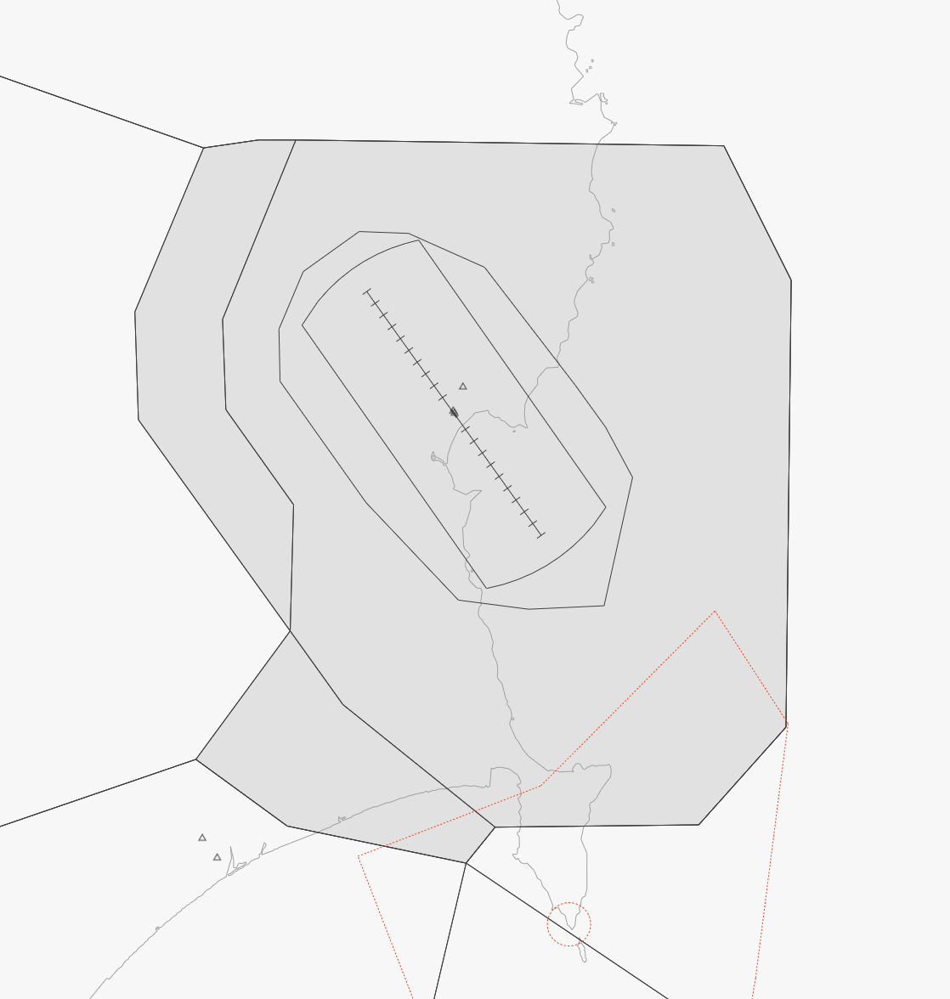
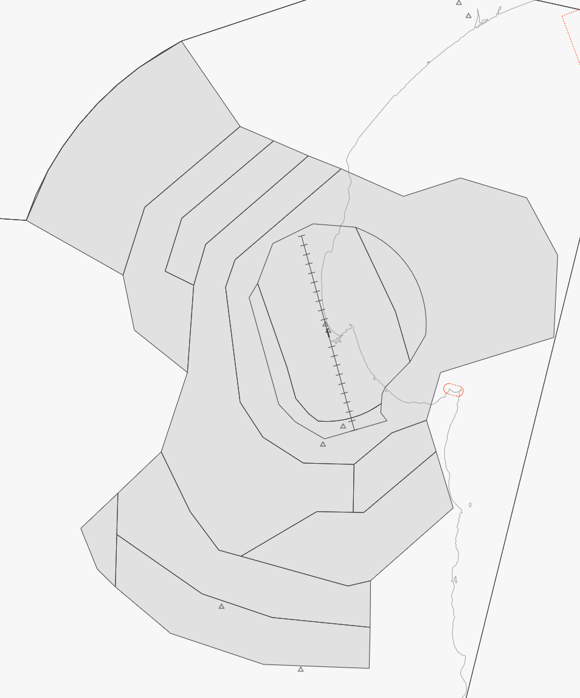

--8<-- "includes/abbreviations.md"

While Cycle 2312 is usually the biggest update of the year, this has been exacerbated by the PBN changes on the East Coast of the North Island. All GS and NR airspace and procedures have been reviewed and amended, with 90% of all procedures being replaced. Across this cycle, this has resulted in 2,500 lines of code being removed, and 3,391 lines being added. 

!!! danger "Important Note for EuroScope Users"  
    EuroScope doesn't automatically enable new sectors of airspace, so users will need to manually enable these in the `Other Set > Display Set > ARTCC Low` dialog.

    The changes made to GS and NR towers have **not** been tested in EuroScope, and it is suggested that users use vatSys to control all Procedural Towers.

## Revision A

### NZAA: Auckland
  - The following procedures have been amended: `UKAPA 2D and 3B`, `APABO 3C and 3A`.
    - All transitions removed. Procedures now commence from either `UKAPA` or `APABO`.

### NZGS: Gisbourne
  - All NZGS airspace reviewed and amended to allow for the containment of new IFR procedures.
    - Gisborne CTR/D airspace `NZA450` disestablished and replaced by `NZA455`.
    - Gisborne CTA/D airspaces `NZA430`, `NZA431`, `NZA432` disestablished and replaced by `NZA444`, `NZA445`, `NZA456`,
  -  All STARs reviewed and replaced by new procedures.
    -  RWY 14: `COOKS 1A`, `DABIP 1A`, `GS 1E`, `KEEPA 1A`, `RULSI 1A`, `VASNI 1A`.
    -  RWY 32: `COOKS 1B`, `DABIP 1B`, `GS 1C`, `KEEPA 1B`, `RULSI 1B`, `VASNI 1B`.
  -  All SIDs reviewed and replaced by new procedures.
    -  RWY 14: `MIGEN 1Q`, `MIGEN 1S`, `OLDEB 1Q`.
    -  RWY 32: `COOKS 1P`, `COOKS 1R`, `MIGEN 1P`.
  - The following conventional SIDs have been reviewed and reseqenced: 
    - RWY 14: `NICK 4`, `NUHAKA 4`, `TUNA 3`.
    - RWY 32: `PAUA 4`, `CRAY 4`.
  - All RNP approaches have been removed and replaced with a `RNP Z` and `RNP Y` for each RWY.

<figure markdown>
   
  <figcaption>Airspace in grey denotes the new procedural airspace of GS TWR, to an UL of 9,500ft.</figcaption>
</figure>

### NZHS: Hastings
  - The following procedures have been amended and resequenced: `VICTOR 3`, `WHISKEY 3`.
    - `YARRO` transition removed from both.

### NZHN: Hamilton
  - Hamilton CTR/D airspace `NZA255` disestablished and replaced by `NZA256`.

### NZHK: Hokitika
  - All STARs have been removed, and new procedures added.
  - The following STARs have been added: `OSRIB 1L and 1M`, `IGNOK 1L and 1M`, `BELEE 1L and 1M` and `IDERO 1L and 1M`.

### NZNR: Napier
  - All NZNR airspace reviewed and amended to allow for the containment of new IFR procedures.
    - Napier CTR/D airspace `NZA456` disestablished and replaced by `NZA457`.
    - Napier CTA/D airspaces `NZA440`, `NZA441`, `NZA442`, `NZA443`, `NZA540`, `NZA541` disestablished and replaced by `NZA433`, `NZA437`, `NZA438`, `NZA449`, `NZA452`, `NZA453`, `NZA454`, `NZA458`, `NZA459`, `NZA531`, `NZA523`, `NZA533`.
  - The following STARs have been reviewed and resequenced/renamed:
    - RWY 16: `NR 1F`, `GENDA 2A`, `OPAPA 3A`, `PANIA 1A`.
    - RWY 34: `NR 1E`, `GENDA 2B`, `OPAPA 3B`.
  - The following STARs have been added:
    - RWY 16: `BITIL 1A`, `POTEX 1A`, `NR 1A`.
    - RWY 34: `LUVTU 1B`, `PANIA 2B`, `NR 1B`.
  - The following SIDs have been added:
    - RWY 16: `LEDIV 3P`, `TUKNE 1P`, `TUKNE 1R`.
    - RWY 34: `OBLOX 3Q`, `GUGTO 1Q`.
  - The following conventional SIDs have been amended:
    - RWY 16: `MIKE 4` becomes `HILL 1`, `NOVEMBER 1` becomes `COAST 1`.
    - RWY 34: `MIKE 4` becomes `WEST 1`, `NOVEMBER 4` becomes `OCEAN 1`.
  - All RNP approaches have been removed, and new RNP approaches added.

<figure markdown>
   
  <figcaption>Airspace in grey denotes the new procedural airspace of NR TWR, to an UL of 9,500ft.</figcaption>
</figure>

### NZNE: North Shore
  - All STARs have been removed, and new procedures added.
  - The following STARs have been added: `KOPPA 1` and `APABO 1B`.
  - RNP 21: `BOLOR` transition replaced by `AVMOL`. FAF `FF21` replaced by ICAO 5LNC `IPKAT`.
  - RNP 03: FAF `MA03` replaced by procedural waypoint `NE403`.

### NZOH: Ohakea
  - Ohakea CTA/C airspace `NZA347` boundary amended.

### NZWO: Wairoa
  - Due to the GS and NR PBN changes, the `HAWKE 1P` becomes the `RULSI 1P`.

### Other Changes
  - Other airspace changed as a result of East Coast PBN changes:
    - Bay CTA/D airspace `NZA439` disestablished and replaced by `NZA467`.
    - Bay CTA/C airspaces `NZA436` & `NZA435` disestablished and replaced by `NZA465` & `NZA469`.

## Standard Routes

There have been 25 standard route changes this cycle. These will be automatically downloaded to vatSys and the standalone Standard Route Tool next time you open the application.

- The following Standard Routes have been removed: `NRWN4`, `NRWB3`, `WBNR2`.

- The following Standard Routes have been amended and resequenced: `CHNR2`, `CHNR4`, `GSNR1`, `GSWO3`, `GSWN1`, `NRCH3`, `NRGS3`, `NRPM3`, `NRWO1`, `NRWN1`, `OHCH2`, `PMCH3`, `PMNR1`, `ROCH1`, `TGCH3`, `WOGS2`, `WNCH5`, `WNDN8`, `WNGS1`, `WNNV5`, `WNNR2`, `WNQN5`, `WNTU3`.

## Dataset Updates

  - All Procedural Towers converted to behave like TMA positions, while retaining a `_TWR` suffix.
  - Volume definitions amended for `NZNR_TWR` and `NZGS_TWR` in line with the new airspace definitions.
  - Documentation Dataset updated.

