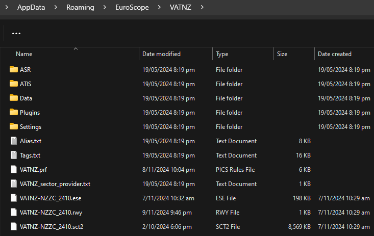
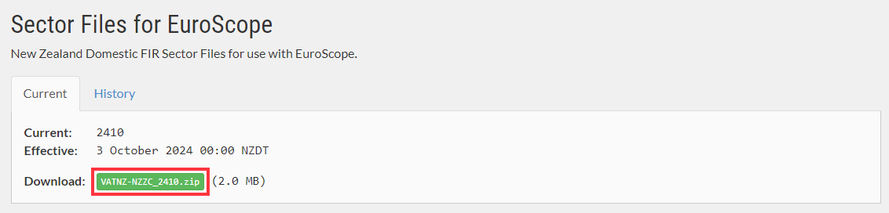
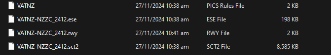

--8<-- "includes/abbreviations.md"

Initial setup, and future AIRAC Cycle updates must be made manually for the EuroScope client.

VATNZ has two packages available:

  - **SkyLine**: Contains all of the required position and frequency definitions alongside the Sector Files. 
  - **Sector Files**: Contains only the Sector Files.

This page covers how to install the VATNZ Skyline Package, and how to update the sector files. For a detailed guide on installation of the client itself, refer to the [EuroScope documentation](https://www.euroscope.hu/wp/installation/){target=new}

For most cycles, Controllers will only need to replace the Sector Files. Controllers will be explicitly instructed in the Changelogs should they need to replace the entire SkyLine package.

## VATNZ Skyline Setup

The Skyline package is intended for initial setup of the client, or for larger changes to the dataset. For regular AIRAC cycle updates, please refer to [Updating Sector Files](#updating-sector-files)

!!! warning "Backing up your Settings"
    Files in the `/Settings/` folder may be overwritten by the new SkyLine package, losing all of your display and list settings. Before updating, we recommend you back-up your `List.txt` and `Screen.txt` files, and reimporting them after you replace the rest of the package.

    It is important that you back-up only those two files, as other files in the `/Settings/` folder would have changed.
  
1. [Download the latest SkyLine Package from the VATNZ website](https://www.vatnz.net/airspace/sector_files/){ target=new }. This will download a `.zip` file named "VATNZ-SKYLINE_xxyy", where `xx` is the year, and `yy` is the cycle.

    

2. In Windows, open an explorer window and navigate to your EuroScope files. By default this is in the `AppData\Roaming\EuroScope` directory. Note: This may be in the `Documents\EuroScope\` directory for older installations of EuroScope.
3. Create a new folder in this directory for your VATNZ files, the name of this folder does not matter.
4. Ensure you archive your current Skyline files if present, then drag the new files into this new folder.

    <figure markdown>
       
      <figcaption>It should look something like this</figcaption>
    </figure>

5. Open EuroScope. If prompted to select a profile file, select `VATNZ.PRF`
6. A dialogue may appear notifying you that the active sector file cannot be found. **Click No**.
7. A file selection dialogue will appear. Select the new `.sct2` file, and click 'Open'.
8. Another dialogue box will appear, notifying you that the file has been loaded. **Click Yes** to make this the new active sector file.
9. When EuroScope loads, ensure that no error messages appear in the System box.

## Updating Sector Files

1. [Download the latest Sector Files from the VATNZ website](https://www.vatnz.net/airspace/sector_files/){ target=new }. This will download a file named "VATNZ-NZZC_xxyy", where `xx` is the year, and `yy` is the cycle.

    

2. In Windows, open an explorer window and navigate to your EuroScope files. By default this is in the `AppData\Roaming\EuroScope` directory. Note: This may be in the `Documents\EuroScope\` directory for older installations of EuroScope.
3. Archive the current `VATNZ-NZZC_xxyy` files, and drag the new files into this directory.

    

4. Open EuroScope. A dialogue will appear notifying you that the active sector file cannot be found. **Click No**.
5. A file selection dialogue will appear. Select the new `.sct2` file, and click 'Open'.
6. Another dialogue box will appear, notifying you that the file has been loaded. **Click Yes** to make this the new active sector file.
7. When EuroScope loads, ensure that no error messages appear in the System box.