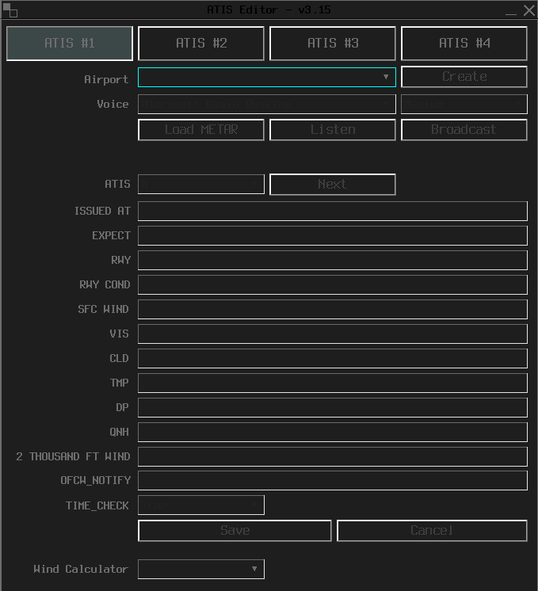
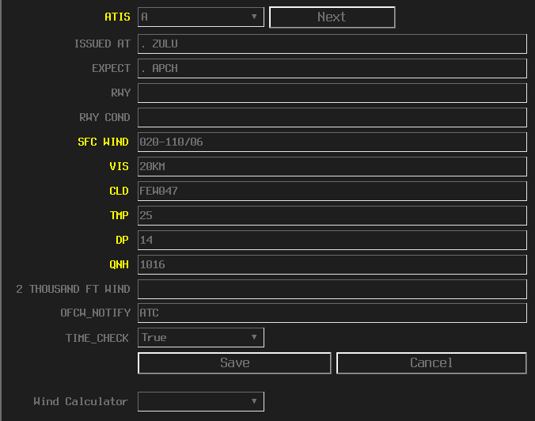
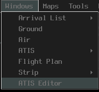

--8<-- "includes/abbreviations.md"

Our vatSys dataset comes pre-loaded with everything a controller needs to get connected, and no external software is required to be updated or modified before the controller can log on to the VATSIM network.

!!! note
    While a Navigraph Subscription is not required, you can update your Nav-data by going to: `Settings > Navigraph > Link Navigraph Account`

## Plugins

Our vatSys dataset currently ships with two plugins, the VATNZ Standard Route Tool and the Multiple ATIS Editor.

Both Plugins can be downloaded from the [VATNZ Website](https://www.vatnz.net/vatnz/resources/)

### VATNZ Standard Route Tool

The VATNZ Standard Route Tool allows controllers to quickly look up standard routes that aircraft have filed, as well as issue pilots with a standard route on request.

!!! info "What is a Standard Route?"
    A Standard Route is a predefined route that is issued to IFR aircraft around New Zealand. These routes are made up of defined nav aids, waypoints, and airways that link to each other, and provide a safe and standard way for IFR aircraft to fly around the country.

    The standard IFR clearance in New Zealand is issued as an "airways clearance". Examples of standard routes can be found [here](https://www.aip.net.nz/assets/AIP/Aerodrome-Charts/Auckland-NZAA/NZAA_61.1.pdf){:target="blank"}

You can find this plugin under `Tools > Standard Route Tool`

<figure markdown>
   
  <figcaption>vatSys Tools Menu</figcaption>
</figure>

A full user manual for this plugin can be found [**here**](https://www.vatnz.net/vatnz/resources/standard-route-tool/){:target="blank"}

### Multiple ATIS Editor

The Multiple ATIS Editor replaces the default vatSys ATIS editor and allows controllers to have up to four ATIS connections whilst controlling.

<figure markdown>
   
  <figcaption>vatSys Multiple ATIS Editor</figcaption>
</figure>

This plugin follows the same colour scheme as our domestic dataset and also has the same functions as the vatSys ATIS editor.

When a new METAR is issued, fields highlighted in yellow indicate a change that needs to be reviewed and updated.

<figure markdown>
   
  <figcaption>Updated Fields</figcaption>
</figure>

The new ATIS editor can be found under `Windows > ATIS Editor`

<figure markdown>
   
  <figcaption>vatSys Windows Menu</figcaption>
</figure>

!!! note
    The default ATIS request function is still present in the menu bar, this is the native function built in to view other ATIS connections.

Many thanks to AJ (badvectors) for creating this plugin, and sharing this plugin with us.    

To check what plugins are currently installed with your client, go to `Info > About` 

<figure markdown>
   
  <figcaption>vatSys Info Menu</figcaption>
</figure>

