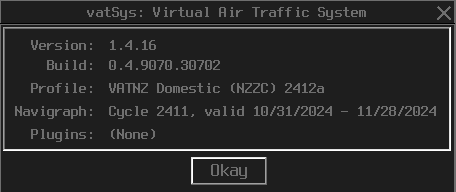

--8<-- "includes/abbreviations.md"

Our vatSys dataset comes pre-loaded with everything a controller needs to get connected, and no external software is required to be updated or modified before the controller can log on to the VATSIM network.

### Plugins

Our vatSys dataset currently ships with one plugin, the VATNZ Standard Route Tool. You can find this under `Tools > Standard Route Tool`

<figure markdown>
   
  <figcaption>vatSys Tools Menu</figcaption>
</figure>

To check what plugins are currently installed with your client, go to `Info > About` 

<figure markdown>
   
  <figcaption>vatSys Info Menu</figcaption>
</figure>

