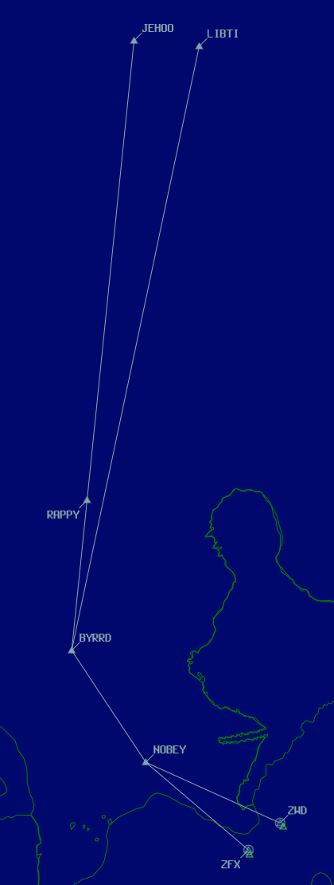

--8<-- "includes/abbreviations.md"

Antarctica offers a handful of challenges on the network - mostly driven by the real-life multi-national nature of the continent.

!!! warning

    These procedures are only for use on Antarctic-based VATNZ positions. Refer to the aerodrome pages for [NZFX](../antarctica/nzfx.md) and [NZWD](../antarctica/nzwd.md). 

## Using FAA Phraseology in Antarctica

When operating positions based in Antarctica, controllers may opt to use FAA phraseology to deliver IFR clearances. For VFR clearances, controllers shall use standard CAA NZ phraseology. 

FAA clearances are delivered in the **CRAFT** format, which is a mneumonic for the structure of the clearance.

| Letter | Item                                             | Example                                                                                                 |
| ------ | ------------------------------------------------ | ------------------------------------------------------------------------------------------------------- |
| C      | Clearance Limit - the destination, NavAid or fix | "Cleared to [Destination]"                                                                              |
| R      | Route - the SID, radar vectors, or airways       | "via the [SID] departure, then as filed"                                                                |
| A      | Altitude - initial climb and expected altitude   | "maintain [altitude], expect flight level [RFL] one zero minutes after departure", or "climb via [SID]" |
| F      | Frequency - the departure frequency              | "departure frequency [xxx.x]"                                                                           |
| T      | Transponder - the assigned squawk code           | "squawk [xxxx]" |

## Using SIDs and STARs

Using published SIDs and STARs in Antarctica is difficult - whilst the navigation data is contained in Navigraph's database, the charts are not. This could lead to a situation where a pilot and controller don't fully understand the clearance that they have been given.

To solve this, VATNZ has:

- Replicated procedures for NZFX and NZWD from the ARINC 424 codings, in the hope that publicly available charts will become available.
- Implemented a manual SID (`MANSID`) and STAR (`MANSTR`) for both NZFX and NZWD, which may be passed to pilots via RTF. 

These procedures can be assigned to any aircraft arriving or departing from NZFX or NZWD.

### SID and STAR Routing

The Manual SID and STAR procedures both share the same routing. 

#### Manual SID Procedure

1. A runway transition segment, consisting of a climb on runway heading to `A050`. Passing `A050`, tracking to `NOBEY`
2. From `NOBEY`, tracking to `BYRRD`
3. Then splitting to two transitions: 
    - `JEHOO` transition: From `BYRRD`, tracking to `RAPPY`, then to `JEHOO`
    - `LIBTI` transition: From `BYRRD`, tracking to `LIBTI`

#### Manual STAR Procedure

1. Two enroute transitions are available:
    - `JEHOO` transition: From `JEHOO`, tracking to `RAPPY`, then to `BYRRD`
    - `LIBTI` transition: From `LIBTI`, tracking to `BYRRD`
2. From `BYRRD`, tracking to `NOBEY`
3. From `NOBEY`, tracking direct to `ZFX` or `ZWD` TACANs to establish either on the TACAN approach or visually.

### Issuing the Procedures

For clearances, controllers shall read the full routing. 

- **SID**: *...climbing runway heading to five thousand, then direct NOBEY, BYRRD, [then transition route], then as filed...* 
- **STAR**: *..from [transition], track via [transition routing], BYRRD, NOBEY then direct [ZFX or ZWD]*

### Maintaining Separation

With aircraft using the same track during climbs and descents, there is a potential for altitude cross conflicts to occur. Controllers must use a progressive altitude passing technique to ensure separation throughout the procedure.

!!! warning "Using these Manual SIDs/STARs during an Event"

    These procedures are not available for use during an Event, as there are significant opportunities for conflict.
    
    During any major event in Antarctica, the operations team will make available additional procedures to provide independant SID and STAR routing.

### vatSys Map Layer

Custom map layers have been created for vatSys, which can be found under `Maps > NZFX (or NZWD)`

<figure markdown>
  { width="300" }
  <figcaption>NZFX and NZWD Manual Procedure Routing</figcaption>
</figure markdown>