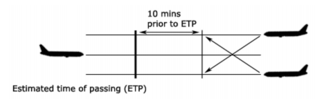
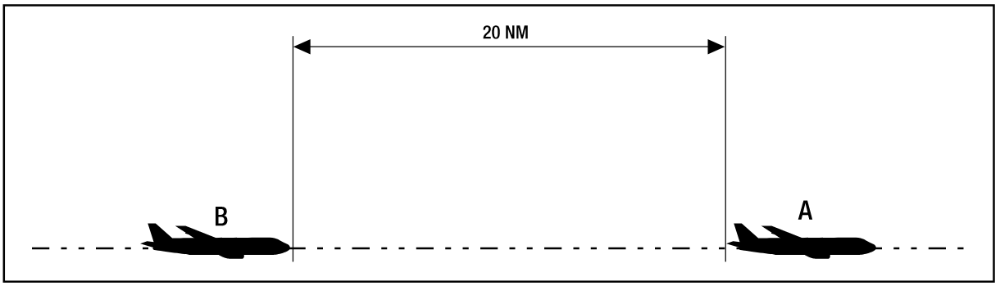
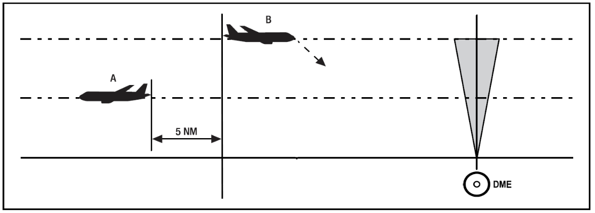
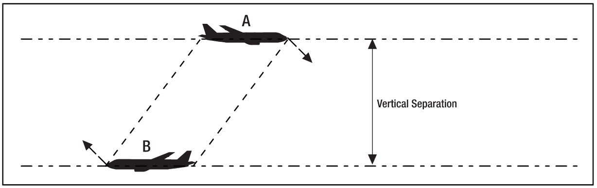
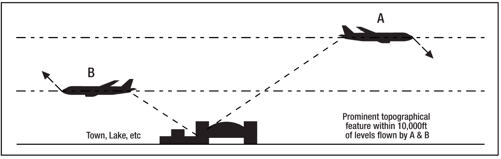
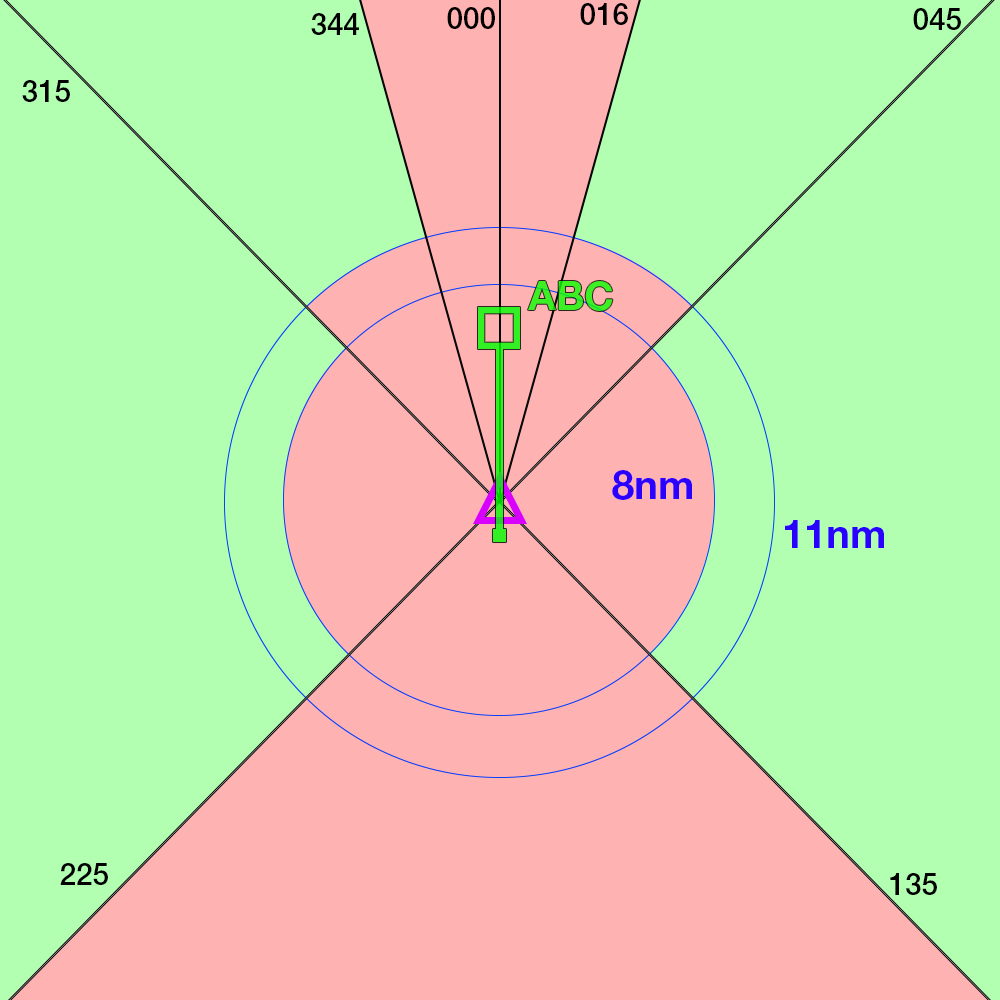

--8<-- "includes/abbreviations.md"

Separation standards refer to the minimum distance apart that aircraft operating in controlled airspace and at airports with an operational control tower must be kept. 

There are three different methods of ensuring separation inside Controlled Airspace - Visual, Radar, and Procedural.

## Visual Separation

### ATC Responsibility

With sufficient visibility and an adequately high cloud base, controllers may visually separate two aircraft by visually acquiring and identifying them both, and determining that their projected flight paths do not conflict.  

Controllers can utilise visual separation by using Tower View linked to a flight simulator or simulating pseudo-visual separation through their Controller Client.  It is generally practical within about **5nm** of the aerodrome.  

This technique is useful for situations such as:

- Procedural towers processing aircraft at altitudes below usable surveillance
- Making more efficient use of runways at major aerodromes by allowing departures to roll with aircraft on final
- Processing VFR aircraft arriving or departing during a busy established sequence (e.g. VFR operations at Auckland or Wellington)

### Pilot Responsibility

Pilots can be instructed to maintain own separation with other aircraft provided:  

- Both aircraft are at or below `A100`, and  
- One pilot reports the other aircraft in sight.  

Pilots will continue to follow ATC instructions but the controller will no longer be responsible for maintaining a separation standard between the two aircraft.  If the pilot loses sight of the aircraft, an alternative separation method will need to be used.  

Where an aircraft is instructed to maintain own separation with an IFR aircraft, traffic information shall be passed to the IFR aircraft, including advice of assignment of separation responsibility to the other aircraft. 

!!! Example "Visual Separation Phraseology"
    ZKFML is a prop that is operating in the Southern Instrument Sector at NZAA, while a Jetstar A320 is inbound on the RNP Y 23L.

    **NZAA_TWR**: "FML, report sighting a Jetstar A320 inbound for the RNP Y. Traffic is to your four o'clock, five miles, descending through 6,000ft"  
    **ZKFML**: "Traffic in sight, FML"  
    **NZAA_TWR**: "FML, maintain visual separation"

    **NZAA_TWR**: "JST433, traffic is a Piper Tomahawk to your 10 o'clock, five miles, 1,500ft within the Instrument Sector. Maintaining visual separation from you"

## Radar Separation

### Enroute

Inside ENR airspace the lateral limit is 5nm. 

The vertical standard depends on various parameters -

| Altitude / Flight Level                   | Separation Standard            |
| ----------------------------------------- | ------------------------------ |
| `SFC` - `FL290`                           | 1000ft                         |
| `FL290` - `FL410`                         | RVSM: 1000ft, Non-RVSM: 2000ft |
| `FL410` - `FL600`                         | 2000ft                         |
| Any Supersonic Aircraft, regardless of FL | 3000ft                         |

### TMA

In AA, OH, WN, CH and QN TMAs the lateral limit is 3nm, and the vertical limit is 1000ft.

In the HN TMA, the lateral limit is 5nm, and the vertical limit remains at 1000ft.

### Aerodrome

#### Jurisdiction

Aerodrome ATC is not responsible for aircraft movement outside of the manoeuvring area, only covering taxiways and runways. Permission is required for aircraft to be able to transit into a manoeuvring area, such as when an aircraft requests a push and start.

#### Runway Operations

As a general rule of thumb, only one aircraft may occupy a single runway at a time. Runway clearance instructions, such as a take-off or landing clearance, may not be given if another aircraft has also been issued clearance for that runway.

A runway may be occupied by more than one aircraft provided that a conditional clearance has been given.

An aircraft may only be issued a landing or takeoff clearance when -

| Situation                                                                     | Controller must ensure..                                                                                                    | Additional Information to be passed to the aircraft |
| ----------------------------------------------------------------------------- | --------------------------------------------------------------------------------------------------------------------------- | --------------------------------------------------- |
| Runway completely unoccupied, and no a/c on the recipcrocal runway centreline |                                                                                                                             | None.                                               |
| A preceding arrival begins to vacate the runway                               | The vacating a/c will be clear when the arriving a/c is at the final approach fix for the procedure being flown.            | "Aircraft vacates `left / right` on `TWY / RWY`"    |
| An a/c is departing ahead                                                     | Meets the [Divergent Procedures criteria](#divergent-procedures), or the a/c is 1nm upwind of the reciprocal RWY threshold. | None.                                               |
| An a/c is departing ahead on the same SID                                     | The aircraft ahead must be a faster aircraft type, and be 3nm upwind of the reciprocal runway threshold.                    | None.                                               |

!!! warning "Protecting the Missed Approach"
    Controllers must ensure that the Missed Approach is protected whenever an aircraft is cleared to land.

#### Divergent Procedures

A divergent procedure is one where the initial leg of the procedure is intended to create immediate separation through a turn away from the path of anticipated traffic. This could be through a specifically designed procedure, or through a manual turn instruction. 

Divergence, and therefore separation, is **deemed to exist when an aircraft is 30 degrees off course** from the anticipated path of following traffic. An aircraft does not have to begin the turn to achieve divergence, but the instruction must be passed to the aircraft.

Some SIDs at NZAA, NZQN and NZWN have a 30 degree turn baked into the procedure to ensure divergence as soon as possible. Controllers may also achieve this by assigning a manual heading on departure. 

### Wake Turbulence

Controllers shall ensure that aircraft are protected against the effects of wake turbulence during take-off landing, or during cruise by applying the following rules:

#### Distance-based Wake Turbulence

This criteria is applicable in the following circumstances:

- In all phases of flight when an aircraft is operating directly behind (1/2 NM laterally) another aircraft at the same level or less than 1000 ft below;
- In all phases of flight when an aircraft is crossing behind another aircraft at the same level or less than 1000 ft below;
- When both aircraft are on an approach to or departure from the same runway, or parallel runways separated by less than 1 NM.

| Leading Aircraft | Following or Crossing Aircraft | Distance (NM) |
| ---------------- | ------------------------------ | ------------- |
| Super (A380)     | Heavy                          | 5             |
|                  | Medium                         | 7             |
|                  | Light                          | 8             |
| Heavy            | Heavy                          | 4             |
|                  | Medium                         | 5             |
|                  | Light                          | 6             |
| Medium           | Light                          | 5             |

#### Time-based Wake Turbulence between arriving Flights

This criteria shall be applied to arriving aircraft:

- For the same runway;
- For parallel runways;
- If the projected flight paths are expected to cross at the same altitude or less than 1000 ft below

| Leadin Aircraft | Following or Crossing Aircraft | Minimum Time |
| --------------- | ------------------------------ | ------------ |
| Super (A380)    | Super                          | 2 minutes    |
|                 | Heavy                          | 2 minutes    |
|                 | Medium                         | 3 minutes    |
|                 | Light                          | 4 minutes    |
| Heavy           | Heavy                          | 2 minutes    |
|                 | Medium                         | 2 minutes    |
|                 | Light                          | 3 minutes    |
| Medium          | Light                          | 3 minutes    |

## Procedural Separation

Due to the lack of assured surveillence within a Control Zone, that zone may be classed as procedural - where separation is provided by positive time or distance control.

There are four types of procedural separation - lateral, longitudinal, vertical and visual. The first three you can apply by using position reports from Pilots, whereas visual separation can be used in line with the [Visual Separation section](#visual-separation).

!!! information
    Some of the following information on Procedural Separation has been sourced from [VATPAC's SOPs](http://sops.vatpac.org/controller-skills/SepStandards/).

### Longitudinal

<figure markdown>
  
</figure>

Longitudinal separation shall only be applied between aircraft on same or reciprocal tracks.

Longitudinal time separation must be established by using pilot estimates and ensuring that the time between two aircraft is equal or greater than the longitudinal time separation minimum.  

!!! Example "Longitudinal Separation Phraseology"
    "ABC, Cross ALPHA at time 1051 or later"  
    "DEF, Hold at BRAVO to leave BRAVO at time 2215 or later"

#### Time
##### Same Track
Aircraft that are on the same track, including situations where one aircraft is climbing or descending through the level of another, are to be separated by **10 minutes**

<figure markdown>
  
</figure>

##### Reciprocal Track
Aircraft flying on reciprocal tracks may only be separated vertically. Such separation must exist **at least 10 minutes** prior to the estimated time of passing

<figure markdown>
  
</figure>

After the estimated time of passing, aircraft may not climb or descend through the level of the opposite direction aircraft until **10 minutes** after the estimated time of passing. It is possible to reduce this requirement if definite passing has been achieved, and this will be explained later in this section.

#### Distance

##### Distance Reports

The lead aircraft must be tracking directly to/from the aid. Always ask the lead aircraft for their distance report prior to the following aircraft.  

Distance checks must be conducted as per the following table:

| If                                                                                          | Conduct Distance checks at intervals of not less than |
| ------------------------------------------------------------------------------------------- | ----------------------------------------------------- |
| No speed control has been applied                                                           | 15 mins                                               |
| Speed control has been applied to limit closing to less than or equal to 35kts or Mach 0.06 | 15 mins                                               |
| There is closing of more than 35kts or Mach 0.06                                            | The standard is not valid                             |
| Speed control has been applied to have opening or stable distance                           | 30 mins                                               |

##### Methods of ensuring Distance-based Separation

!!! tip "Methods"

    === "20nm Exists Between"

        **Conditions**: Aircraft are on the same track.

        { width="600" }

    === "5nm Definite Passing"

        **Conditons**: Reports indicate that the aircraft have passed and the distance is opening

        { width="600" }

    === "Sight and Pass"

        **Conditons**:

          - Both aircraft report sighting and passing the other by day, and in Oceanic by night,
          - Both aircraft are above `A100`,
          - There is no possibility of incorrect identification by other aircraft.

        { width="600" }

    === "Opposite Side of Visual Fix"

        **Conditons**:

          - Both aircraft report passing the same visual fix,
          - The visual fix must be a prominent topographical feature within 10,000 FT of the levels of each aircraft

        { width="600" }

### Lateral

#### Time-based crossing track

Aircraft that are on crossing tracks, including situations where one aircraft is climbing or descending through the level of another, are to be separated by **15 minutes** at the point of intersection

<figure markdown>
  
</figure>

Where a difference 15 minutes does not exist at the crossing point, vertical separation shall be applied from the time at which the second aircraft is 15 minutes from the crossing point until the first aircraft is 15 minutes past the crossing point.

<figure markdown>
  
</figure>

#### Lat Sep Table

Lateral Separation works off the basis off establishing a *Lateral Separation Point* (Lat Sep point). That is, when given an angle that 2 tracks intersect at, a distance at which lateral separation is considered to exist procedurally. These figures are detailed in the table below:

| Tracks intersecting at | Lat Sep point         |
| ---------------------- | --------------------- |
| 0°-15°                 | No lateral separation |
| 16°-44°                | 11nm                  |
| 44°-135°               | 8nm                   |
| 136°-180°              | No lateral separation |

In a more visual form, ABC can be considered to be laterally separated from aircraft in the green areas, and not laterally separated from aircraft in the red areas. This only applies to intersecting angles **at the crossing point**, and both aircraft tracking directly to/from the crossing point.

This can be used to plan restrictions as required when surveillance coverage cannot be assured.

<figure markdown>
{ width="700" }
  <figcaption>Lateral Separation Diagram</figcaption>
</figure>

### Vertical

Vertical separation is the most common form of separation that is employed within oceanic airspace, as a controller can have two aircraft flying at vertically separated levels with no risk of a loss of separation until one needs to climb or descend.

The primary source of aircraft altitudes and levels shall be pilot reports. 

| Altitude / Flight Level                   | Separation Standard            |
| ----------------------------------------- | ------------------------------ |
| `SFC` - `FL290`                           | 1000ft                         |
| `FL290` - `FL410`                         | RVSM: 1000ft, Non-RVSM: 2000ft |
| `FL410` - `FL600`                         | 2000ft                         |
| Any Supersonic Aircraft, regardless of FL | 3000ft                         |

!!! Note
    RVSM airspace exists only between FL290 and FL410

!!! Note
    You cannot clear an aircraft to climb/descend into levels that were previously occupied by another aircraft until that aircraft reports clear of the levels in question.