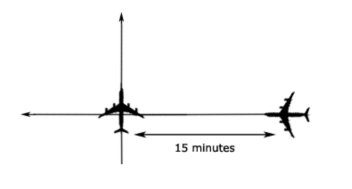
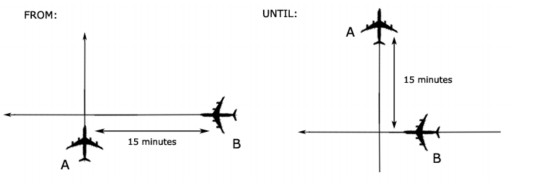
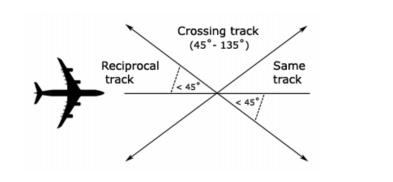
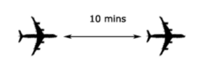

--8<-- "includes/abbreviations.md"

Separation standards refer to the minimum distance apart that aircraft operating in controlled airspace and at airports with an operational control tower must be kept. 

There are three different methods of ensuring separation inside Controlled Airspace - Radar, Procedural and Visual.

## Radar Separation

### Enroute

Inside ENR airspace the lateral limit is 5nm. 

The vertical standard depends on various parameters -

| Altitude / Flight Level                   | Separation Standard            |
| ----------------------------------------- | ------------------------------ |
| `SFC` - `FL290`                           | 1000ft                         |
| `FL290` - `FL410`                         | RVSM: 1000ft, Non-RVSM: 2000ft |
| `FL410` - `FL600`                         | 2000ft                         |
| Any Supersonic Aircraft, regardless of FL | 3000ft                         |

### TMA

In AA, OH, WN, CH and QN TMAs the lateral limit is 3nm, and the vertical limit is 1000ft.

In the HN TMA, the limit is 5nm.

### Aerodrome

#### Jurisdiction

Aerodrome ATC is not responsible for aircraft movement outside of the manoeuvring area, only covering taxiways and runways. Permission is required for aircraft to be able to transit into a manoeuvring area, such as when an aircraft requests a push and start.

#### Runway Operations

As a general rule of thumb, only one aircraft may occupy a single runway at a time. Runway clearance instructions, such as a take-off or landing clearance, may not be given if another aircraft has also been issued clearance for that runway.

A runway may be occupied by more than one aircraft provided that a conditional clearance has been given.

An aircraft may only be issued a landing or takeoff clearance when -

| Situation                                                                     | Controller must ensure..                                                                                                      | Additional Information to be passed to the aircraft |
| ----------------------------------------------------------------------------- | ----------------------------------------------------------------------------------------------------------------------------- | --------------------------------------------------- |
| Runway completely unoccupied, and no a/c on the recipcrocal runway centreline |                                                                                                                               | None.                                               |
| A preceding arrival begins to vacate the runway                               | The vacating a/c will be clear when the arriving a/c is at the DA                                                             | "Aircraft vacates `left / right` on `TWY / RWY`"    |
| An a/c is departing ahead                                                     | Meets the [Divergent Procedures criteria](#divergent-procedures), or the a/c is 1.5nm upwind of the reciprocal RWY threshold. | None.                                               |
| An a/c is departing ahead on the same SID                                     | The aircraft ahead must have a higher approach rating, and be 1.5nm upwind of the reciprocal RWY threshold                    | None.                                               |

!!! warning "Protecting the Missed Approach"
    Controllers must ensure that the Missed Approach is protected whenever an aircraft is cleared to land.

#### Divergent Procedures

A divergent procedure is one where the initial leg of the procedure is intended to create immediate separation through a turn away from the path of anticipated traffic. This could be through a specifically designed procedure, or through a manual turn instruction. 

Divergence, and therefore separation, is **deemed to exist when an aircraft is 30 degrees off course** from the anticipated path of following traffic. An aircraft does not have to begin the turn to achieve divergence, but the instruction must be passed to the aircraft.

Some SIDs at NZAA, NZQN and NZWN have a 30 degree turn baked into the procedure to ensure divergence as soon as possible. Controllers may also achieve this by assigning a manual heading on departure. 

### Wake Turbulence

Controllers shall ensure that aircraft are protected against the effects of wake turbulence during take-off or landing by applying the following rules:

#### Distance-based Wake Turbulence

| Lead Aircraft | Following Aircraft | Distance (NM) |
| ------------- | ------------------ | ------------- |
| Super (A380)  | Super              | -             |
|               | Heavy              | 6             |
|               | Medium             | 7             |
|               | Light              | 8             |
| Heavy         | Heavy              | 4             |
|               | Medium             | 5             |
|               | Light              | 6             |
| Medium        | Heavy              | -             |
|               | Medium             | -             |
|               | Light              | 5             |

#### Time-based Wake Turbulence

| Lead Aircraft | Following Aircraft | Time (min) |
| ------------- | ------------------ | ---------- |
| Super (A380)  | Super              | -          |
|               | Heavy              | 2          |
|               | Medium             | 3          |
|               | Light              | 3          |
| Heavy         | Heavy              | -          |
|               | Medium             | 2          |
|               | Light              | 2          |
| Medium        | Heavy              | -          |
|               | Medium             | -          |
|               | Light              | 2          |

## Procedural Separation

Due to the lack of assured surveillence within a Control Zone, that zone may be classed as procedural - where separation is provided by positive time or distance control.

There are four types of procedural separation - lateral, longitudinal, vertical and visual. The first three you can apply by using position reports from Pilots, whereas visual separation can be used in line with the [Visual Separation section](#visual-separation).

### Vertical

Vertical separation is the most common method, as two aircraft flying at separated levels have separation assurance and do not require constant monitoring. For example, if you have two aircraft within your Control Zone, by having one aircraft at `A060`, and the other at `A080`, they are separated. 

Like ENR and TMA airspace, the minimum vertical separation is 1,000 feet.

!!! important
    This method may only apply when an aircraft is in level flight. 

### Lateral

#### Time-based Crossing Track

Aircraft that are on crossing tracks, including situations where one aircraft is climbing or descending through the level of another, are to be separated by 15 minutes at the point of intersection

<figure markdown> 
  
  <figcaption>15 Minutes on a Crossing Track</figcaption>
</figure>

Where a difference of 15 minutes does not exist at the crossing point, vertical separation shall be applied from the time at which the second aircraft is 15 minutes from the crossing point until the first aircraft is 15 minutes past the crossing point.

<figure markdown> 
  
  <figcaption>15 Minutes does not exist on a Crossing Track</figcaption>
</figure>

### Longitudinal

Longitudinal separation shall only be applied between aircraft on same or reciprocal tracks.

Longitudinal time separation must be established by using pilot estimates and ensuring that the time between two aircraft is equal or greater than the longitudinal time separation minimum. 

<figure markdown> 
  
  <figcaption>Longitudinal Separation Diagram</figcaption>
</figure>

!!! example 
    "JST455, cross WYPNT at time 1544 or later"  

#### Time

Aircraft that are on the same track, including situations where one aircraft is climbing or descending through the level of another, are to be separated by 10 minutes.

<figure markdown> 
  
  <figcaption>Longitudinal Separation Diagram</figcaption>
</figure>

## Oceanic

## Visual Separation

### ATC Responsibility

With sufficient visibility and an adequately high cloud base, controllers may visually separate two aircraft by visually acquiring and identifying them both, and determining that their projected flight paths do not conflict.  

Controllers can utilise visual separation by using Tower View linked to a flight simulator or simulating pseudo-visual separation through their Controller Client.  It is generally practical within about **5nm** of the aerodrome.  

This technique is useful for situations such as:

- Procedural towers processing aircraft at altitudes below usable surveillance
- Making more efficient use of runways at major aerodromes by allowing departures to roll with aircraft on final
- Processing VFR aircraft arriving or departing during a busy established sequence (e.g. helicopter operations at Sydney)

### Pilot Responsibility

Pilots can be instructed to maintain own separation with other aircraft provided:  

- Both aircraft are at or below `A100`, and  
- One pilot reports the other aircraft in sight.  

Pilots will continue to follow ATC instructions but the controller will no longer be responsible for maintaining a separation standard between the two aircraft.  If the pilot loses sight of the aircraft, an alternative separation method will need to be used.  

Where an aircraft is instructed to maintain own separation with an IFR aircraft, traffic information shall be passed to the IFR aircraft, including advice of assignment of separation responsibility to the other aircraft. 

??? example "Visual Seperation Phraseology"
    ZKFML is a prop that is operating in the Southern Instrument Sector at NZAA, while a Jetstar A320 is inbound on the RNP Y 23L.

    **NZAA_TWR**: "FML, report sighting a Jetstar A320 inbound for the RNP Y. Traffic is to your four o'clock, five miles, descending through 6,000ft"  
    **ZKFML**: "Traffic in sight, FML"  
    **NZAA_TWR**: "FML, maintain visual separation"

    **NZAA_TWR**: "JST433, traffic is a Piper Tomahawk to your 10 o'clock, five miles, 1,500ft within the Instrument Sector. Maintaining visual separation from you"

