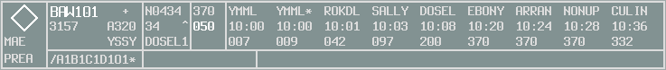

--8<-- "includes/abbreviations.md"

!!! note "Clickable Strip"
    - Clickable overview of the Strip found in vatSys.
    - Move the mouse over the panels to get the specific content shown.
    
    Idea stolen from [FlyByWire's 'Clickable Cockpit'](https://docs.flybywiresim.com/pilots-corner/a32nx-briefing/flight-deck/)

  

  <a href="">
Aircraft Direction Indicator
</a>

  <a href="">
Controlling Sector
</a>

  <a href="">
FDR State
</a>

  <a href="">
Callsign
</a>

  <a href="">
CPDLC Status
</a>

  <a href="">
VFR Indicator
</a>

  <a href="">
Assigned SSR Code
</a>

  <a href="">
Aircraft Type
</a>

  <a href="">
CTOT
</a>

  <a href="">
Destination
</a>

  <a href="">
Filtered FDR Remarks
</a>

