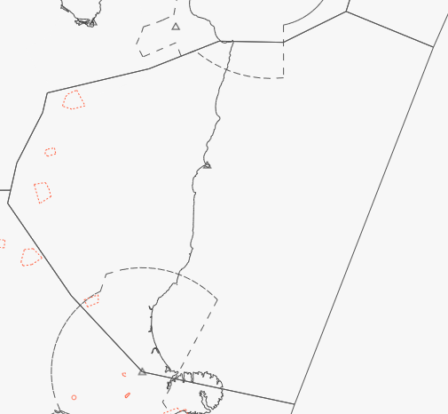

--8<-- "includes/abbreviations.md"

    
## Positions

| Sector Name                     | Shortcode | Callsign             | Frequency | Login ID   |
| ------------------------------- | --------- | -------------------- | --------- | ---------- |
| Christchurch Control (Kaikoura) | KAI       | Christchurch Control | 129.3     | NZCH-K_CTR |

## Airspace

KAI covers all airspace within the lateral bounds as found below, with the only exception being the airspace delegated to CH TMA. The lower limit for most airspace is `A075`. 

As CH TMA has an upper limit of `A095`, KAI provides control for any aircraft overflying the CH TMA up to its boundary with STH.

When CH TMA is offline, KAI automatically inherits and assumes responsibility for that sector.

<figure markdown> 
  
  <figcaption>Kaikoura's Lateral Bounds</figcaption>
</figure>

## Sector Responsibilities

KAI is responsible for the management of southbound NZCH arrivals, in addition to managing the traffic between NZCH and northern destinations.

### CH TMA

KAI shall ensure that an efficient arrival flow is managed into CH TMA from the North. 

KAI shall ensure that aircraft overflying the CH TMA are no lower than `FL190` without coordination.

### WN TMA

KAI shall ensure that an efficient arrival flow is managed into WN TMA from the South.

## Coordination

### Oceanic

Oceanic-bound aircraft are required to cross the FIR boundary at their CFL and via a defined waypoint. 

KAI may clear Oceanic bound aircraft direct to their boundary crossing fix without coordination from ARO. If aircraft request an amendment to their RFL, this shall be coordinated with ARO.

KAI shall give ARO a **10 minute warning** of the aircraft's crossing of the FIR boundary.

When traffic crosses into KAI from NZCI, they shall be identified in the normal manner, and provided with a domestic squawk code. 

??? hint "RTF for NZCI-bound traffic"
    Traffic bound for NZCI should be advised that they will be uncontrolled, and that ARO is proving a limited monitoring service.

    Aircraft bound for NZCI typically remain at flight levels under the Lower Limit of Oceanic airspace, and shall be handed over to UNICOM when crossing the FIR boundary. BAY shall advise ARO in the same manner as a reqular Oceanic flight, as Oceanic will maintain a limited monitoring service.

    **KAI**: *Chathams 541, cleared to leave controlled airspace on crossing waypoint `BOUNDRY FIX`. Control services not available. Auckland Radio providing limited monitoring. Continue with UNICOM now on 122.800. Call Auckland Radio on the ground for IFR cancellation.*

### NAK

KAI shall not issue any STAR clearances to aircraft crossing into NAK.

KAI shall ensure that any aircraft crossing the KAI/NAK boundary, with the exception of NZWS or NZNS traffic, are established on an airway. KAI may clear aircraft direct to a boundary fix, provided it is established on an airway thereafter.

### STH

KAI shall issue STARs without coordination to aircraft bound for an aerodrome within STH's boundaries, and may descend aircraft to `FL200` if necessary.

KAI shall ensure that aircraft have been cleared to their RFL on crossing the boundary, with the exception of descending traffic.

KAI shall ensure that any aircraft crossing the KAI/STH boundary is established on an airway. KAI may clear aircraft direct to a boundary fix, provided it is established on an airway once it reaches the direct-to fix.

### CH TMA

KAI may issue STAR clearances to aircraft bound for NZCH without coordination, provided that the STAR links with the nominated runway and approach type as stated in the ATIS. A request for the use of a non-nominated approach requires agreement from both the TMA and ADC Controller.

KAI may descend aircraft to `A095` without coordination from CH TMA.

If a sequencing conflict is to occur, KAI shall coordinate with CH TMA as to an ideal arrival order.

KAI may clear aircraft direct to the STAR's CH TMA boundary fix without coordination, provided that they have been cleared to rejoin the STAR thereafter. Aircraft may be cleared to track direct to a fix within CH TMA's boundary with coordination, subjec to the same condition.

??? hint "RTF for rejoining a STAR"
    **KAI**: *New Zealand 677, track direct KABGO to rejoin the STAR. When ready descend A080*.

    **Note**: As `KABGO` sits within CH TMA's airspace, co-ordination would be required.

### WN TMA

KAI shall issue STAR clearances for NZWB and NZWN bound aircraft without coordination, provided that the NZWN STAR issued links with the nominated runway and approach type as stated in the ATIS. A request for use of the non-nominated approach requires agreement from both the TMA and ADC Controller.

#### NZWN

KAI may descend NZWN bound aircraft to `A110` without coordination from WN TMA.

If a sequencing conflict is to occur, KAI shall coordinate with WN TMA as to an ideal arrival order.

KAI may clear aircraft direct to the STAR's WN TMA boundary fix without coordination, provided that they have been cleared to rejoin the STAR thereafter. Aircraft may be cleared to track direct to a fix within WN TMA's boundary with coordination, subjec to the same condition.

??? hint "RTF for rejoining a STAR"
    **KAI**: *New Zealand 677, track direct MEEDA to rejoin the STAR. When ready descend A040*.

    **Note**: As `MEEDA` sits within WN TMA's airspace, co-ordination would be required.

#### NZWB

Provided that there is no conflicting KAI traffic, KAI may clear NZWB bound aircraft direct to the `ELPIT` or `OMDOX` fixes on the `JAMIE #J or #K` STARs without coordination.

KAI may descend aircraft bound for NZWB to `A080` without coordination from WN TMA.

### NS TWR

KAI shall assign STARs without coordination to any aircraft bound for NZNS.

KAI may clear NZNS bound aircraft direct to `BISEB` or `GUNEL`, if those STARs have been issued. KAI may descend NZNS bound traffic to `A010` without coordination from NAK or NS TWR.