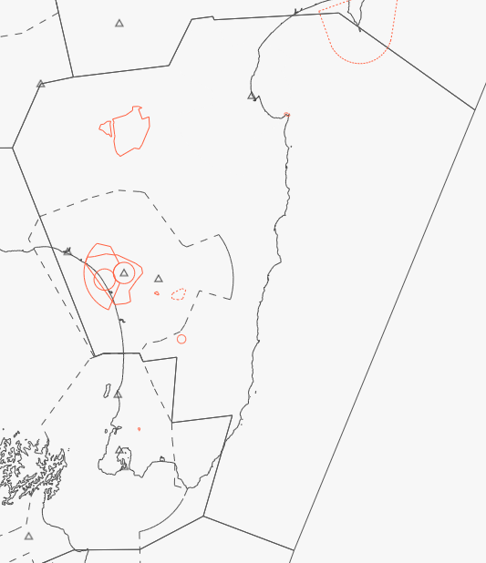

--8<-- "includes/abbreviations.md"

## Positions

| Sector Name    | Shortcode | Callsign       | Frequency | Login ID |
| -------------- | --------- | -------------- | --------- | -------- |
| Ohakea Control | OHA       | Ohakea Control | 126.200   | NZOH_CTR |

## Airspace

OHA covers all airspace within the lateral bounds as found below. The lower limit is `A065` west of Mount Ruapehu, and `A095` to the east.

As OH TMA has an upper limit of `A095`, OHA provides control for any aircraft overflying the OH TMA.

When OH TMA is offline, OHA automatically inherits and assumes all responsibility for that sector.

When NR TWR is offline, OHA automatically inherits the TWR and Procedural Approach services provided by NR TWR. See [the responsibilities section on NR TWR](#nr-twr).

<figure markdown> 
  
  <figcaption>Ohakea's Lateral Bounds</figcaption>
</figure>

## Sector Responsibilities

OHA is responsible for managing the flow of prop traffic between NZAA and NZWN, in addition to linking smaller aerodromes with the majors. 

OHA is also responsible for the management of a large volume of military traffic, in and around the OH TMA.

### OH TMA

OHA also manages traffic into and out of OH TMA. When OH TMA is offline, OHA automatically inherits OH TMA's airspace. 

OHA shall ensure that aircraft overflying the OH TMA are no lower that `A110` without coordination.

### WN TMA

OHA is responsible for ensuring an efficient arrival flow for prop traffic into the WN TMA. 

### NR TWR

When offline, the NR Procedural Tower service shall be provided by OHA. 

When responsible for NR TWR, OHA may opt to provide a radar approach service, rather than a procedural approach service.

## Coordination

### Oceanic

Oceanic-bound aircraft are required to cross the FIR boundary at their RFL and via a defined waypoint. 

OHA may clear Oceanic bound aircraft direct to their boundary crossing fix without coordination from ARO. If aircraft request an amendment to their RFL, this shall be coordinated with ARO.

OHA shall give ARO a **10 minute warning** of the aircraft's crossing of the FIR boundary.

When traffic crosses into the NZZC FIR from NZCI, they shall be identified in the normal manner, and provided with a domestic squawk code. 

!!! hint "RTF for NZCI-bound traffic"
    Traffic bound for NZCI shall be advised that they will be uncontrolled, and that ARO is proving a limited monitoring service.

    Aircraft bound for NZCI typically remain at flight levels under the Lower Limit of Oceanic airspace, and shall be handed over to UNICOM when crossing the FIR boundary. BAY shall advise ARO in the same manner as a reqular Oceanic flight, as Oceanic will maintain a limited monitoring service.

    **OHA**: *Chathams 391, cleared to leave controlled airspace on crossing waypoint `BOUNDRY FIX`. Control services not available. Auckland Radio providing limited monitoring. Continue with UNICOM now on 122.800. Call Auckland Radio on the ground for IFR cancellation.*

### RAN

OHA shall assign STARs to any aircraft bound for NZAA without coordination, provided it is for the nominated runway and approach type as stated in the ATIS. A request for use of a non-nominated approach requires coordination from RAN, who will liaise with AA TMA and ADC.

While descent is normally provided by RAN, OHA may descend props to `FL150` and jets to `FL190` without coordination from RAN.

### NAK

OHA shall assign STARs to any aircraft bound for an aerodrome within NAK without coordination. 

Where necessary, OHA may descend aircraft to `FL200` without coordination from NAK.

### BAY

OHA shall issue STARs without coordination to aircraft bound for an aerodrome within BAY's boundaries, and may descend aircraft to `FL200` if necessary.

OHA shall ensure that aircraft have been cleared to their RFL on crossing the boundary, with the exception of any descending traffic.

### OH TMA

OHA shall ensure that all traffic bound for NZWU, NZPM or NZOH have been issued a STAR, and may issue a STAR without coordination if necessary.

OHA may descend aircraft to `A095` without coordination from OH TMA.

If military operations are active within the NZOH area, OHA shall reissue aircraft with the MOA active STARs to ensure that civilian and military traffic is seperated. 

### WN TMA

OHA may issue STAR clearances to aircraft bound for any aerodrome within WN TMAs airspace without coordination, provided that the STAR links with the nominated runway and approach type as stated in the ATIS. A request for use of a non-nominated approach requires agreement from both the TMA and ADC Controller.

OHA may descend aircraft to `A110` without coordination from WN TMA.

If a sequencing conflict is to occur, OHA shall coordinate with WN TMA as to an ideal arrival order. 

OHA may clear aircraft direct to the STAR's WN TMA boundary fix without coordination, provided that they have been cleared to rejoin the STAR after that point. Aircraft may be cleared to track direct to a fix within WN TMA's boundary with coordination, subject to the same condition.

!!! hint "RTF for rejoining a STAR"
    **NAK**: *New Zealand 677, track direct LADIT to rejoin the STAR. When ready descend A080*.

    **Note**: As `LADIT` sits within WN TMA's airspace, coordination would be required. 