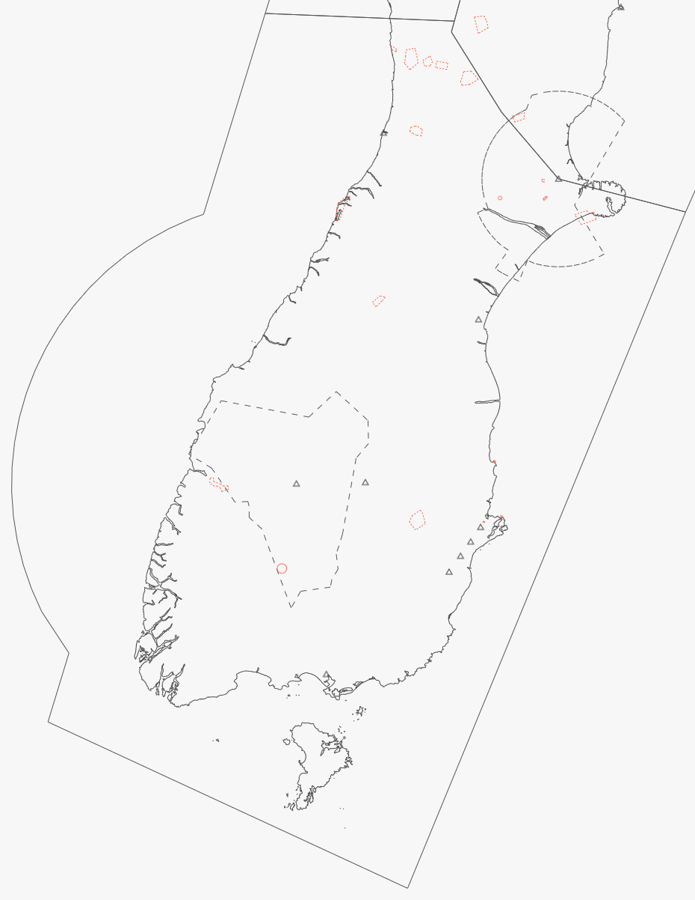

--8<-- "includes/abbreviations.md"

    
## Positions

| Sector Name                  | Shortcode | Callsign             | Frequency | Login ID   |
| ---------------------------- | --------- | -------------------- | --------- | ---------- |
| Christchurch Control (South) | STH       | Christchurch Control | 129.3     | NZCH-S_CTR |

## Airspace

STH covers all airspce within the lateral bounds as found below, with the only exception being the airspace delegated to CH TMA, QN TMA, and the NV and DN Procedural Towers. The lower limit for most airspace is `A135`.

As CH TMA has an upper limit of `A095`, STH provides control for any aircraft overflying the CH TMA up to its boundary with KAI.

As QN TMA has an upper limit of `FL175`, STH provides control for any aircraft overflying the QN TMA.

When KAI or QN TMA is offline, STH automatically inherits and assumes responsibility for those sectors.

When DN TWR or NV TWR is offline, STH automatically inherits the TWR and Procedural Approach services provided by those sectors. See the responsibilities sections on [DN TWR](#dn-twr) and [NV TWR](#nv-twr).

When CH TMA is offline, that position is inherited by KAI. If KAI is also offline, STH automatically assumes responsibility for KAI, and therefore for CH TMA also.

<figure markdown> 
  
  <figcaption>South's Lateral Bounds</figcaption>
</figure>

!!! important "Oceanic airspace delegated to STH"
    STH has been delegated airspace on NZZC FIR's western boundary to ensure smooth operations in and out of NZQN. This airspace consists of a 130nm QN VOR arc, where the overlap is then delegated to STH. Four IFR waypoints exist on this boundary - `BEBOB`, `DADLU`, `MADOK` and `EKODA`. These waypoints are all considered oceanic boundary fixes.

## Sector Responsibilities

STH is responsible for managing all NZQN traffic, in addition to managing the arrivals and departures of NZCH traffic to and from the Tasman.

STH also manages the traffic in and out of NZNV and NZDN, and the integration into other traffic streams.

### QN TMA

STH shall ensure that an efficient arrival flow is managed into QN TMA.

When QN TMA is offline, STH automatically inherits QN TMA's airspace.

STH shall ensure that aircraft overflying the QN TMA are no lower than `FL190` without coordination.

### CH TMA

STH shall ensure that an efficient flow is managed into CH TMA from the West.

STH shall ensure that aircraft overflying the CH TMA are no lower than `A110` without coordination.

### DN TWR

STH shall ensure that an efficient arrival flow is managed into DN TWR's airspace. 

DN TWR is only authorised to climb aircraft to a maximum of `FL250`. On handover, STH shall clear the aircraft to its RFL.

When DN TWR is offline, the DN Procedural Tower service shall be provided by STH. 

When responsible for DN TWR, STH may opt to provide a radar approach service, rather than a procedural approach service.

### NV TWR

STH shall ensure that an efficient arrival flow is managed into NV TWR's airspace. 

When NV TWR is offline, the NV Procedural Tower service shall be provided by STH. 

When responsible for NV TWR, STH may opt to provide a radar approach service, rather than a procedural approach service.

## Coordination

### Oceanic

Oceanic-bound aircraft are required to cross the FIR boundary at their RFL and via a defined waypoint. 

STH may clear Oceanic bound aircraft direct to their boundary crossing fix without coordination from ARO. If aircraft request an amendment to their RFL, this shall be coordinated with ARO.

STH shall give ARO a **10 minute warning** of the aircraft's crossing of the FIR boundary.

### NAK

STH shall issue STARs without coordination to aircraft bound for an aerodrome within NAK's boundaries, and may descend aircraft to `FL190` if necessary. 

STH shall ensure that aircraft have been cleared to their RFL on crossing the boundary, with the exception of any descending traffic. 

### KAI

While mostly not needed, STH may descend aircraft to `FL190` if necessary.

STH shall ensure that aircraft have been cleared to their RFL on crossing the boundary, with the exception of any descending traffic.

STH shall ensure that any aircraft crossing the STH/KAI boundary is established on an airway. STH may clear aircraft direct to a boundary fix, provided it is established on an airway once it reaches the direct-to fix.

### QN TMA

STH shall issue STARs to aircraft bound for NZQN without coordination, provided that the STAR links with either the `RNP Y (AR)` or `RNP Z (AR)` approaches. If a non-standard approach is requested, such as the `RNP F` or `VOR DME`, coordination shall occur. This requires agreement from both the TMA and ADC Controller.

STH may descend aircraft to `FL175` without coordination from QN TMA, although shall assign `FL180` as standard.

Due to the unique geography of NZQN, a standard sequence of at least 15nm shall be maintained between any aircraft commencing on a STAR.

STH may clear aircraft direct to the STAR's QN TMA boundary fix without coordination, provided that they have been cleared to rejoin the STAR after that point. Aircraft may not be cleared direct to a fix within QN TMA's boundary.

Where an NZDN oceanic arrival may descend into QN TMA airspace, STH shall hand that aircraft to QN TMA on passing `FL175`. QN TMA shall then hand back that aircraft no less than 15nm from `BASOS`.

### CH TMA

STH shall issue STARs to aircraft bound for NZCH wihout coordination, provided that the STAR links with the nominated runway and approach type as stated in the ATIS. A request for the use of a non-nominated approach requires agreement from both the TMA and ADC Controller.

STH may descend aircraft to `A095` without coordination from CH TMA. 

If a sequencing conflict is to occur, STH shall coordinate with CH TMA as to an ideal arrival order.

STH may clear aircraft direct to the STAR's CH TMA boundary without coordination, provided that they have been cleared to rejoin the STAR thereafter. Aircraft may be cleared to track direct to a fix within CH TMA's boundary with coordination, subject to the same condition.

#### Short STARs - NZCH

`BELEE #J` and `BELEE #K` are Short STARs into CH TMA that capture ILS 02 and ILS 20 at their intermediate fixes, `IDUBU` and `DIVSU` respectively. Controllers must co-ordinate with CH TMA before clearing aircraft for these arrivals, as prior planning may be required to ensure flow is maintained.

These STARs are flow control STARs, allowing controllers to sequence aircraft onto a shorter final approach. Controllers should utilise these STARs when a conflict exists at the IAF for the ILS 02/20 or if northbound or southbound arrival flows have already been established.

These arrivals provide track shortening of **4NM** compared to the `A`/`B` arrivals.

### DN TWR

STH shall issue STARs to aircraft bound for NZDN without coordination from DN TWR. 

DN TWR is only authorised to climb aircraft to a maximum of `FL250`. On handover, STH shall clear the aircraft to its RFL.

STH may descend NZDN bound aircraft to `A100`, unless the aircraft has been given the `BASOS` oceanic STAR, where the following conditions apply -

  -  The aircraft shall be descended no lower than `FL190` whilst overflying QN TMA airspace. If further descent is required, the aircraft shall be handed to QN TMA, who will hand the aircraft back no later that 15nm from `BASOS`. 

### NV TWR

STH shall issue STARs to aircraft bound for NZNV without coordination from NV TWR.

STH may descend NZNV bound aircraft to `A095`, unless -

  -  The aircraft has been given the `ANOPA` STAR, with the `SUNGU` transition. In this case, the aircraft shall be descended no lower than `FL190` while overhead the QN TMA. Should further descend be required, STH is to hand the aircraft to QN TMA.
  -  The aircraft has been given the `DUKOP` STAR. In this case, the aircraft shall be descended no lower than `A135` while overhead DN TWR airspace. Should further descend be required, STH shall coordinate with DN TWR. The aircraft is to remain with STH for radar monitoring.
