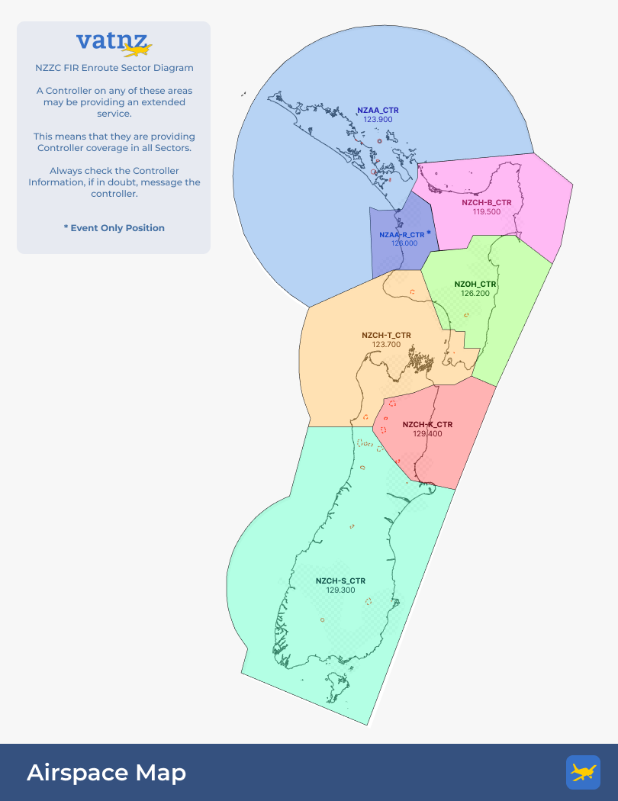

New Zealand has seven Enroute Sectors, six of which can be staffed routinely on the network. This section provides detailed information on how to run each sector's operations, and lists some nuances that may be associated with them. 

VATNZ Controllers are able to staff all six permanent Enroute Sectors at once, in a situation known as Extended Services. [You can find out more about Sector Inheritance and Extended Services here](../controller-skills/inheritance-extending.md).

!!! tip "Interactive Sector Map"
    Hover over a sector to view basic position information, then click the sector to open the full procedure page.

  

  

    
    
    
    
    
    
    
  

  

    <strong>Auckland - Oceanic Radar (OCR)</strong>
    NZAA_CTR | Auckland Control | 123.900
    Sequences NZAA and NZWP arrivals.
    Click for more information
  

  

    <strong>Auckland - Raglan (RAN)</strong>
    EVENT ONLY
    NZAA-R_CTR | Auckland Control | 126.000
    Click for more information
  

  

    <strong>Christchurch - Bays (BAY)</strong>
    NZCH-B_CTR | Bay Approach | 119.500
    Manages East Coast flow into AA TMA and OHA.
    Click for more information
  

  

    <strong>Ohakea (OHA)</strong>
    NZOH_CTR | Ohakea Control | 126.200
    Links prop and military traffic around OH TMA.
    Click for more information
  

  

    <strong>Christchurch - Taranaki (NAK)</strong>
    NZCH-T_CTR | Christchurch Control | 123.700
    Primary NZAA, NZCH, NZQN and NZWN flow sector.
    Click for more information
  

  

    <strong>Christchurch - Kaikoura (KAI)</strong>
    NZCH-K_CTR | Christchurch Control | 129.400
    Manages northbound and southbound NZCH traffic.
    Click for more information
  

  

    <strong>Christchurch - South (STH)</strong>
    NZCH-S_CTR | Christchurch Control | 129.300
    Manages NZQN, NZDN, NZNV and western NZCH flows.
    Click for more information
  

## General Rules of Thumb for ENR

This section outlines some general rules for Enroute Controllers. More specific rules for each sector can be found on the individual sector pages.

### ATIS Connection Management

Controllers are permitted to create up to 4 ATIS connections on the network and they should adhere to the following guidance when creating ATIS connections;

| Position                   | Primary ATIS Aerodromes    | Additional ATIS Aerodromes (Inherited Sectors) |
| -------------------------- | -------------------------- | ---------------------------------------------- |
| NZAA_CTR (OCR)             | NZAA, NZWP                 | NZNP (RAN) NZHN, NZTG, NZRO, NZGS (BAY)        |
| NZCH-B_CTR (BAY)           | NZTG, NZRO, NZGS           | NZHN (RAN)                                     |
| NZOH_CTR (OHA)             | NZPM, NZOH, NZNR           | None                                           |
| NZCH-T_CTR (NAK)           | NZWN, NZNS, NZWB           | NZPM, NZOH, NZNR (OHA)                         |
| NZCH-K_CTR (KAI)           | NZCH                       | None                                           |
| NZCH-S_CTR (STH)           | NZDN, NZQN, NZNV           | NZCH (KAI)                                     |

!!! important
    Controllers should create **at least one** ATIS connection for aerodromes within their primary sector before aerodromes within inherited or extended sectors.

    Controllers may create an ATIS connection at an aerodrome with high levels of traffic if that aerodrome falls within an inherited or extended sector.
    

!!! note
    Should a controller find that an ATIS has already been created by a controller below them, they should attempt to satisfy the requirements of the above logic table. 
    
    ATIS connections within extended or inherited sectors should be surrendered if another controller logs onto that position, unless prior co-ordination has been made.

### STARs

Generally, if an aircraft's destination is in a bordering sector, you should ensure that a STAR clearance has been issued. In most cases a STAR clearance will be issued by the sector immediately before it's destination sector.

### Altitude Management

In most cases aircraft should cross an ENR border either at their RFL, or in climb to their RFL.

If an aircraft requires a descent into an **ENR** sector, they can be descended to `FL200` if northbound, or `FL190` if southbound without coordination from the next sector.

If an aircraft requires a descent into a **TMA** or **Procedural TWR** sector, they can be descended to that airspace's Upper Limit without coordination from the that sector.

### Direct Routing

Aircraft should never be routed directly to a fix that is outside of your sector without coordination first. 

Enroute sectors may clear an aircraft directly to a ENR boundary fix without coordination, provided that they fly on an established airway thereafter.

Enroute sectors may clear an aircraft directly to a TMA STAR boundary fix, provided they have then been cleared to track by the STAR thereafter. Additionally, an aircraft may be cleared direct to a point on the STAR, provided that it has been coordinated, and they have been told to rejoin the STAR thereafter.
