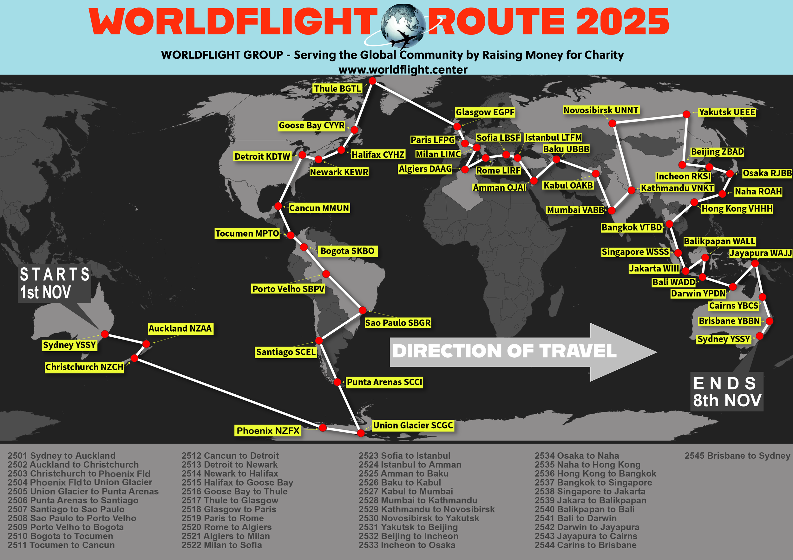

--8<-- "includes/abbreviations.md"

Welcome to the Controller Briefing for World Flight 2025.

## World Flight Teams

Official WorldFlight teams should be afforded priority at all stages of flight. 

The list of callsigns is below:

| Callsign | Aircraft Type | Team Name | 
| -------- | ------------- | --------- |
| ANZ361 | B738 | Hamilton |
| ANZ362 | B738 | Hamilton |
| ANZ363 | B738 | Hamilton |
| ASY121 | A332 | Simflite AU |
| BAW47C | B744 | Simfest UK |
| CVY44N | B744 | Team Covey |
| DAL209 | B738 | WorldFlight USA |
| DAL2507 | B738 | Cali Crew |
| EXS25N | B738 | Ness Aviation |
| GTI1471 | B744 | WorldFlight Perth |
| JHL44 | A320 | Team JeeHell |
| KLM2064 | B738 | Amsterdam 737 Club |
| NPT11W | B738 | Velocity UK |
| NWA179 | B743 | Jurrasic Jets |
| QFA25 | B744 | WorldFlight AU |
| RYR7MA | B738 | Ascent Aviation |

## Route

