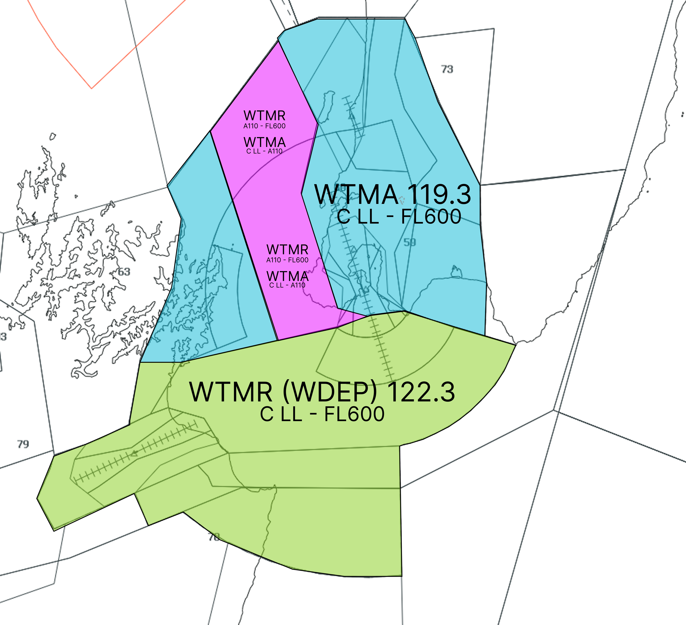
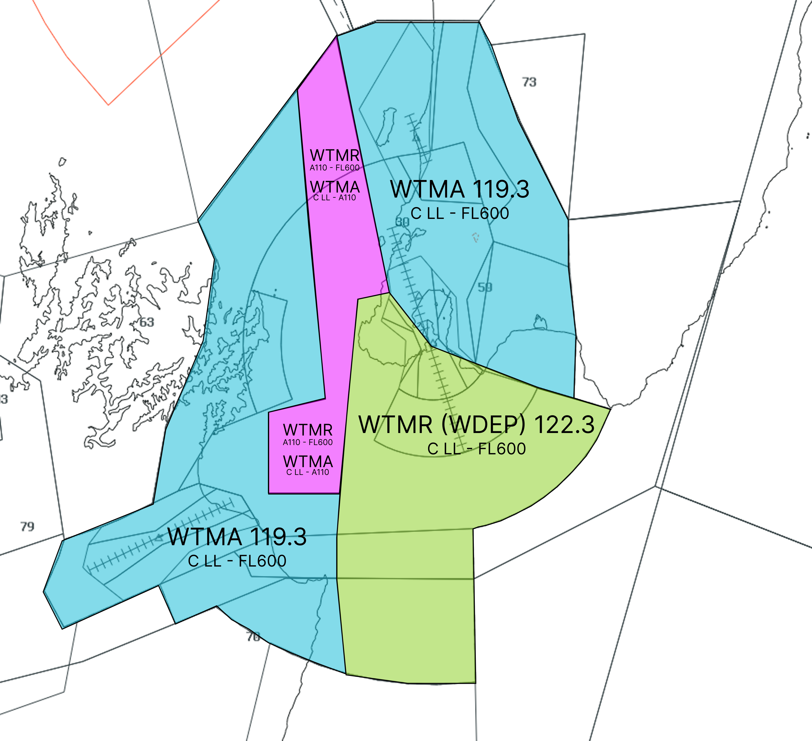
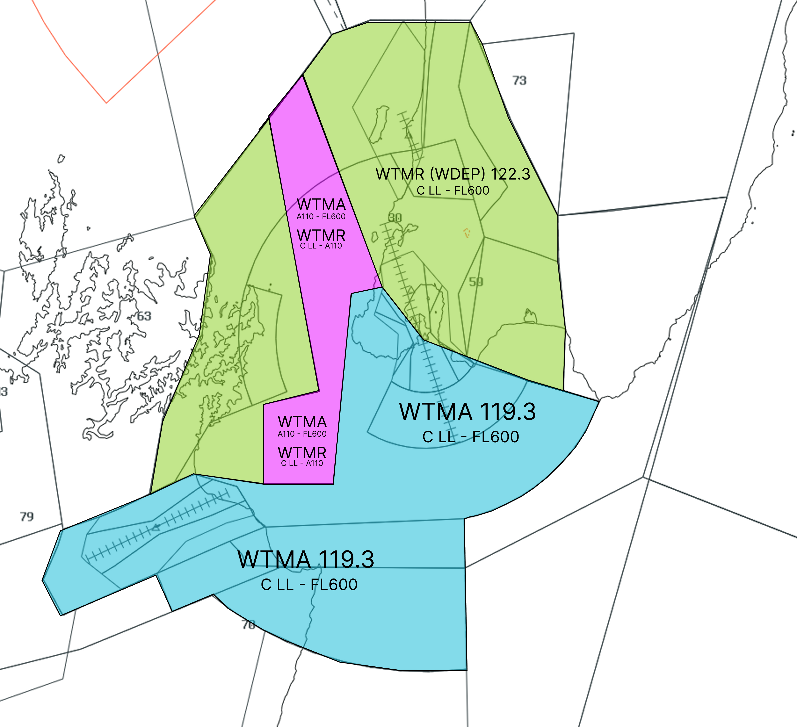
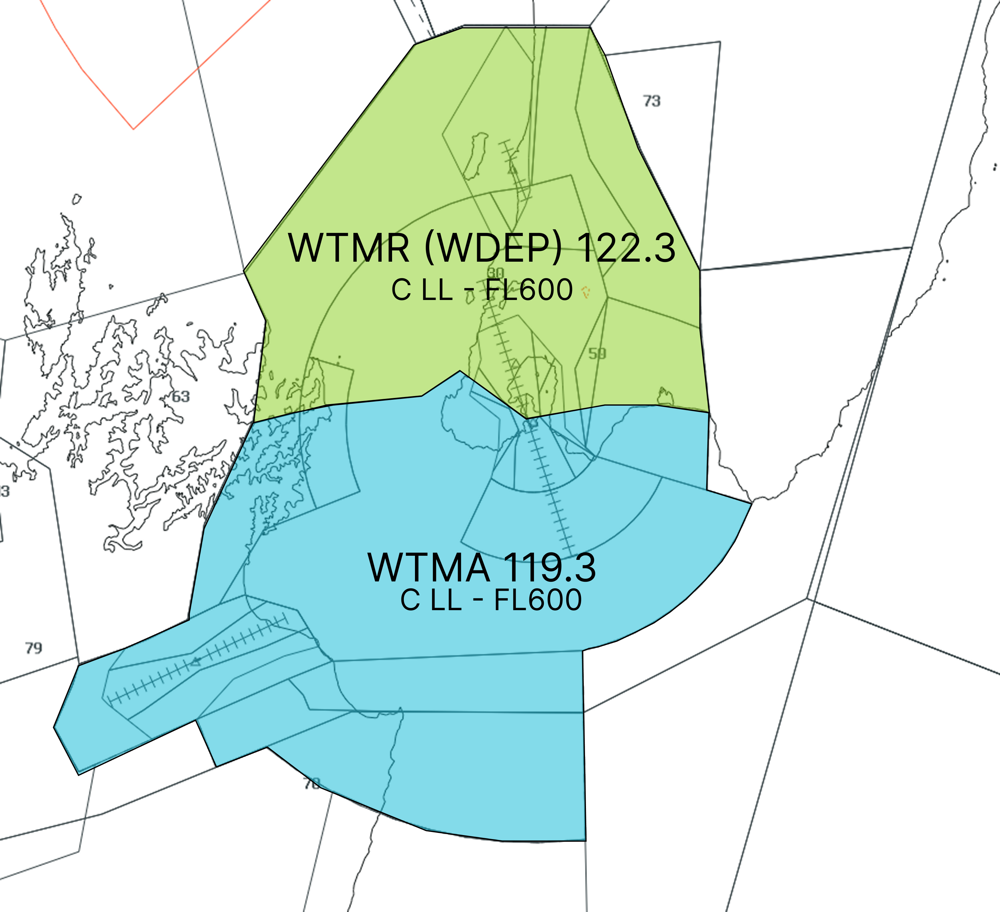
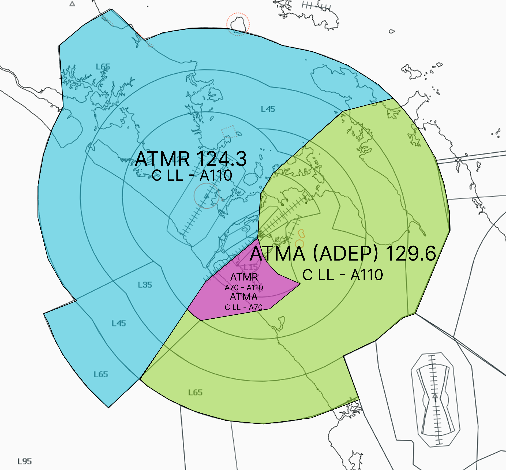
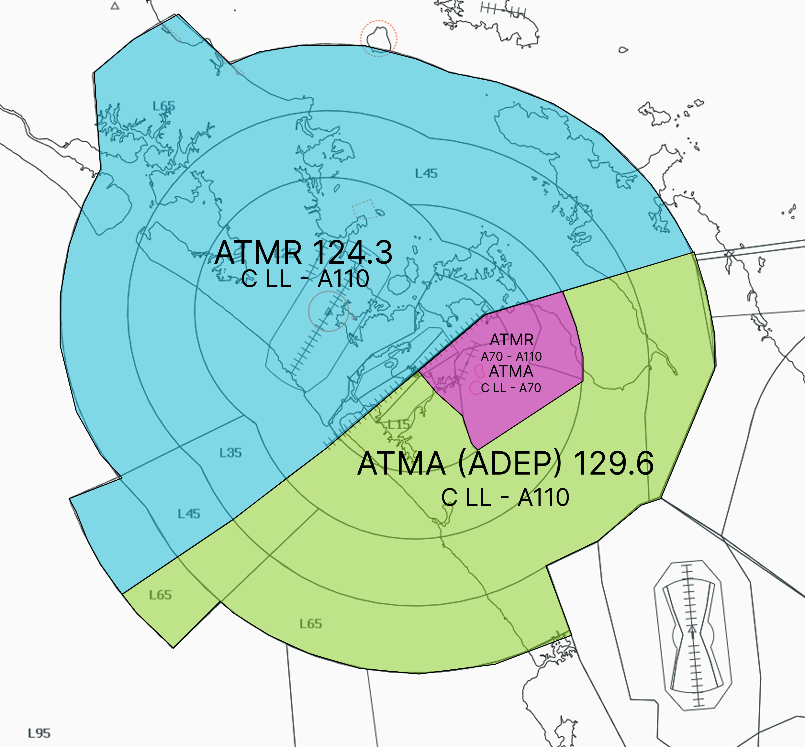
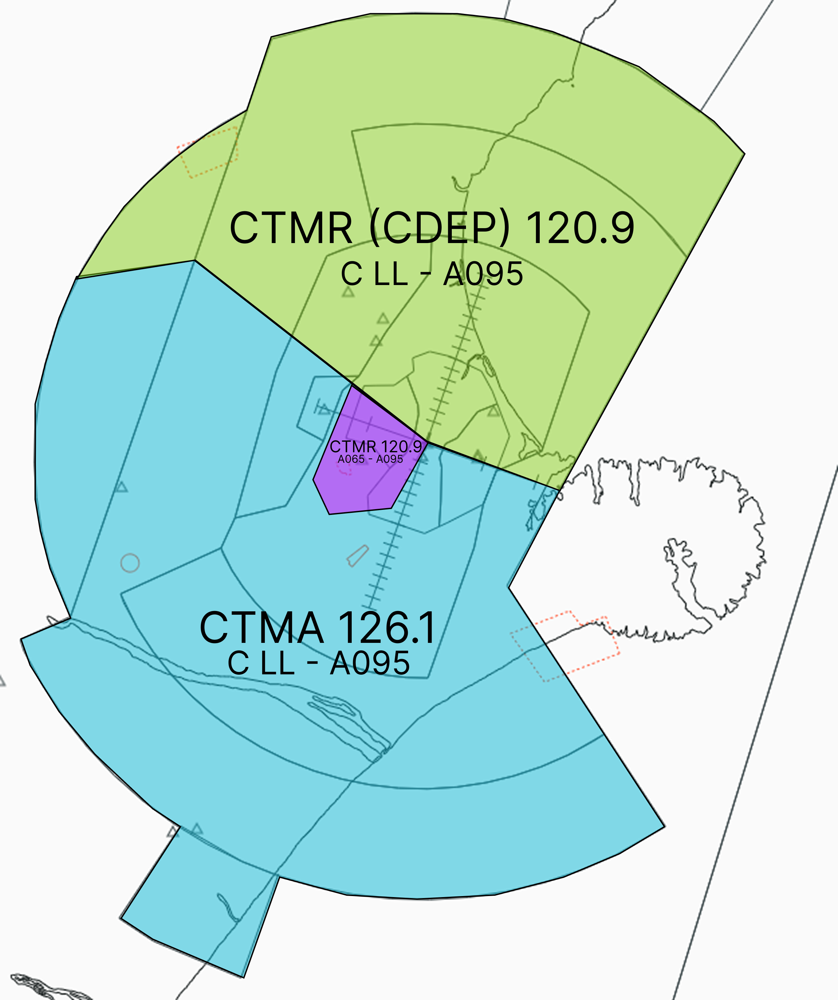
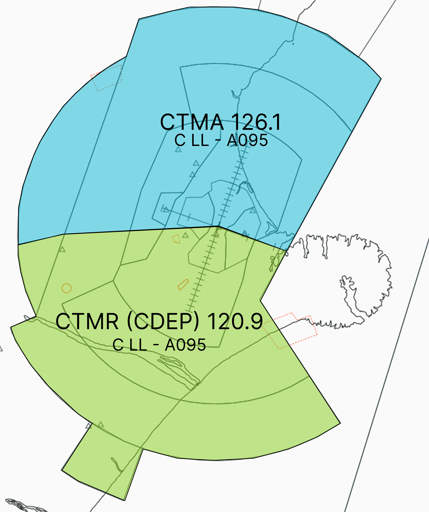

--8<-- "includes/abbreviations.md"

Select the active runway mode and traffic direction to view the corresponding event split. The diagrams show the lateral boundary, controlling position and vertical limits for each sector.

## NZWN - Wellington

=== "Runway 16"

    === "Northern traffic"

        <figure markdown>
          
          <figcaption>NZWN event split - Runway 16, northern traffic</figcaption>
        </figure>

    === "Western and southern traffic"

        <figure markdown>
          
          <figcaption>NZWN event split - Runway 16, western and southern traffic</figcaption>
        </figure>

=== "Runway 34"

    === "Northern traffic"

        <figure markdown>
          
          <figcaption>NZWN event split - Runway 34, northern traffic</figcaption>
        </figure>

    === "Western and southern traffic"

        <figure markdown>
          
          <figcaption>NZWN event split - Runway 34, western and southern traffic</figcaption>
        </figure>

## NZAA - Auckland

=== "Runway 05R"

    <figure markdown>
      
      <figcaption>NZAA event split - Runway 05R</figcaption>
    </figure>

=== "Runway 23L"

    <figure markdown>
      
      <figcaption>NZAA event split - Runway 23L</figcaption>
    </figure>

## NZCH - Christchurch

=== "Runway 02"

    <figure markdown>
      
      <figcaption>NZCH event split - Runway 02</figcaption>
    </figure>

=== "Runway 20"

    <figure markdown>
      
      <figcaption>NZCH event split - Runway 20</figcaption>
    </figure>
