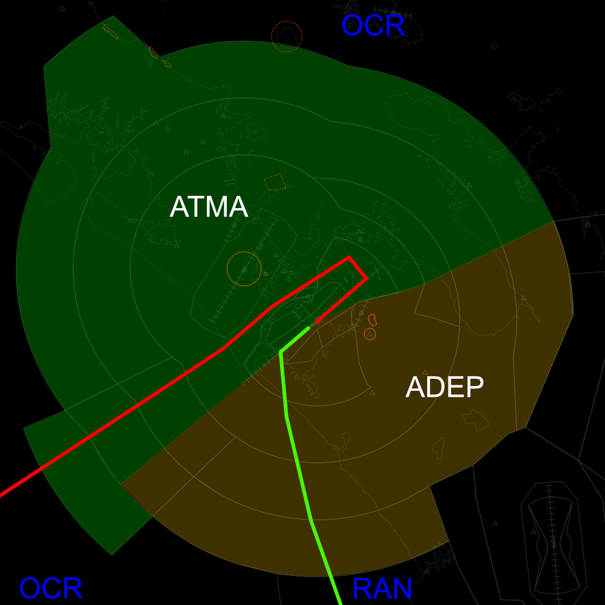
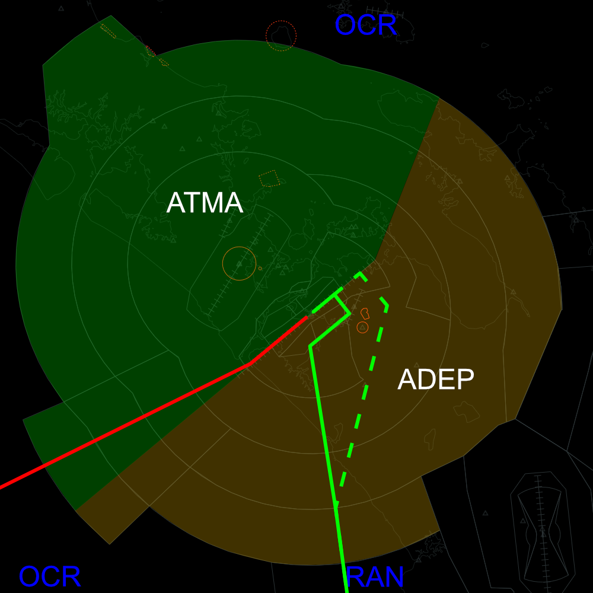

--8<-- "includes/abbreviations.md"

## Airspace Division

### RWY 23L

<figure markdown>
  {width="700"} 
  <figcaption>23L Airspace Division</figcaption>
</figure>

### RWY 05R

<figure markdown>
  {width="700"} 
  <figcaption>05R Airspace Division</figcaption>
</figure>
