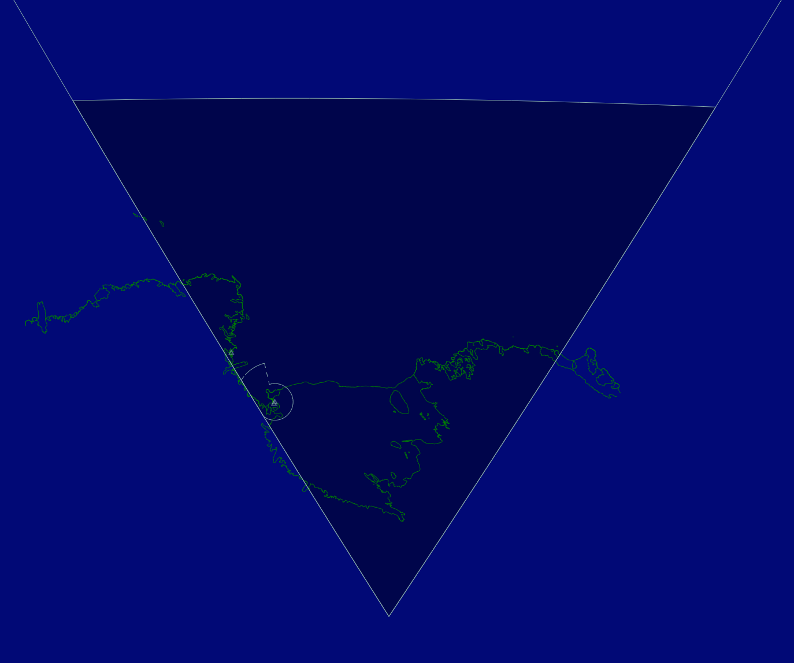

--8<-- "includes/abbreviations.md"

Mac Center provides Air Traffic Services for aircraft operating within the McMurdo Sector of Antarctica. This includes enroute and oceanic air traffic control, flight following, search and rescue coordination, and non-radar approach services where applicable. Mac Center coordinates closely with Auckland Radio for flights between Antarctica and New Zealand, and Brisbane Radio for flights between Antarctica and Australia.

## Positions

| Callsign | Position Name | RTF Designator | Frequency                     | Notes |
| -------- | ------------- | -------------- | ----------------------------- | ----- |
| NZCM_FSS | Mac Center    | Mac Center     | 9.032 (VHF alias 128.700 MHz) |       |

!!! warning "Use of 118.200 MHz"
    Aircraft approaching Antarctica will normally transfer from the HF frequency to **118.200 MHz** when operating within the McMurdo Sector.

    To transmit on **118.200 MHz**, controllers must cross-couple (`XC`) **NZCM_CTR**.

    **NZCM_CTR** is a utility position used **only** for cross-coupling and must **never** be staffed.

## Airspace Overview

{ align=right width="40%" }

Mac Center is responsible for aircraft operating **south of 60° South latitude** within the McMurdo Sector and supporting United States Antarctic Program (USAP) operations.

Mac Center coordinates with neighbouring ATS units at the following boundaries:

- **North:** Auckland Radio (60° South Latitude)
- **North-West:** Melbourne Radio (163° East Longitude)

!!! info "Services Provided"
    Depending on the operation, Mac Center may provide:

    - Enroute and Oceanic Air Traffic Control
    - Flight Following
    - Search and Rescue Coordination
    - Non-Radar Approach Services
    - Traffic Advisory Services

## Airspace Classification

The McMurdo Sector contains three classes of airspace.

| Airspace | Description |
| --------- | ----------- |
| **Class A** | `FL245` to `FL600` throughout the McMurdo Sector |
| **Class D** | 4.3 NM around Phoenix Field from the surface to `A025` when the tower is operating |
| **Class E** | Surface to below `FL245` within 100 NM of Pegasus Field and Williams Field (excluding Class D airspace) |

!!! note
    Further information on operating within each airspace classification can be found in the **Procedures** section.
