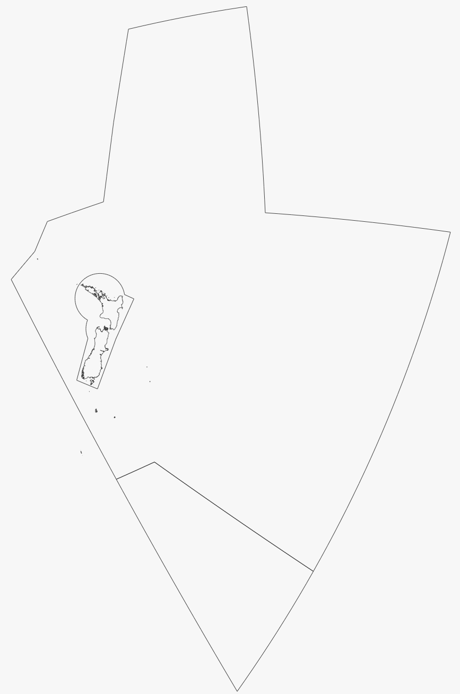
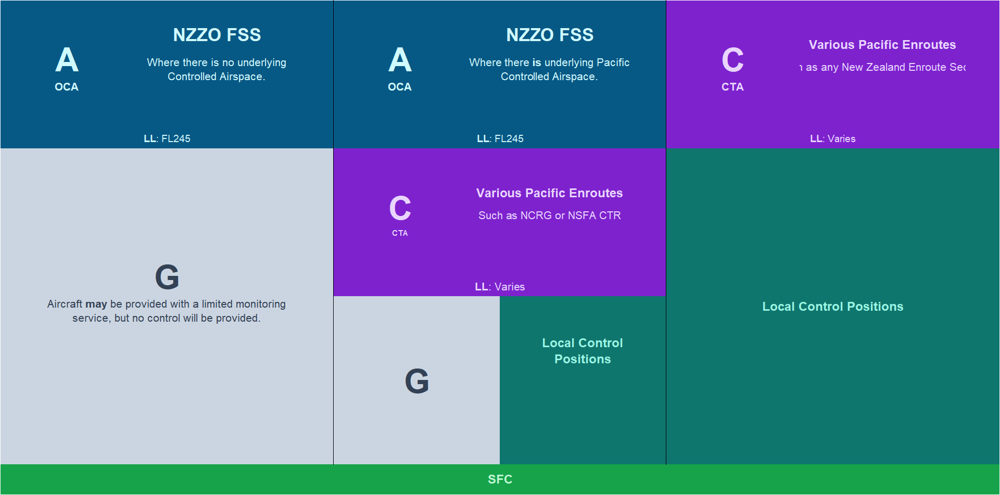

--8<-- "includes/abbreviations.md"

Auckland Radio is an oceanic control station that covers the entirely of the NZZO FIR from FL245 to FL600, except where intersected by the NZZC and NZCM FIRs. In the real-world, radar coverage over this large area over the ocean is not possible - therefore non-radar procedures are used to ensure the separation of aircraft.

## Positions

There are three approved positions that can be staffed within the NZZO FIR. 

| Callsign   | Position Name         | RTF Designator | Frequency                    | Notes               |
| ---------- | --------------------- | -------------- | ---------------------------- | ------------------- |
| NZZO_FSS   | Auckland Radio        | Auckland Radio | 8.867 (VHF alias 129.00MHz)  |                     |
| NZZO-E_FSS | Auckland Radio - East | Auckland Radio | 5.643 (VHF alias 131.500MHz) | Event Only Position |
| NZCM_FSS   | MacMurdo Center       | Mac Center     | 9.032 (VHF alias 128.700MHz) |                     |

## Airspace Overview

{ align=right width="40%"}

Auckland Radio is airspace begins at FL245, and tops-out at FL600. The lateral boundaries of NZZO can be seen to the right, as is bounded by:

  - **West:** Brisbane Radio - Indian South, Tasman and Lord Howe Island sectors.
  - **North West**: Nadi Oceanic
  - **North**: Oakland Oceanic
  - **North-East**: Tahiti Oceanic
  - **East**: Pascula
  - **South**: MacMurdo Center

It is important to note that NZZO **does not** provide coverage over, or within the NZZC FIR.

Below is an overview of the various classes of airspace that can be found within the NZZO. 

<figure markdown> 
  { width="100%" }
</figure>

