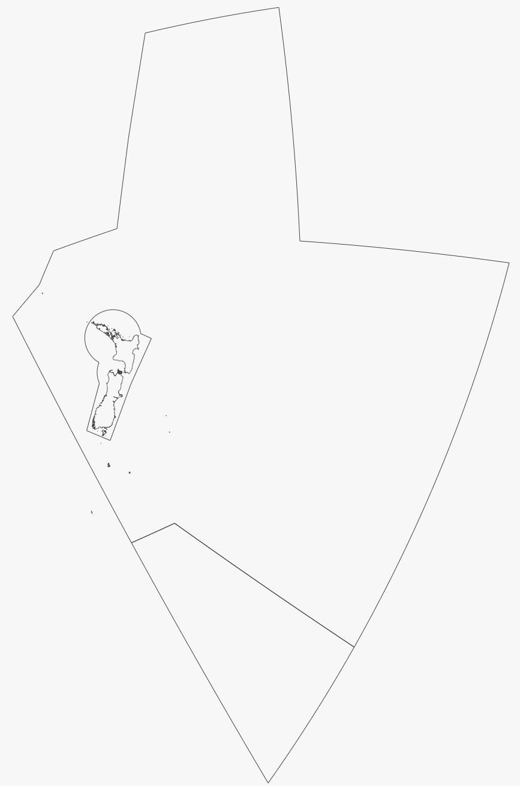
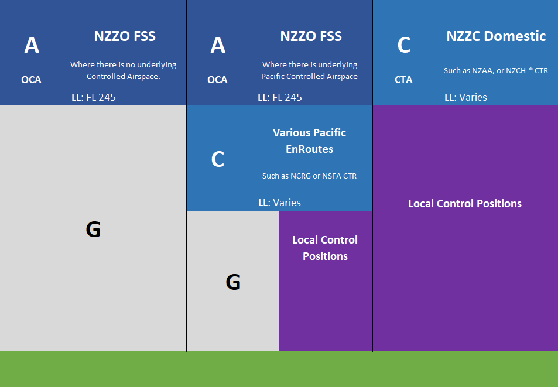

--8<-- "includes/abbreviations.md"

Auckland Radio is responsible for managing oceanic air traffic control within the NZZO FIR. This vast area spans much of the open ocean, where radar coverage is unavailable, necessitating the use of non-radar procedural control to ensure safe separation of aircraft. Auckland Radio works in close coordination with neighbouring FIRs, including NZZC and NZCM, to maintain efficient and safe operations across these boundaries.

## Positions

| Position Name        | Shortcode | Callsign      | Frequency                    | Login ID     | Usage                                     |
| -------------------- | --------- | ------------- | ---------------------------- | ------------ | ----------------------------------------- |
| Auckland Radio       | ARO       | NZZO_FSS      | 8.867 (VHF alias 129.000MHz) | NZZO_FSS     | Primary                                   |
| Auckland Radio Tasman| ART       | NZZO-TSN_FSS  | 5.643 (VHF alias 129.500MHz) | NZZO-TSN_FSS | Secondary                                 | 
| MacMurdo Center      | MAC       | NZCM_FSS      | 9.032 (VHF alias 128.700MHz) | NZCM_FSS     | Primary. Covered by ARO when MAC offline. | 
|

### Event Only Positions

!!! Danger "Important"
    The following are designated as Event Only positions, and may only be staffed during a VATNZ event where approved, or if explicitly authorised by the Operations Director.

| Position Name               | Shortcode | Callsign    | Frequency                   | Login ID   | Usage                       |
| --------------------------- | --------- | ----------- | --------------------------- | ---------- | --------------------------- |
| Auckland Radio East         | ARE       | NZZO-E_FSS  | 5.643 (VHF alias 131.500MHz)| NZZO-E_FSS | Event Only                  | 

## Airspace Overview

{ align=right width="40%"}

Auckland Radio controls the airspace within the NZZO FIR, which extends from FL245 to FL600. The lateral boundaries of NZZO are shown in the diagram to the right and are defined as follows:

- **West**: Brisbane Radio (Indian South, Tasman, and Lord Howe Island sectors)
- **North West**: Nadi Oceanic
- **North**: Oakland Oceanic
- **North-East**: Tahiti Oceanic
- **East**: Mataveri Radio (Easter Island)
- **South**: MacMurdo Center

It’s important to note that NZZO **does not** provide coverage over or within the NZZC FIR.

Below is an overview of the various classes of airspace that can be found within the NZZO. 

<figure markdown> 
  { width="100%" }
</figure>

