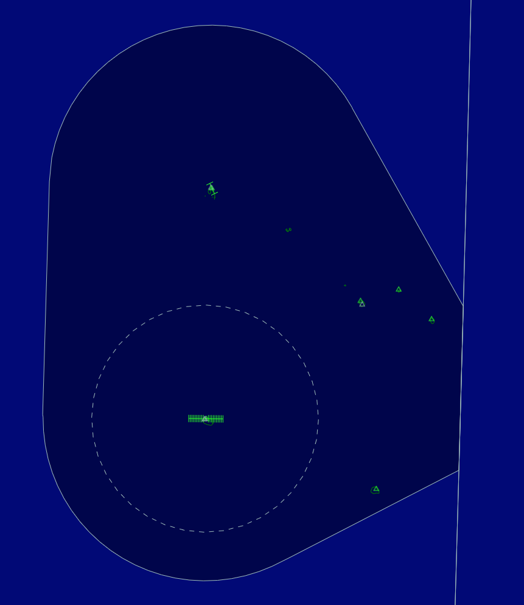

--8<-- "includes/abbreviations.md"

## Positions

| Position Name      | Shortcode | Callsign                  | Frequency | Login ID | Usage   |
| ------------------ | --------- | ------------------------- | --------- | -------- | ------- |
| Rarotonga Tower    | TRA       | Rarotonga (Raro) Tower    | 118.100   | NCRG_APP | Primary |
| Rarotonga Control  | RAR       | Rarotonga (Raro) Control  | 118.900   | NCRG_CTR | Primary |
| Auckland Radio     | ARO       | Auckland Radio            | 129.000   | NZZO_FSS | Primary |

### Event Only Positions

!!! danger "Important"
    The following position may only be staffed during a VATNZ event where approved, or if explicitly authorised by the Operations Director.

| Position Name      | Shortcode | Callsign                  | Frequency | Login ID | Usage      |
| ------------------ | --------- | ------------------------- | --------- | -------- | ---------- |
| Rarotonga Delivery | DRA       | Rarotonga (Raro) Delivery | 121.900   | NCRG_DEL | Event only |

## Rarotonga Control

<figure markdown>
  
</figure>

**NCRG_CTR** "Rarotonga Control" on 118.900 provides an enroute radar service within the Rarotonga CTA from `A055` to `FL245`.

Rarotonga Control:

- Provides the enroute interface between Rarotonga Tower and Auckland Radio.
- Provides a top-down service to NCRG when Rarotonga Tower is offline.
- Shall transfer aircraft climbing above `FL245` to ARO before the common airspace boundary.
- Shall accept arrivals from ARO and descend them into the Rarotonga CTA.

ARO is responsible above `FL245`. Aircraft operating above `FL245` should be transferred to ARO on 129.000.

## Rarotonga Tower

!!! info "Why is the login ID NCRG_APP?"
    Rarotonga Tower uses an `_APP` suffix because the FSD restricts `_TWR` callsigns to a visibility range of 50nm.

**NCRG_APP** "Rarotonga Tower" on 118.100 provides a combined procedural approach, tower and ground service for NCRG.

**Limits**: There are three layers to Rarotonga Tower's area of responsibility:

- A circle 30nm in diameter, centred on RG VOR from `SFC` to `A055`.
- A circle 50nm in diameter, centred on RG VOR from `A055` to `A095`.
- A circle 70nm in diameter, centred on RG VOR from `A095` to `A145`.

Rarotonga Tower may conduct auto-release to RAR provided the aircraft is departing via a nominated runway and SID. Any departure requiring a heading, non-standard track or amended level shall be coordinated with RAR before departure.

Aircraft climbing above RAR's upper limit shall be instructed to contact RAR after departure. RAR will transfer the aircraft to ARO when required.

## Rarotonga Delivery

**NCRG_DEL** "Rarotonga Delivery" on 121.900 is an Event Only position.

DRA provides clearance delivery only. When DRA is online:

- DRA shall issue IFR clearances and weather information to departing aircraft.
- TRA remains responsible for runway, taxi, start and pushback operations.
- DRA shall coordinate non-standard clearances, amended levels or routing changes with TRA before issuing the clearance.

When DRA is offline, TRA shall issue IFR clearances and weather information.

## Weather Information

There is **no ATIS** at Rarotonga.

Controllers shall not create an NCRG ATIS connection. The current weather information shall be passed by voice:

- DRA shall provide weather information with the IFR clearance when DRA is online.
- TRA shall provide weather information to departures when DRA is offline.
- TRA shall provide weather information to arrivals before issuing an approach or landing clearance if the aircraft has not already received it.

Weather information should include the runway in use, surface wind, visibility, cloud, temperature, QNH and any relevant operational remarks.

## Coordination

Any requests for a non-nominated approach shall be coordinated with TRA.

TRA shall coordinate IFR departures with RAR unless auto-release conditions are met.

RAR shall provide a 10-minute warning to ARO before an aircraft crosses the common airspace boundary. ARO shall provide the same warning to RAR for arriving aircraft.

RAR shall coordinate with ARO if an aircraft is unable to cross the common airspace boundary at the cleared level, or if an amended route or level is required.
