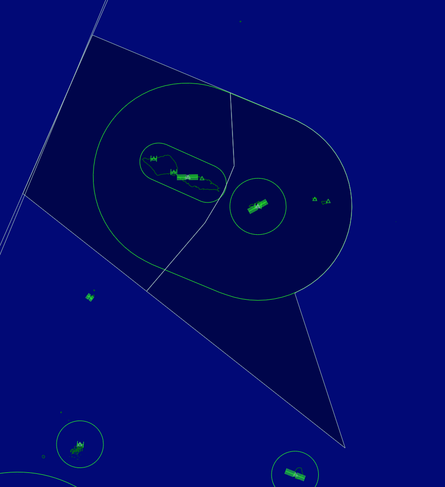
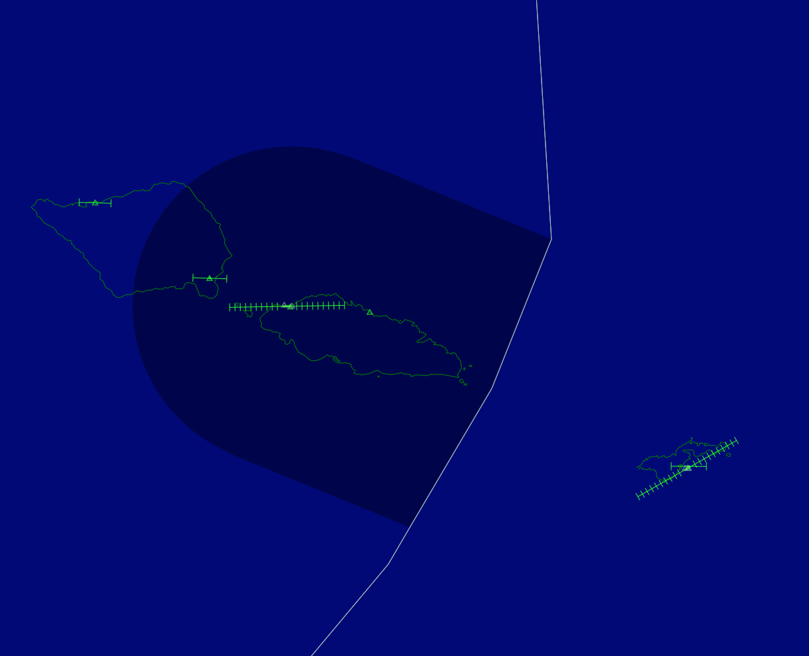
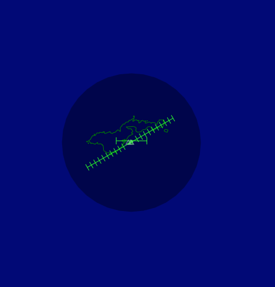

--8<-- "includes/abbreviations.md"

| Position Name      | Shortcode | Callsign              | Frequency | Login ID | Usage       |
| ------------------ | --------- | --------------------- | --------- | -------- | ----------- |
| Auckland Radio     | ARO       | Auckland Radio        | 129.000   | NZZO_FSS |             |
| Faleolo Control    | FAL       | Faleolo Control       | 126.900   | NSFA_CTR |             |
| Faleolo Tower      | TFA       | Faleolo Tower         | 118.100   | NSFA_TWR |             |
| Pago Pago Tower    | TTU       | Pago Tower            | 122.900   | NSTU_TWR | Event only  |

## Faleolo Control

There are no real-world Enroute Sectors operating above Samoa, however due to Samoa's complex Approach sectors and large TMAs, we haved merged them into a single Faleolo Control Sector.

<figure markdown>
  
</figure>

* **NSFA_CTR**: "Faleolo Control" on 126.900. 
    * **Limits**: Vertical limits differ. Includes the main sector to the West, and the 'R' sector over Pago Pago.
        * The West Sector is from `SFC` to `FL245`. 
        * The East Sector is from `A035` to `FL245`.
    * The West Sector provides an Enroute Service for NSFA, and interfaces directly with NSFA.
    * The East Sector provides a TMA service to NSTU, but **does not** provide a Tower service, as the lower limit is `A035`. 

## Faeleolo Tower

<figure markdown>
  
</figure>

* **NSFA_TWR** "Faleolo Tower" on 118.100.
    * **Limits**: `SFC` to `A075`. Lateral bounds as shown above.
    * Provides a Procedural Approach service for NSFA. Also provides a control service for NSMA to the west.

## Pago Pago (NSTU)

<figure markdown>
  
  <figcaption> In this case TTUs airspace is `SFC` to `A035` <figcaption>
</figure>

NSTU (Pago Pago) is an interesting aerodrome. It is normally uncontrolled, with a combined APP/DEP above it, starting at `A035`. On the network, this service is to be provided by FAL. 

A tower position will be established on the network for NSTU, as an Event Only position on 122.900. While not incredibly accurate, it will be helpful when an event in underway in the area. The NSTU Clearance position will **not** be modelled.

TTU shall request release of **ALL** IFR departures with FAL prior to departure. 

Since there are no published SIDs TTU shall clear the aircraft by means of a radar vector or a means of establishing on track to thier first waypoint. 

## Coordination

As usual, any requests for a non-nominated approach shall be coordinated with the Towers as needed. 

TTU shall request release of **ALL** IFR departures with FAL prior to departure.

TFA may conduct auto-release to FAL provided the aircraft are on a RNAV SID off the Nominated Runway. 

FAL shall provide a 10-minute warning to ARO before an aircraft crosses the common airspace boundary. As FAL provides a radar service no coordination is requried from ARO. 