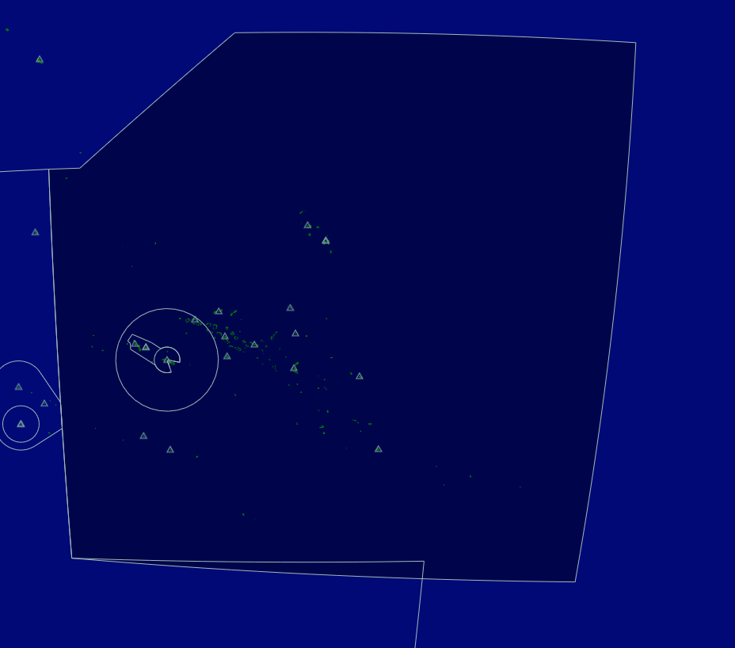
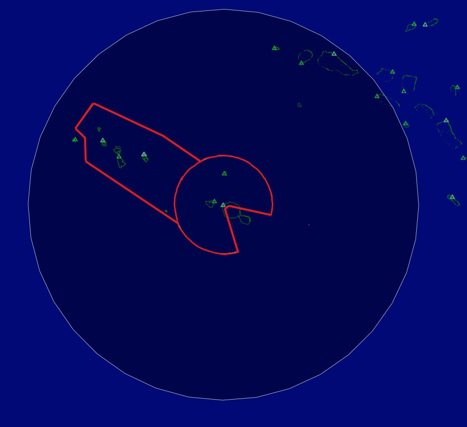
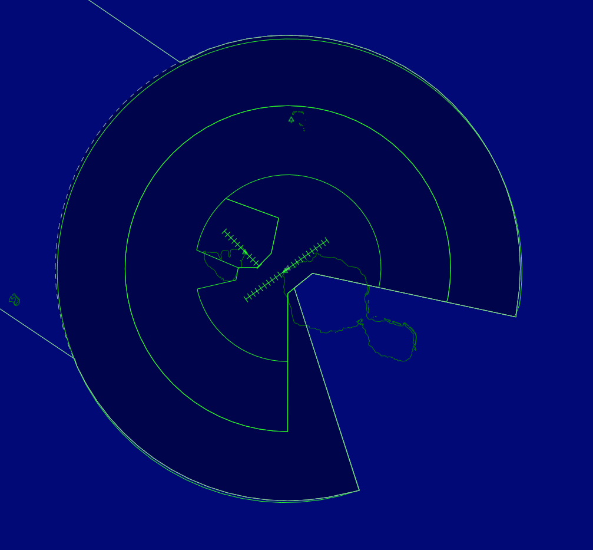
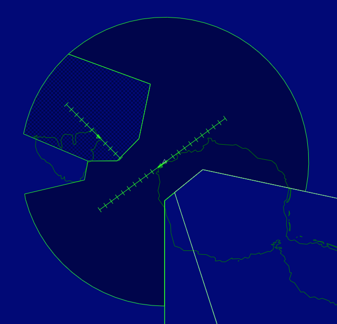
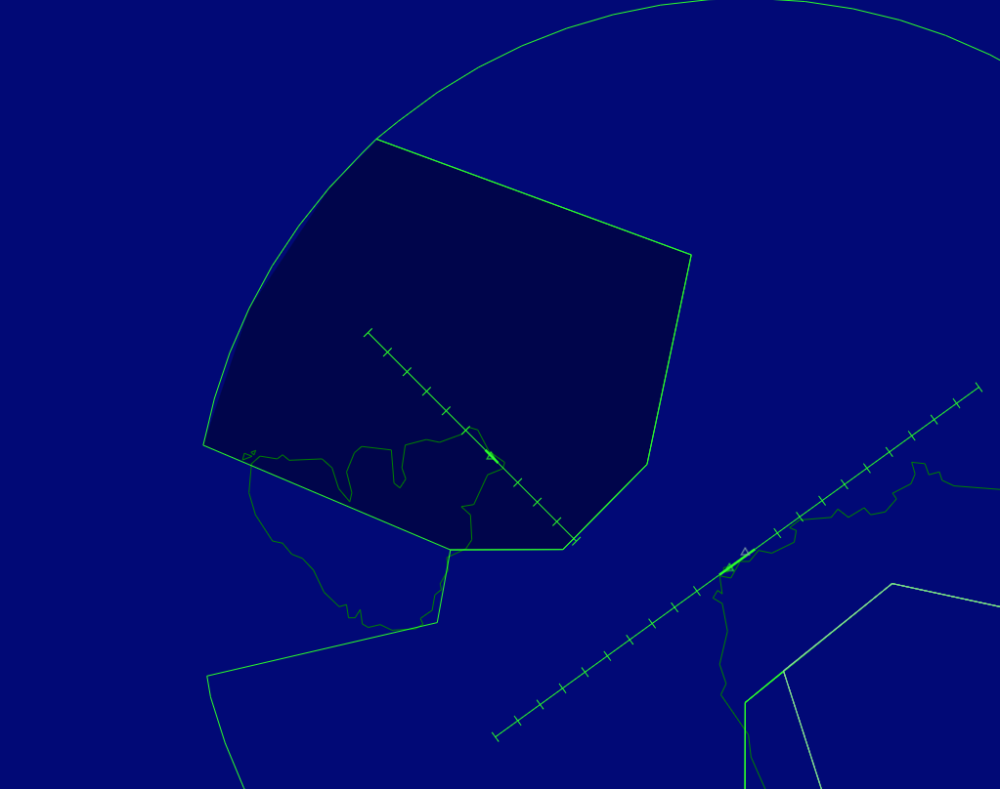
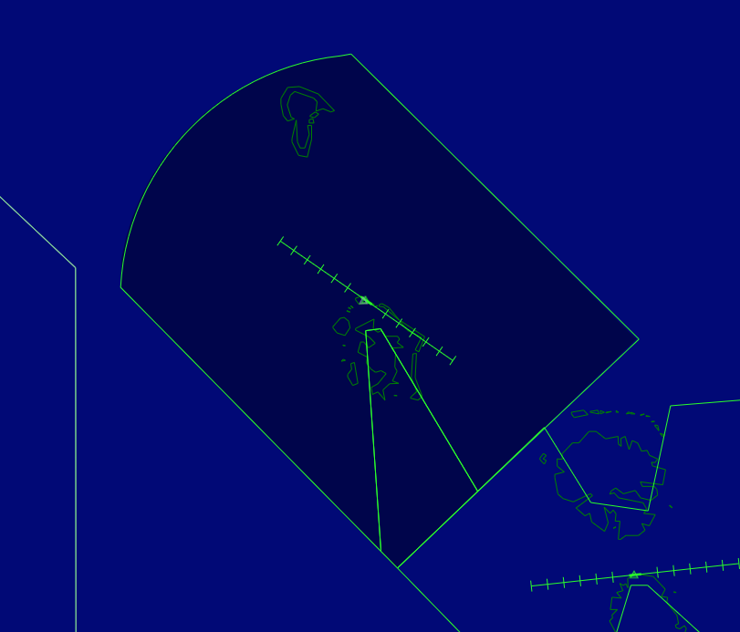
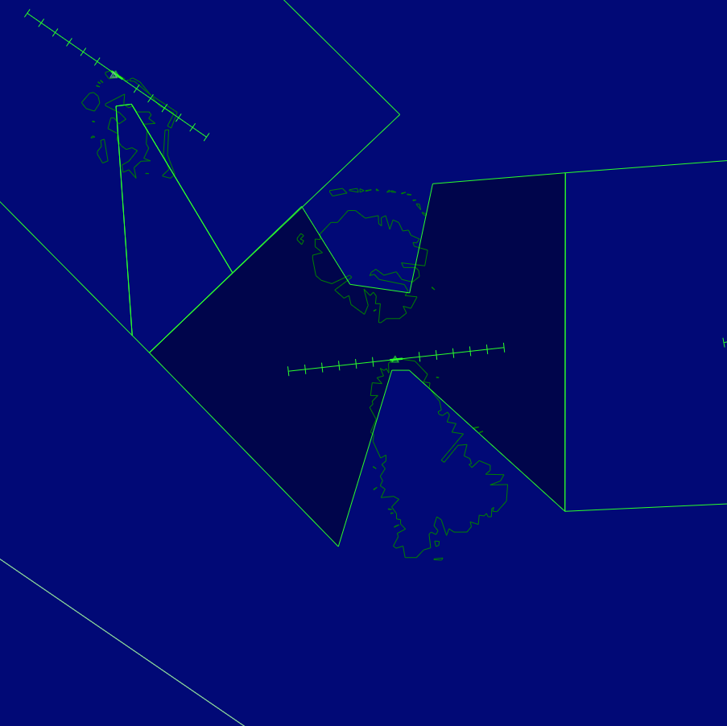

--8<-- "includes/abbreviations.md"

## Positions

| Position Name   | Shortcode | Callsign        | Frequency | Login ID | Usage     |
| --------------- | --------- | --------------- | --------- | -------- | --------- |
| Tahiti Oceanic  | NTTT      | Tahiti Control  | 125.500   | NTTT_FSS | Primary   |
| Tahiti Control  | TAH       | Tahiti Control  | 134.700   | NTTC_CTR | Primary   |
| Tahiti Approach | A-TAH     | Tahiti Approach | 121.300   | NTAA_APP | Primary   |
| Tahiti Tower    | T-TAH     | Tahiti Tower    | 118.100   | NTAA_TWR | Primary   |
| Tahiti Ground   | G-TAH     | Tahiti Ground   | 121.900   | NTAA_GND | Secondary |
| Bora Bora Tower | TNTTB     | Bora Tower      | 118.900   | NTTB_TWR | Primary   |
| Raiatea Tower   | TNTTR     | Raiatea Tower   | 118.500   | NTTR_TWR | Primary   |

### Event Only Positions

!!! danger "Important"
    The following position may only be staffed during a VATNZ event where approved, or if explicitly authorised by the Operations Director.

| Position Name | Shortcode | Callsign     | Frequency | Login ID | Usage      |
| ------------- | --------- | ------------ | --------- | -------- | ---------- |
| Moorea Tower  | TNTTM     | Moorea Tower | 118.700   | NTTM_TWR | Event only |

## Tahiti Airspace

Tahiti's airspace has several differences from the NZZO FIR:

- Oceanic Class A airspace starts at `FL195`, rather than `FL245`.
- Outside tower, approach and enroute CTAs, the NTTT FIR is Class E from `A045` to `FL195`.
    - IFR aircraft above `A045` require an IFR clearance and separation service.
    - VFR aircraft above `A045` are entitled to a traffic information service, but are not required to be in contact with anyone.
- Outside these CTAs, airspace from `SFC` to `A045` is Class G.

## Tahiti Oceanic

<figure markdown>
  
</figure>

**NTTT_FSS** "Tahiti Control" on 125.500 provides the Oceanic FSS service above `FL195`. It also provides the Class E IFR and traffic service above `A045` outside other tower, approach and enroute CTA airspace.

## Tahiti Control

<figure markdown>
  
</figure>

**NTTC_CTR** "Tahiti Control" on 134.700 provides the following services:

- A radar service within the red Iles Sous le Vent sector shown on the map, from `A015` to `FL195`.
- A procedural service in the remainder of the area within 200nm of TAF, from `A045` to `FL195`.
- An enroute and approach control service for NTTB (Bora Bora), NTTR (Raiatea), NTTH (Huahine) and NTUU (Tupai).

The red sector is the radar area; all other airspace within the 200nm boundary is procedural. Within the 200nm area, NTTT_CTR provides the Class E service above `A045`; outside it, the service is provided by NTTT_FSS. NTTB and NTTR have tower services from `SFC` to `A015`. NTTH is uncontrolled, with the base of NTTT_CTR at `A015`.

## Tahiti Approach

<figure markdown>
  
</figure>

**NTAA_APP** "Tahiti Approach" on 121.300 provides a service from `A025` to `FL195` within the Tahiti TMA, a 50nm radius area centred on NTAA with a southeastern exclusion.

## Tahiti Tower

<figure markdown>
  
</figure>

**NTAA_TWR** "Tahiti Tower" on 118.100 provides the tower service from `SFC` to `A025` within the NTAA control zone. The zone is approximately a 20nm circle centred on the TAF VOR, with exclusions over mainland Tahiti and Moorea.

NTAA_TWR provides the ground service on 121.900. When Moorea Tower is offline, NTAA_TWR provides the tower service for NTTM.

## Moorea Tower

<figure markdown>
  
</figure>

**NTTM_TWR** "Moorea Tower" on 118.700 provides a tower service from `SFC` to `A015` within the NTTM control zone. The control zone sits entirely within NTAA_TWR's airspace.

NTAA_APP provides the approach service above `A015` and does not provide a top-down service to NTTM_TWR. Take care when assigning SIDs and STARs: the extended centreline for NTTM RWY 12/30 intersects the NTAA RWY 04/22 centreline. Traffic at NTAA has priority.

When NTTM_TWR is offline NTAA_TWR shall provide the TWR service.

## Bora Bora Tower

<figure markdown>
  
</figure>

**NTTB_TWR** "Bora Tower" on 118.900 provides a tower service from `SFC` to `A015`. Its CTR is approximately a 15nm by 10nm area centred on the BB NDB, with the long axis running northwest to southeast. A small area south of the aerodrome has a lower limit of `A005`.

The NTTB CTR sits within NTTT_CTR's airspace; NTTT_CTR provides the approach and enroute service. NTTB_TWR also covers NTUU (Tupai) to the north.

## Raiatea Tower

<figure markdown>
  
</figure>

**NTTR_TWR** "Raiatea Tower" on 118.500 provides a tower service from `SFC` to `A015`. The NTTR CTR interfaces with Bora Bora's CTR to the northwest and extends approximately 10nm east of the aerodrome. Its northern and southern boundaries account for Fareura/Puurauti and Tefatoaiti respectively.

NTTT_CTR provides the approach and enroute service above the NTTR CTR.

## Coordination

Coordinate requests for non-nominated approaches with the relevant tower position as required.

TAH shall provide a 10-minute warning to NTTT before an aircraft crosses the common airspace boundary.