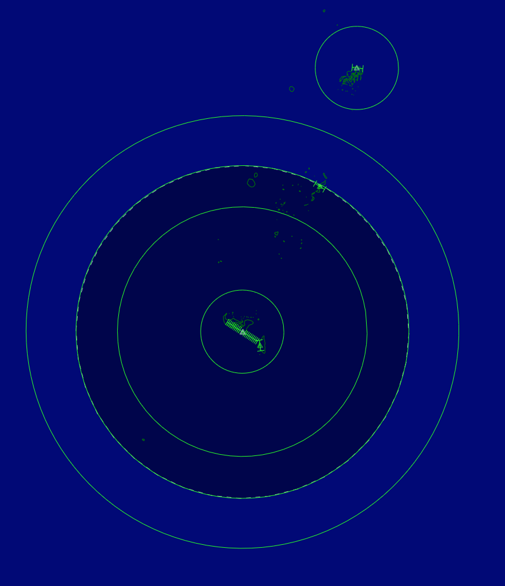

--8<-- "includes/abbreviations.md"

| Position Name      | Shortcode | Callsign         | Frequency | Login ID | Usage     |
| ------------------ | --------- | ---------------- | --------- | -------- | --------- |
| Fua'amotu SMC      | GTF       | Fua'Amotu Ground | 121.900   | NFTF_GND | Secondary |
| Fua'amotu TWR      | TTF       | Fua'Amotu Tower  | 118.500   | NFTF_APP | Primary   |

### Event Only Positions

!!! Danger "Important"
    The following are designated as Event Only positions, and may only be staffed during a VATNZ event where approved, or if explicitly authorised by the Operations Director.

| Position Name | Shortcode | Callsign              | Frequency | Login ID | Usage      |
| ------------- | --------- | --------------------- | --------- | -------- | ---------- |
| Vava'u FIS    | VFS       | Vava'u Flight Service | 118.100   | NFTV_TWR | Event only |
| Niue FIS      | NFS       | Niue Flight Service   | 118.100   | NIUE_TWR | Event only |

### Event Only Positions

!!! Danger "Important"
    The following are designated as Event Only positions, and may only be staffed during a VATNZ event where approved, or if explicitly authorised by the Operations Director.

| Position Name | Shortcode | Callsign              | Frequency | Login ID | Usage      |
| ------------- | --------- | --------------------- | --------- | -------- | ---------- |
| Vava'u FIS    | VFS       | Vava'u Flight Service | 118.100   | NFTV_TWR | Event only |
| Niue FIS      | NFS       | Niue Flight Service   | 118.100   | NIUE_TWR | Event only |

## Fua'amotu Tower

!!! info "Why is their callsign Tower, not Approach?"
    We've had to implement this position with a `_APP` suffix, as the FSD restricts `_TWR` callsigns to a visibility range of 50nm. 

**NFTF_APP** "Fua'Amotu Tower" on 118.500

### Airspace

<figure markdown>
  
</figure>

**Limits**: There are three layers to NFTF_APP's area of responsibility:

- A circle 23nm in diameter, centered on TBU VOR from SFC to 3,500ft.

- A circle 75nm in diameter, centered on TBU VOR from 3,500ft to 9,500ft.

- A circle 100nm in diameter, centered on TBH VOR from 9,500ft to 19,500ft.

Fua'Amotu TWR shall instruct aircraft to report passing `FL190` additionally should aircraft be climbing above `FL245` they shall be instructed to contact ARO passing `FL240`. i.e. "Passing `FL240` contact Auckland Radio 129.0"

## AFIS NFTV/NIUE

!!! warning "AFIS"
    NFTV AFIS is not yet modelled on the network however we endever to get this set up within the near future 

Vava'u and Niue have a Flight Information Service, while only Vava'u weirdly has a Ground service on 121.900. The FIS provides only traffic information. This will be modelled as **NFTV_TWR** or **NIUE_TWR**, with a standard Tower visibility range of 50nm. The Tower is to provide a traffic information service, in addition to relaying IFR clearances from NZZO_FSS.

Clearances remain **invalid** until Auckland Radio advises that they are released. Controllers shall note aircraft cruising below `FL245` shall be advised they will only get a traffic service

Refer to the **AFIS** [guide](../../controller-skills/flight-service.md#standard-phraseology).

### Departures

Both Flight Services shall instruct aircraft that are vacating the MBZ to contact ARO. If aircraft are unable to make contact with ARO they shall remain on the AFIS frequency until they are able to make contact with ARO. 

### Arrivals

Arriving aircraft will be given clearance to leave Controlled Airspace on descent through `FL245`. Aircraft should attempt to make contact with NFS around 40 DME. If aircraft are unable to make contact with NFS, they should call ARO, who should call Nuie on the landline to attempt to make contact. NFS will report your landing back to NZZO_FSS in order to close your flightplan.

## Coordination

Any requests for a non-nominated approach shall be coordinated with the Tower as needed.

TTF shall provide a 10-minute warning to ARO before an aircraft crosses the common airspace boundary. ARO shall provide the same warning to TTF for arriving aircraft. 

Flight Services shall call ARO to cancel Flight Plans for arriving aircraft.
