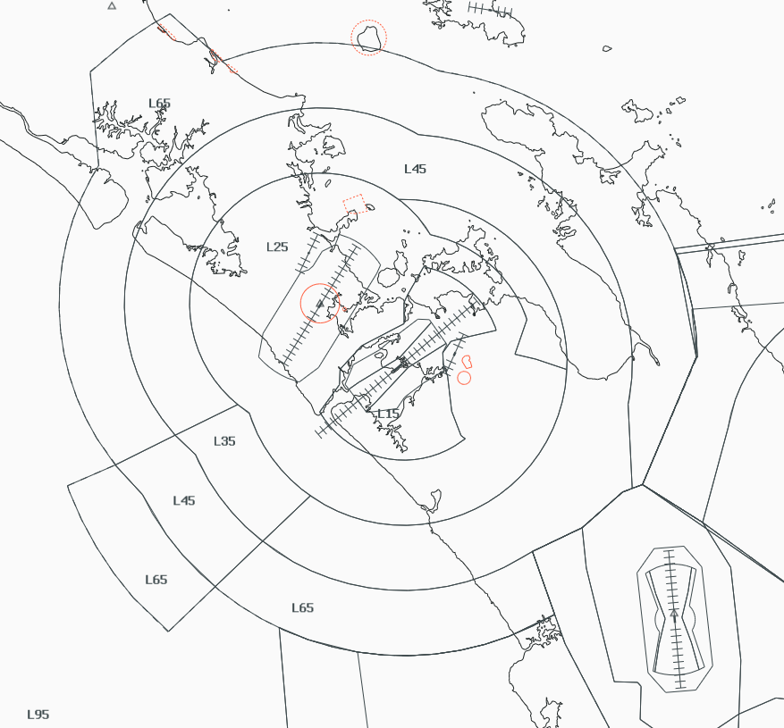

--8<-- "includes/abbreviations.md"

## Positions

| Position Name | Shortcode | Callsign          | Frequency | Login ID | Usage     |
| ------------- | --------- | ----------------- | --------- | -------- | --------- |
| Auckland TMA  | ATMA      | Auckland Approach | 124.300   | NZAA_APP | Primary   |

### Event Only Positions

!!! Danger
    The following are designated as Event Only positions, and may only be staffed during a VATNZ event where approved, or if explicitly authorised by the Operations Director.

| Position Name       | Shortcode | Callsign          | Frequency | Login ID | Usage                       |
| ------------------- | --------- | ----------------- | --------- | -------- | --------------------------- |
| Auckland Departures | ADEP      | Auckland Approach | 129.600   | NZAA_DEP | Events - Traffic Management |

## Airspace

The Auckland CTA/C follows the lateral and vertical boundaries as shown below. 

<figure markdown>
   
  <figcaption>Auckland TMA (CTA/C)</figcaption>
</figure>

### Transfer of Control Points

|Transfer Flow         | Requirements                                                 | Notes                                                                       | 
| -------------------- | ------------------------------------------------------------ | --------------------------------------------------------------------------- | 
| Tower -> Approach    | Once the aircraft becomes airborne off the runway            | Tower shall instruct all aircraft to contact ATMA airborne                  |
| Approach -> Control  | Once the aircraft are approaching the lateral bounds         | Aircraft can be handed off when nothing further is required of the aircraft | 
| Control -> Approach  | Once the aircraft is appraching the cleared level by control | Aircraft may not always be cleared to A110 when handed to ATMA              | 
| Approach -> Tower    | Once established on final (ILS/LOC) or over the IAF (RNP)    |                                                                             |

## Departures

Aircraft released to ATMA may be tracked direct to a fix or assigned a heading to aid with sequencing or for the benifit of the pilot. 

Aircraft must climb to A030 on the extended runway centreline before turning North on departure. Aircraft may be turned south passing A005. 

## Arrivals 