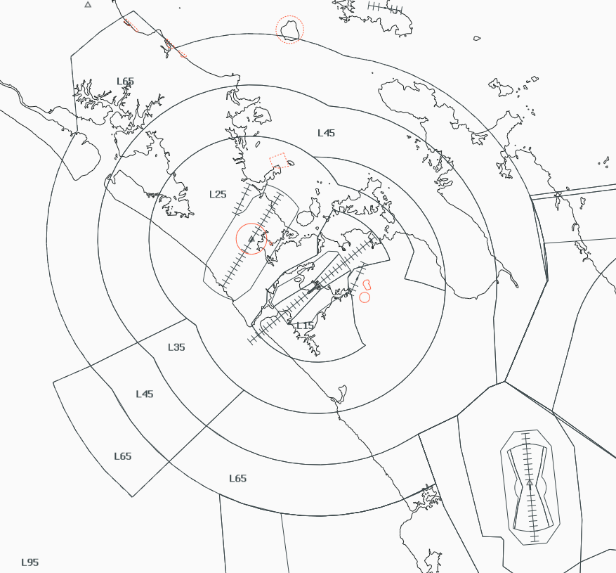

--8<-- "includes/abbreviations.md"

!!! note "Auckland Procedures"
    The ATMA procedures build upon information already contained in the [NZAA Aerodrome Procedures](../aerodromes/Class-C/nzaa.md), and any Controller logged on to ATMA should be familiar with those procedures.

## Positions

| Position Name | Shortcode | Callsign          | Frequency | Login ID | Usage     |
| ------------- | --------- | ----------------- | --------- | -------- | --------- |
| Auckland TMA  | ATMA      | Auckland Approach | 124.300   | NZAA_APP | Primary   |

### Event Only Positions

!!! Danger
    The following are designated as Event Only positions, and may only be staffed during a VATNZ event where approved, or if explicitly authorised by the Operations Director.

| Position Name       | Shortcode | Callsign          | Frequency | Login ID | Usage                       |
| ------------------- | --------- | ----------------- | --------- | -------- | --------------------------- |
| Auckland Departures | ADEP      | Auckland Approach | 129.600   | NZAA_DEP | Events - Traffic Management |

## Airspace

The Auckland CTA/C follows the lateral and vertical boundaries as shown below. 

<figure markdown>
   
  <figcaption>Auckland TMA (CTA/C)</figcaption>
</figure>

### Transfer of Control Points

|Transfer Flow         | Requirements                                                  | Notes                                                                       | 
| -------------------- | ------------------------------------------------------------- | --------------------------------------------------------------------------- | 
| Tower -> Approach    | Once the aircraft becomes airborne off the runway             | Tower shall instruct all aircraft to contact ATMA airborne                  |
| Approach -> Control  | Once the aircraft are approaching the lateral bounds          | Aircraft may be handed off when nothing further is required of the aircraft | 
| Control -> Approach  | Once the aircraft is approaching the cleared level by control | Aircraft may not always be cleared to A110 when handed to ATMA              | 
| Approach -> Tower    | Once established on final (ILS/LOC) or over the IAF (RNP)     |                                                                             |

## Departures

Departures will be assigned by Auckland Controllers in accordance with the [SID Assignment guide](../aerodromes/Class-C/nzaa.md#sid-assignment). 

ATMA may climb departing aircraft as necessary to maintain separation and traffic flow up to their requested flight level. International aircraft shall be instructed to climb to `FL250`, if further climb is requested, they shall be handed to OCR.

!!! hint "RTF for re-joining a SID"
    Where an aircraft has been taken off their assigned SID, and is required to then re-join at a later point, the following RTF must be used:

    **ATMA**: *New Zealand 677, track direct LAKES to rejoin the SID*.

    **Note**: This RTF is not valid when track-shortening on a SID, and the standard "track direct" RTF shall be used.

### Prop Departures

ATMA should note that all prop-preferential SIDs have a hold-down altitude restriction during their initial departure leg. Most Pilots are not aware of these limitations, therefore ATMA should be aware of the limitations, particularly on the `BROOK 3Q`, `REKIS #Q` and `STEAL #P`. ATMA can use a stepped climb methodology to ensure that these limitations are met.

### Track Shortening

Aircraft under the jurisdiction of ATMA may be track-shortened or assigned a heading to assist with sequencing or for separation. 

ATMA may track-shorten where practical within their sector. ATMA may track-shorten aircraft direct to `KARRL` without coordination, provided that it their flight plan has been amended.

As track-shortening direct to `TAPAT` or `BOGUN` can interfere with arrivals within OCR, these shall be co-ordinated.

### Short-Sector STARs

ATMA is responsible for issuing STAR clearances for aircraft bound for NZHN and NZTG and shall do so without coordination. 

### Assigned Heading Departures

Assigned Heading departures may be requested by Tower or ATMA in order to allow for more efficient traffic flow from the runway. Controllers can use this method to ensure that a 30° divergence exists between tracks - either keeping the go-around path clear, or by moving an aircraft away from another aircraft's departure path. These shall be issued in accordance with [NZAA - Assigned Headings](../aerodromes/Class-C/nzaa.md#assigned-headings).

!!! example "RTF and coordination for Assigned Heading departure"
    **AA TMA** -> **AA TWR**: "New departure instructions for ANZ631, assigned heading 190 degrees climbing FL360, released"  
    **AA TWR** -> **AA TMA**: "Copy, ANZ631  heading 190 degrees climbing FL360, released"
    

## Arrivals 

OCR, RAN or BAY will hand aircraft to ATMA no lower than `A110`, unless co-ordinated.

### Track Shortening

ATMA should make use of track-shortening on STARs to allow for an efficient sequence to be applied. Where an aircraft has been taken away from the STAR and are subsequently required to re-join and follow the STAR, the following RTF shall be used:

!!! hint "RTF for re-joining a STAR"
    **ATMA**: *New Zealand 677, track direct VINCE to re-join the STAR. Descend A050*.

Provided the separation allows, aircraft may be tracked direct `SABAV` and `GITUK` for their respective ILS, or to `ZORBA`, `ELBOP` or `ATAMA` their respective RNP (AR) approach. Due to the routing of international STARs, minimal track shortening shall be applied.

### Noise Abatement

NZAA runs noise abatement from 2300L until 0600L, and the procedures contained in [NZAA - Noise Abatement](../aerodromes/Class-C/nzaa.md#noise-abatement) may be applied within this time.

Controllers shall note that only the RNP Y RWY 05R (AR) approach is authorised for use during noise abatement hours.

## Uncontrolled IFR 

For aircraft departing NZNE and NZAR, they shall be issued an Uncontrolled IFR clearance. Depending on traffic levels outside controlled airspace, they can either be required to validate their clearance before departure, or prior to entering controlled airspace.

For Uncontrolled IFR aircraft leaving the ATMA control area, ATMA shall issue the appropriate STAR for that aerodrome, and clear the aircraft to leave controlled airspace on descent. 

If the aircraft is terminating underneath the ATMA control area, they shall be instructed to contact you on the ground to cancel their IFR flight plan. If their flight is terminating underneath another sector, such as OCR, they shall be instructed to contact that sector. This shall be coordinated.

## Coordination

### Auckland Tower

ATMA shall coordinate with TAA on any requested approach that is not nominated in the ATIS. 

### OCR, RAN and BAY

ATMA shall coordinate any track shortening outside of their control area that is not stated in [Departures - Track Shortening](../terminal/atma.md#departures). 
