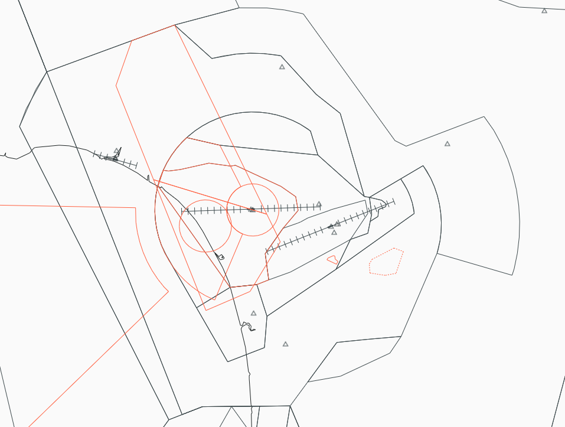

--8<-- "includes/abbreviations.md"

!!! note "Ohakea Procedures"
    The OTMA procedures build upon information already contained in the [NZOH Aerodrome Procedures](../aerodromes/Class-D/nzoh.md) and [NZPM Aerodrome Procedures](../aerodromes/Class-D/nzpm.md), any Controller logged on to OTMA should be familiar with those procedures.

## Positions

| Position Name   | Shortcode | Callsign            | Frequency | Login ID | Usage     |
| --------------- | --------- | ------------------- | --------- | -------- | --------- |
| Ohakea TMA      | OTMA      | Ohakea Approach     | 125.100   | NZOH_APP | Primary   |

## Airspace

Ohakea CTA/C follows the lateral and vertical boundaries as shown below. Controllers shall note OTMA has an upper limit of `A110`.

<figure markdown>
   
  <figcaption>Ohakea TMA (CTA/C)</figcaption>
</figure>

### Transfer of Control Points

#### Palmerston North

|Transfer Flow         | Requirements                                                  | Notes                                                                       | 
| -------------------- | ------------------------------------------------------------- | --------------------------------------------------------------------------- | 
| Tower -> Approach    | Once the aircraft becomes airborne off the runway             | Tower shall instruct all aircraft to contact OTMA airborne                  |
| Approach -> Control  | Once the aircraft are approaching the lateral bounds          | Aircraft may be handed off when nothing further is required of the aircraft | 
| Control -> Approach  | Once the aircraft is approaching the cleared level by control |                                                                             | 
| Approach -> Tower    | Once established on final                                     | Aircraft on the RNP W 25 shall be instructed to contact Tower at `IVREP` and aircraft on the RNP 07 shall be instructed to contact tower at `GUTNI`|

#### Ohakea

|Transfer Flow         | Requirements                                                  | Notes                                                                       | 
| -------------------- | ------------------------------------------------------------- | --------------------------------------------------------------------------- | 
| Tower -> Approach    | Once the aircraft becomes airborne off the runway             | Tower shall instruct all aircraft to contact OTMA airborne                  |
| Approach -> Control  | Once the aircraft are approaching the lateral bounds          | Aircraft may be handed off when nothing further is required of the aircraft | 
| Control -> Approach  | Once the aircraft is approaching the cleared level by control |                                                                             | 
| Approach -> Tower    | Once established on final (ILS/LOC) or over the IAF (RNP)     |                                                                             |

## Departures 

### Track Shortening on SIDs

Controllers shall use their own discretion when using track shortening.

## Arrivals

OHA shall hand aircraft to OTMA no lower then `A110` unless coordinated. 

### Palmerston North

Controllers shall note that the following STARs lead to a visual approach or the `RNP X 25` and are least preferred unless requested by the pilot: `IDLUR#A`, `LUNBA#E` and `TUTSI#E`. 

### Ohakea

Controllers shall note that all Ohakea STARs lead to RNP approaches, therefore manual vectoring will be required for aircraft on the ILS or VOR approach. 

## WTMA Arrivals

OHA may issue STAR clearances to aircraft bound for any aerodrome within WN TMAs airspace without coordination, provided that the STAR links with the nominated runway and approach type as stated in the ATIS. A request for use of a non-nominated approach requires agreement from both the TMA and ADC Controller. **This applies to aircraft crusing at `A110` or below only.**

## MOAs

Controllers shall note that since there are no current VSOAs within VATNZ. MOAs shall not be used at anytime and therefore aircraft may fly through what would usually be restricted airspace. 

## Coordination

### OHA

OTMA shall coordinate any track shortening outside of their control area.

### OH/PM TWR

Any approach **not** nominated in the ATIS shall be coordinated with TOH or TPM as required.

### WTMA

Aircraft cruising at `A110` or below shall be handed directly from OTMA to WTMA. OTMA is responsible for issuing a STAR ([See WTMA Arrivals above](#wtma-arrivals)). Also, any approach **not** nominated in the ATIS shall be coordinated with WTMA prior to a STAR clearance being issued to the aircraft. 