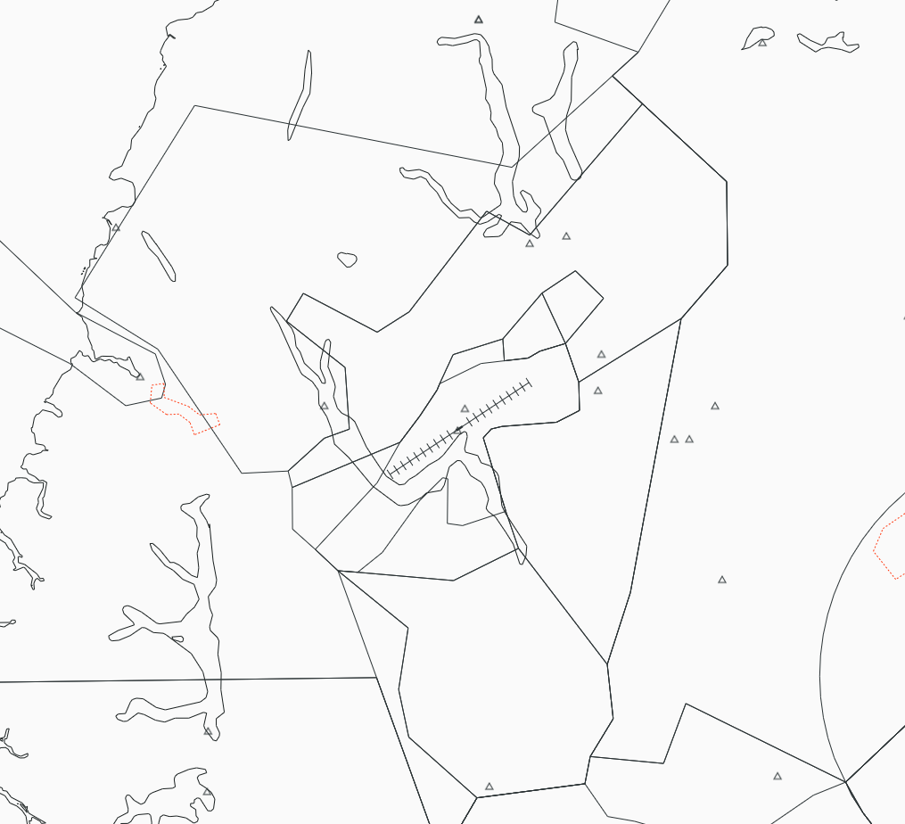

--8<-- "includes/abbreviations.md"

!!! note "Queenstown Procedures"
    The QTMA procedures build upon information already contained in the [NZQN Aerodrome Procedures](../aerodromes/Class-C/nzqn.md), and any Controller logged on to QTMA shall be familiar with those procedures.

## Positions

| Position Name   | Shortcode | Callsign             | Frequency | Login ID | Usage   |
| --------------- | --------- | -------------------- | --------- | -------- | ------- |
| Queenstown TMA  | QTMA      | Queenstown Approach  | 125.750   | NZQN_APP | Primary |

## Airspace

The Queenstown CTA/C follows the lateral and vertical boundaries as shown below. 

<figure markdown>
   
  <figcaption>Queenstown TMA (CTA/C)</figcaption>
</figure>

### Transfer of Control Points

| Transfer Flow       | Requirements                                                             | Notes                                                                                                            |
|---------------------|--------------------------------------------------------------------------|------------------------------------------------------------------------------------------------------------------|
| Tower -> Approach   | Once the aircraft becomes airborne off the runway                        | Tower shall instruct all aircraft to contact QTMA airborne                                                       |
| Approach -> Control | Once the aircraft are approaching the lateral or vertical bounds of QTMA | Aircraft may also be handed off when clear of all conflicts, provided the next sector accepts the early handover.|
| Control -> Approach | Aircraft is approaching the vertical and lateral bounds of the TMA       | Aircraft may be handed off early, provided that QTMA is happy to accept.                                         |
| Approach -> Tower   | Once established on approach, or within QN TWR's CTR/C.                  | QTMA may hold onto aircraft till `A050` with reference to [Arrivals](#retaining-aircraft-on-the-approach).       |

## Departures

Departures shall be assigned in accordance with the [SID Assignment guide](../aerodromes/Class-C/nzqn.md#sid-assignment). 

QTMA may climb aircraft up to a maximum of `FL250`, with further available when handed to STH.

### Track Shortening on SIDs

Typically aircraft are given track shortening instructions as they climb through `A080` to track direct to a waypoint upon passing `A100`. This waypoint is typically `TIMJO` and `SAVLA` for domestic flights, and boundary fixes for Oceanic bound aircraft. This shall be coordinated with STH. 

## Arrivals 

STH will hand aircraft to QTMA no lower than `FL180`, unless coordinated.

Aircraft shall be issued either the `RNP Y (AR)` or `RNP Z (AR)` approaches. If a non-standard approach is requested, such as the `RNP F/G/H` or `VOR DME`, coordination shall occur with agreement required between QTWR and QTMA. 

Once in QTMA airspace, arrivals may be descended to `FL150` and then `A100` to commence the approach. QTMA may clear aircraft straight down to `A100` where traffic permits.

!!! Note
    Due to high mountainous terrain, controllers shall avoid track shortening aircraft on the STAR but may do so where needed for separation with other traffic. 

### Retaining Aircraft on the Approach

QTMA usually elects to retain aircraft on the RNPs down to about `A050` until they are assured separation exists at the threshold (with respect to backtracking aircraft). This requires coordination with QTWR.

### Time Seperation on the Approach

When RWY 05 is in use aircraft on the `RNP Y/Z` shall be seperated by a minimum 7 minutes at `MOPGA`, the same applies to aircraft on the `RNP F` at `LETPO`.

When RWY 23 is in use aircraft on the `RNP Y/Z` shall be seperated by a minimum of 5 minutes at `ATVUP`, the same applies to aircraft on the `RNP G/H` at `GIVAK`.

### Missed Approaches

Aircraft that go missed that do **not** join the visual circuit will be instructed to contact QTMA passing `A040` and shall be tracked via the published missed approach to `SUNGU` to hold. Should the aircraft want to attempt another approach they shall be issued a `SUNGU` STAR for the respective runway. 

!!! Note
    Aircraft unable to reach `A092` by `SUNGU` shall be tracked further south via the missed approach track to `NV VOR` until terrain seperation can be achieved. 

## Coordination

### STH

Any track shortening shall be coordinated with STH.

### QN TWR

QTMA shall coordinate any non-nominated approaches with QTWR. QTMA shall also coordinate when retaining aircraft to a lower altitude on the approach, reference [Arrivals Section](#retaining-aircraft-on-the-approach). 

### NV TWR

QTMA shall coordinate any NV arrivals via `SUNGU` with NV TWR. 

### DN TWR

QTMA shall coordinate any oceanic arrivals bound for DN with DN TWR. 